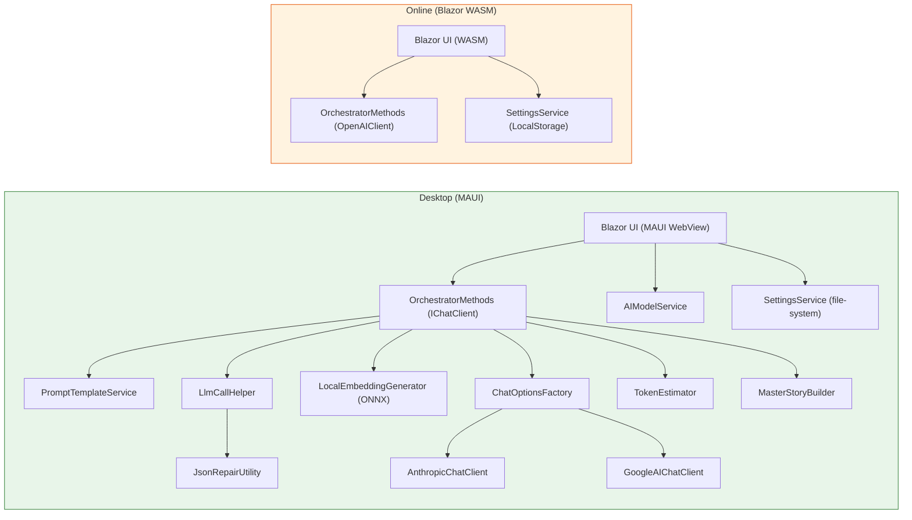
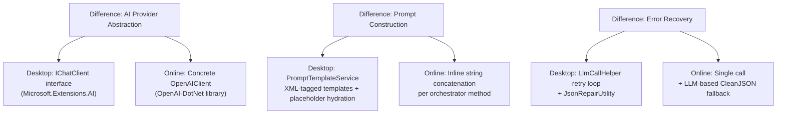
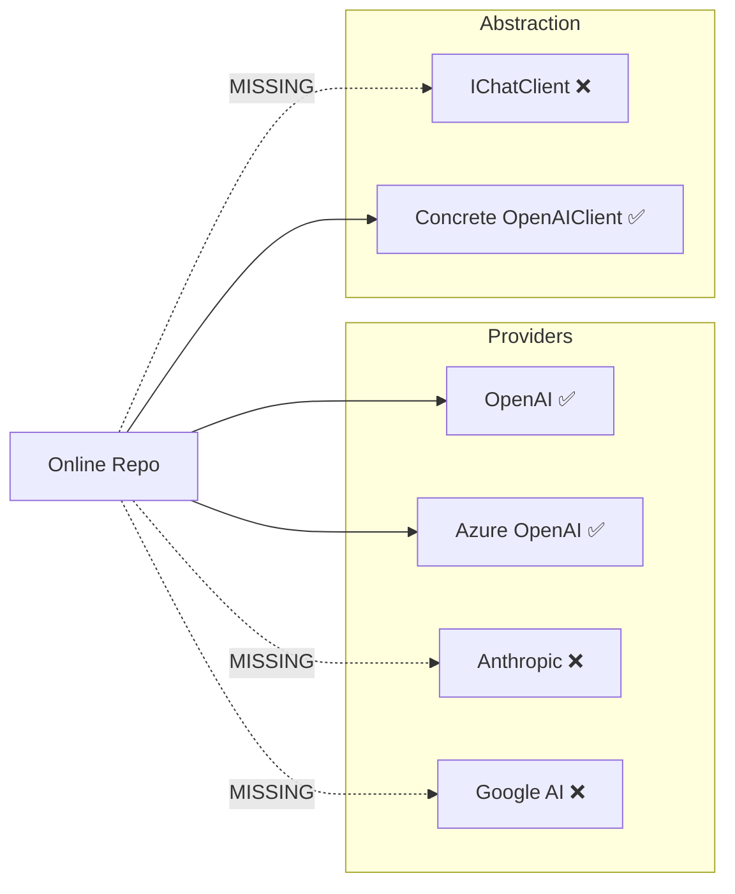
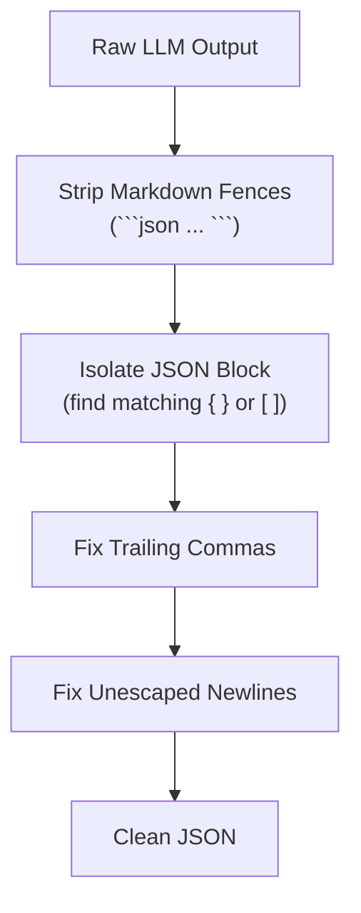
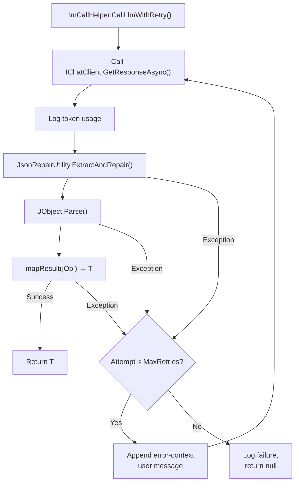
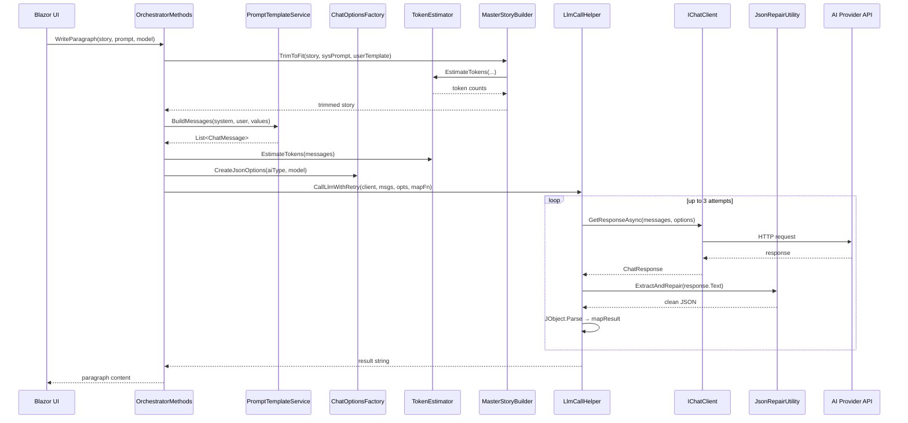
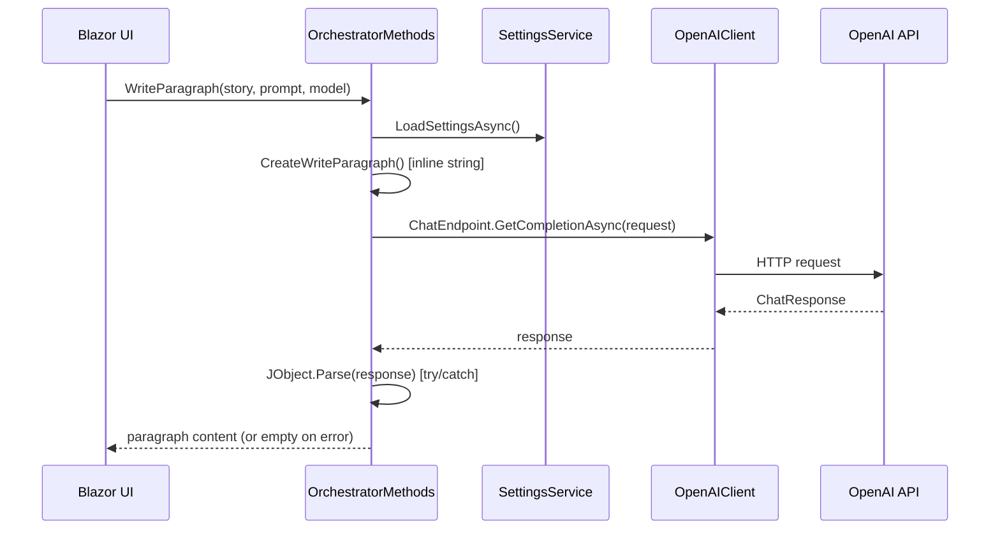
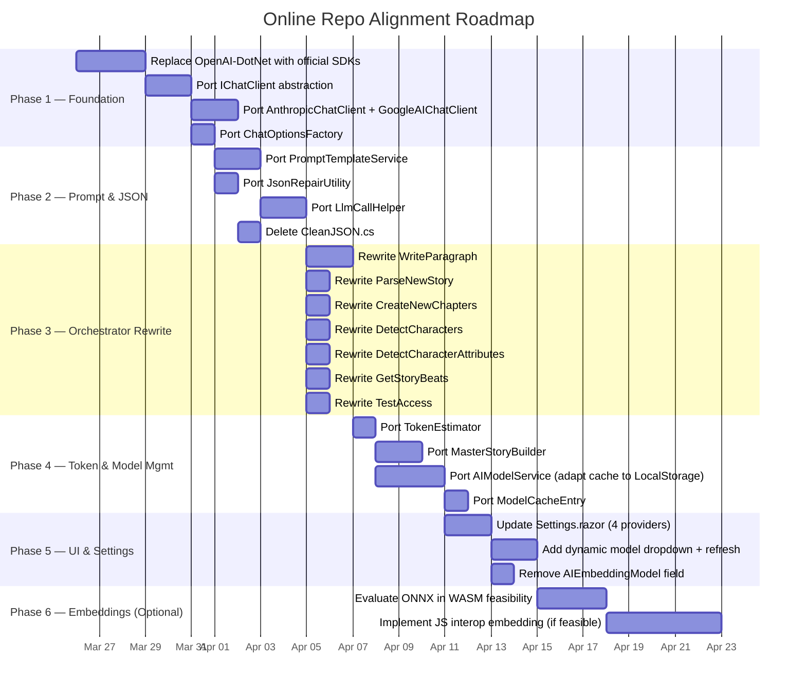

# AI Settings & Story Creation — Code Comparison and Alignment Plan

> **Repositories compared**
>
> | Label | Path | Platform |
> |-------|------|----------|
> | **Desktop** | `AIStoryBuilders\AIStoryBuilders` | .NET MAUI (Windows desktop) |
> | **Online** | `AIStoryBuilders\AIStoryBuildersOnline` | Blazor WebAssembly (browser) |
>
> _Generated 2026-03-25_

---

## Table of Contents

1. [Executive Summary](#1-executive-summary)
2. [High-Level Architecture Comparison](#2-high-level-architecture-comparison)
3. [AI Client & Provider Support](#3-ai-client--provider-support)
4. [Settings Service & Configuration Storage](#4-settings-service--configuration-storage)
5. [Prompt Engineering & Template System](#5-prompt-engineering--template-system)
6. [JSON Handling & Repair](#6-json-handling--repair)
7. [Embedding & Vector Generation](#7-embedding--vector-generation)
8. [LLM Call Infrastructure](#8-llm-call-infrastructure)
9. [Model Listing & Dynamic Retrieval](#9-model-listing--dynamic-retrieval)
10. [Token Estimation & Context-Window Management](#10-token-estimation--context-window-management)
11. [Story Creation Flows (Orchestrator Methods)](#11-story-creation-flows-orchestrator-methods)
12. [UI Settings Page Comparison](#12-ui-settings-page-comparison)
13. [Dependency & Package Comparison](#13-dependency--package-comparison)
14. [File Inventory Delta](#14-file-inventory-delta)
15. [Implementation Plan — Phased Roadmap](#15-implementation-plan--phased-roadmap)
16. [Risk & Migration Notes](#16-risk--migration-notes)

---

## 1. Executive Summary

The **Desktop** codebase has undergone significant modernisation that the **Online** codebase has not yet adopted. The key gaps are:

| Area | Desktop (Current) | Online (Current) |
|------|--------------------|-------------------|
| AI providers | OpenAI, Azure OpenAI, **Anthropic**, **Google AI** | OpenAI, Azure OpenAI only |
| AI client abstraction | `Microsoft.Extensions.AI` (`IChatClient`) | Legacy `OpenAI-DotNet` wrapper (`OpenAIClient`) |
| Prompt construction | Centralised `PromptTemplateService` with XML-tagged templates | Inline string concatenation in each method |
| JSON repair | Deterministic `JsonRepairUtility` (regex-based) | LLM-based `CleanJSON` method (costs extra tokens) |
| LLM retry logic | `LlmCallHelper` with structured retry + validation | None — single call, manual `try/catch` |
| Embeddings | **Local ONNX** (`all-MiniLM-L6-v2`) via `LocalEmbeddingGenerator` | Cloud-based via OpenAI Embeddings API |
| Model listing | Dynamic `AIModelService` with file-system cache | Hard-coded dropdown lists |
| Token budgeting | `TokenEstimator` + `MasterStoryBuilder.TrimToFit` | None |
| Settings storage | File-system JSON (`MyDocuments`) | `Blazored.LocalStorage` (browser) |

The following sections detail every difference and provide a phased implementation plan to bring Online up to parity.

---

## 2. High-Level Architecture Comparison



### Key Architectural Differences



---

## 3. AI Client & Provider Support

### 3.1 Desktop — Multi-Provider via `IChatClient`

The Desktop `CreateOpenAIClient()` method returns `IChatClient` and supports four providers:

```
switch (SettingsService.AIType)
    "OpenAI"       → OpenAIClient → .GetChatClient(model).AsIChatClient()
    "Azure OpenAI" → AzureOpenAIClient → .GetChatClient(model).AsIChatClient()
    "Anthropic"    → new AnthropicChatClient(apiKey, model)
    "Google AI"    → new GoogleAIChatClient(apiKey, model)
```

**Custom adapter classes** implement `IChatClient`:

| Class | Wraps | NuGet |
|-------|-------|-------|
| `AnthropicChatClient` | `Anthropic.SDK` | `Anthropic.SDK 5.10.0` |
| `GoogleAIChatClient` | `Mscc.GenerativeAI` | `Mscc.GenerativeAI 3.1.0` |

Both adapters:
- Map `ChatRole.System` / `ChatRole.User` / `ChatRole.Assistant` to the provider's native role type.
- Return `ChatResponse` with populated `UsageDetails`.
- Throw `NotSupportedException` for streaming (not used by the app).

### 3.2 Online — OpenAI-Only via Legacy Library

The Online `CreateOpenAIClient()` returns `OpenAIClient` (from `OpenAI-DotNet 8.8.7`):
- Uses `OpenAIAuthentication` + `OpenAISettings` with `HttpClient`.
- Only handles `"OpenAI"` and `"Azure OpenAI"` (treated as resource-name/deployment-based).
- No `IChatClient` abstraction — every caller works with the concrete `OpenAIClient` API.

### 3.3 Gap Summary



### 3.4 What to Implement

1. Replace `OpenAI-DotNet` package with:
   - `Azure.AI.OpenAI`
   - `Microsoft.Extensions.AI`
   - `Microsoft.Extensions.AI.Abstractions`
   - `Microsoft.Extensions.AI.OpenAI`
   - `Anthropic.SDK`
   - `Mscc.GenerativeAI`
2. Port `AnthropicChatClient.cs` and `GoogleAIChatClient.cs` into `AI/`.
3. Port `ChatOptionsFactory.cs` into `AI/`.
4. Rewrite `OrchestratorMethods.CreateOpenAIClient()` to return `IChatClient` using the Desktop's switch pattern.
5. Remove the `CreateEmbeddingOpenAIClient()` method (embeddings will go local — see §7).

---

## 4. Settings Service & Configuration Storage

### 4.1 Property Comparison

| Property | Desktop | Online | Notes |
|----------|---------|--------|-------|
| `Organization` | ✅ | ✅ | |
| `ApiKey` | ✅ | ✅ | |
| `AIModel` | ✅ | ✅ | |
| `AIType` | ✅ | ✅ | |
| `Endpoint` | ✅ | ✅ | |
| `ApiVersion` | ✅ | ✅ | |
| `GUID` | ❌ | ✅ | Online-only user identifier |
| `AIEmbeddingModel` | ❌ (removed) | ✅ | Desktop uses local embeddings; no longer needed |

### 4.2 Storage Mechanism

| | Desktop | Online |
|---|---------|--------|
| **Backend** | File-system JSON (`MyDocuments/AIStoryBuilders/AIStoryBuildersSettings.config`) | `Blazored.LocalStorage` (IndexedDB) |
| **Load** | `LoadSettings()` (synchronous constructor) | `LoadSettingsAsync()` (called from every orchestrator method) |
| **Save** | `SaveSettings(...)` — 6 params | `SaveSettingsAsync(...)` — 8 params (includes GUID, AIEmbeddingModel) |

### 4.3 What to Implement

1. Remove `AIEmbeddingModel` property from `Settings` class and from `SaveSettingsAsync` params (once local embeddings are adopted).
2. Keep `GUID` — it is Online-specific and useful.
3. Desktop's `LoadSettings()` is sync because MAUI file I/O is sync-safe. Online must remain async due to `LocalStorage`.
4. Add default `AIType` values for `"Anthropic"` and `"Google AI"` in the load-settings null-check block.

---

## 5. Prompt Engineering & Template System

### 5.1 Desktop — `PromptTemplateService`

The Desktop centralises all LLM prompts in `PromptTemplateService.Templates`:

| Template Constant | Operation |
|---|---|
| `WriteParagraph_System` / `WriteParagraph_User` | Paragraph generation |
| `ParseNewStory_System` / `ParseNewStory_User` | Story text → structured data |
| `CreateNewChapters_System` / `CreateNewChapters_User` | Chapter outline generation |
| `DetectCharacters_System` / `DetectCharacters_User` | Character name extraction |
| `DetectCharacterAttributes_System` / `DetectCharacterAttributes_User` | New attribute detection |
| `GetStoryBeats_System` / `GetStoryBeats_User` | Story beat extraction |

Templates use **XML-style tags** (`<story_title>`, `<paragraph>`, etc.) and `{Placeholder}` tokens. The `BuildMessages()` method hydrates placeholders and returns a `List<ChatMessage>`.

### 5.2 Online — Inline String Concatenation

Each `OrchestratorMethods.*` file builds its own prompt via helper methods like:
- `CreateWriteParagraph()`
- `CreateSystemMessageParseNewStory()`
- `CreateSystemMessageCreateNewChapters()`
- `CreateDetectCharacters()`
- `CreateDetectCharacterAttributes()`
- `CreateStoryBeats()`

These use `"####"` markdown-style headings and raw string concatenation with `\n`.

### 5.3 Impact of the Difference

| Concern | Desktop | Online |
|---------|---------|--------|
| Prompt consistency | High — single source of truth | Low — scattered across files |
| Provider compatibility | XML tags work well with all providers | `####` markers work but not optimal |
| JSON schema enforcement | Explicit schema in system prompt | Implicit — relies on format examples |
| Maintainability | Easy to update templates centrally | Must update each method individually |

### 5.4 What to Implement

1. Port `PromptTemplateService.cs` into `AI/`.
2. Replace each inline `Create*` helper method with calls to `PromptTemplateService.BuildMessages()`.
3. Remove the now-unused `Create*` helper methods from each partial class.

---

## 6. JSON Handling & Repair

### 6.1 Desktop — Deterministic `JsonRepairUtility`



This is a **zero-cost, deterministic** regex pipeline. No LLM call required.

### 6.2 Online — LLM-Based `CleanJSON`

The Online repo has `OrchestratorMethods.CleanJSON.cs`, which sends malformed JSON **back to the LLM** with a prompt asking it to fix the JSON. This:
- Costs additional API tokens.
- Adds latency (extra round-trip).
- May itself produce invalid JSON.

### 6.3 What to Implement

1. Port `JsonRepairUtility.cs` into `AI/`.
2. Replace `OrchestratorMethods.ExtractJson()` — which currently does not exist in a robust form Online — with `JsonRepairUtility.ExtractAndRepair()`.
3. Delete `OrchestratorMethods.CleanJSON.cs` entirely.

---

## 7. Embedding & Vector Generation

### 7.1 Desktop — Local ONNX

The Desktop uses `LocalEmbeddingGenerator`:
- **Model**: `all-MiniLM-L6-v2` (ONNX format, 384 dimensions).
- **Tokenizer**: Custom WordPiece implementation reading `vocab.txt`.
- **Processing**: Mean-pooling + L2-normalization.
- Implements `IEmbeddingGenerator<string, Embedding<float>>`.
- Registered as a **singleton** in DI.
- **No cloud calls** for embeddings.

### 7.2 Online — Cloud-Based OpenAI Embeddings

The Online repo calls the OpenAI Embeddings API (`text-embedding-ada-002` or Azure model) via `CreateEmbeddingOpenAIClient()`:
- Requires network connectivity.
- Costs money per token.
- Returns 1536-dimensional vectors (ada-002).
- Dimension mismatch with Desktop if stories are shared.

### 7.3 Browser Constraint — ONNX in WASM

Running `Microsoft.ML.OnnxRuntime` in Blazor WebAssembly is **not straightforward**. Options:

| Option | Feasibility | Notes |
|--------|-------------|-------|
| `onnxruntime-web` (JS interop) | Medium | Use JavaScript ONNX runtime via JS interop |
| Server-side embedding endpoint | High | Add a minimal API that runs ONNX on the server |
| Continue using cloud embeddings | High | Keep current approach but switch to a model that produces 384-d vectors |
| `Microsoft.ML.OnnxRuntime.WebAssembly` | Low | Experimental; large WASM payload |

### 7.4 What to Implement

**Recommended approach: JS interop with `onnxruntime-web`** or **keep cloud embeddings** as a temporary measure, ensuring the vector dimensions are documented.

If keeping cloud embeddings:
1. No changes needed to `GetVectorEmbedding` / `GetVectorEmbeddingAsFloats`.
2. Document the 1536-d vs 384-d dimension difference.
3. Add a `GetBatchEmbeddings` method (Desktop has it, Online does not).

If moving to local embeddings later:
1. Add `onnxruntime-web` npm package and JS interop layer.
2. Port `LocalEmbeddingGenerator` logic to a JS/TS file.
3. Create a C# `IJSRuntime`-based wrapper implementing `IEmbeddingGenerator`.

---

## 8. LLM Call Infrastructure

### 8.1 Desktop — `LlmCallHelper`



Additionally, `CallLlmForText()` handles plain-text responses (e.g., `GetStoryBeats`).

### 8.2 Online — No Retry Infrastructure

Each orchestrator method makes a **single call** to `api.ChatEndpoint.GetCompletionAsync()` and wraps the result parsing in a `try/catch`. On failure:
- The error is logged.
- An empty result is returned.
- No retry attempt is made.

### 8.3 What to Implement

1. Port `LlmCallHelper.cs` into `AI/`.
2. Refactor each orchestrator method to call `LlmCallHelper.CallLlmWithRetry<T>()` or `CallLlmForText()`.
3. Remove the per-method `try/catch` JSON parsing blocks.

---

## 9. Model Listing & Dynamic Retrieval

### 9.1 Desktop — `AIModelService`

The Desktop has a full `AIModelService` singleton that:
- Fetches models from each provider's API (`OpenAI`, `Azure OpenAI`, `Google AI`; Anthropic uses a known-models list).
- Caches results to the file system for 24 hours (`ModelCache/` directory).
- Uses SHA-256 hash of the API key as cache key.
- Falls back to hard-coded defaults on failure.
- Supports `RefreshModelsAsync()` to force-refresh.

### 9.2 Online — Hard-Coded Lists

The Online `Settings.razor` has:
```csharp
List<string> colModels = new List<string>() { "gpt-4o", "gpt-5", "gpt-5-mini" };
```

### 9.3 What to Implement

1. Port `AIModelService.cs` into `AI/` (or `Services/`).
2. Port `ModelCacheEntry.cs` into `Models/`.
3. Replace file-system cache with `Blazored.LocalStorage` or `sessionStorage` cache.
4. Update `Settings.razor` to inject `AIModelService` and call `GetModelsAsync()` on provider change.
5. Add refresh button (already in Desktop's `Settings.razor`).

---

## 10. Token Estimation & Context-Window Management

### 10.1 Desktop — `TokenEstimator` + `MasterStoryBuilder`

**TokenEstimator** provides:
- `EstimateTokens(string)` — character-count heuristic (`chars / 4.0`).
- `EstimateTokens(IEnumerable<ChatMessage>)` — sums message tokens.
- `GetMaxPromptTokens(string modelId)` — looks up context window × 0.75 budget ratio.

**MasterStoryBuilder** uses `TokenEstimator` to:
1. Calculate base token cost (system prompt, story metadata, current paragraph, etc.).
2. Compute remaining budget.
3. Combine `PreviousParagraphs` and `RelatedParagraphs`, sort by `relevance_score` descending.
4. Greedily keep the highest-scored paragraphs that fit within the budget.

### 10.2 Online — No Token Management

The Online repo has **no token estimation or context trimming**. Large stories will produce prompts that exceed model context windows, causing API errors or truncated responses.

### 10.3 What to Implement

1. Port `TokenEstimator.cs` into `AI/`.
2. Port `MasterStoryBuilder.cs` into `Services/`.
3. Add `relevance_score` field to `JSONParagraphs` (if not already present).
4. Call `MasterStoryBuilder.TrimToFit()` in `WriteParagraph` before building the prompt.

---

## 11. Story Creation Flows (Orchestrator Methods)

### 11.1 Method-by-Method Comparison

#### `WriteParagraph`

| Aspect | Desktop | Online |
|--------|---------|--------|
| Client | `IChatClient` | `OpenAIClient` |
| Prompt | `PromptTemplateService` templates | `CreateWriteParagraph()` inline builder |
| Token trimming | `MasterStoryBuilder.TrimToFit()` | None |
| JSON mode | `ChatOptionsFactory.CreateJsonOptions()` | `TextResponseFormat.JsonSchema` |
| Retry | `LlmCallHelper.CallLlmWithRetry<string>()` | Single call + `try/catch` |
| Return type | `string` (paragraph content) | `string` (paragraph content) |

#### `ParseNewStory`

| Aspect | Desktop | Online |
|--------|---------|--------|
| Client | `IChatClient` | `OpenAIClient` |
| Prompt | `PromptTemplateService` templates | `CreateSystemMessageParseNewStory()` |
| Return type | `string` (raw JSON) | `Message` (OpenAI-DotNet type) |
| Retry | `LlmCallHelper.CallLlmWithRetry<string>()` | Single call |

#### `CreateNewChapters`

| Aspect | Desktop | Online |
|--------|---------|--------|
| Client | `IChatClient` | `OpenAIClient` |
| Return type | `ChatResponse` (M.E.AI) | `Message` (OpenAI-DotNet) |
| Retry | Direct `GetResponseAsync()` (no retry for this one) | Single call |

#### `DetectCharacters`

| Aspect | Desktop | Online |
|--------|---------|--------|
| Client | `IChatClient` | `OpenAIClient` |
| Prompt | `PromptTemplateService` templates | `CreateDetectCharacters()` |
| Retry | `LlmCallHelper.CallLlmWithRetry<List<Character>>()` | Single call + `try/catch` |

#### `DetectCharacterAttributes`

| Aspect | Desktop | Online |
|--------|---------|--------|
| Client | `IChatClient` | `OpenAIClient` |
| Prompt | `PromptTemplateService` templates | `CreateDetectCharacterAttributes()` |
| Retry | `LlmCallHelper.CallLlmWithRetry<List<SimpleCharacterSelector>>()` | Single call + `try/catch` |

#### `GetStoryBeats`

| Aspect | Desktop | Online |
|--------|---------|--------|
| Client | `IChatClient` | `OpenAIClient` |
| Return | Plain text via `LlmCallHelper.CallLlmForText()` | `ChatResponse` object |

#### `TestAccess`

| Aspect | Desktop | Online |
|--------|---------|--------|
| Client | `IChatClient` | `OpenAIClient` |
| Embedding test | Tests `LocalEmbeddingGenerator` | Tests cloud embeddings (Azure only) |

### 11.2 Orchestrator Method Call Flow — Desktop (Target State)



### 11.3 Orchestrator Method Call Flow — Online (Current State)



---

## 12. UI Settings Page Comparison

### 12.1 Desktop `Settings.razor` Features

- **4 AI providers** in dropdown: `"OpenAI"`, `"Azure OpenAI"`, `"Anthropic"`, `"Google AI"`.
- **Dynamic model dropdown** populated by `AIModelService.GetModelsAsync()`.
- **Refresh button** to force-refresh models from API.
- **Loading indicator** while models are fetching.
- **Filterable dropdown** with `AllowFiltering` and `AllowClear`.
- **Provider-specific API key links** for all four providers.
- **Label**: "Embeddings are handled locally (no cloud embedding calls needed)."
- Azure-specific fields (Endpoint, ApiVersion) shown conditionally.
- **Dynamic `ModelFieldLabel`** property that changes based on `AIType`.

### 12.2 Online `Settings.razor` Features

- **2 AI providers** in dropdown: `"OpenAI"`, `"Azure OpenAI"`.
- **Hard-coded model list** (`gpt-4o`, `gpt-5`, `gpt-5-mini`).
- Azure-specific fields shown conditionally (including `AIEmbeddingModel`).
- Provider-specific API key links for OpenAI and Azure only.

### 12.3 What to Implement

1. Add `"Anthropic"` and `"Google AI"` to `colAITypes`.
2. Replace `colModels` hard-coded list with dynamic `availableModels` from `AIModelService`.
3. Add refresh button and loading indicator.
4. Add `AllowFiltering` to model dropdown.
5. Add API key help buttons for Anthropic and Google AI.
6. Add dynamic `ModelFieldLabel` computed property.
7. Remove `AIEmbeddingModel` field (or keep hidden until local embeddings are decided).

---

## 13. Dependency & Package Comparison

### 13.1 NuGet Package Delta

| Package | Desktop | Online | Action Needed |
|---------|---------|--------|---------------|
| `OpenAI-DotNet` | ❌ (removed) | `8.8.7` | **Remove** — replaced by official SDK |
| `Azure.AI.OpenAI` | `2.1.0` | ❌ | **Add** |
| `Microsoft.Extensions.AI` | `10.3.0` | ❌ | **Add** |
| `Microsoft.Extensions.AI.Abstractions` | `10.3.0` | ❌ | **Add** |
| `Microsoft.Extensions.AI.OpenAI` | `10.3.0` | ❌ | **Add** |
| `Anthropic.SDK` | `5.10.0` | ❌ | **Add** |
| `Mscc.GenerativeAI` | `3.1.0` | ❌ | **Add** |
| `Microsoft.ML.OnnxRuntime` | `1.24.3` | ❌ | **Add** (if local embeddings) |
| `Microsoft.ML.Tokenizers` | `2.0.0` | ❌ | **Add** (if local embeddings) |
| `Azure.Identity` | `1.18.0-beta.2` | ❌ | Optional |
| `Microsoft.Extensions.Caching.Memory` | `10.0.0` | ❌ | Optional (for model cache) |
| `Blazored.LocalStorage` | ❌ | `4.5.0` | **Keep** — Online-specific |
| `DocX` | `3.0.1` | `5.0.0` | Online is newer — keep |
| `Radzen.Blazor` | `4.24.5` | `8.3.8` | Online is newer — keep |

### 13.2 Package Compatibility Notes

- `Microsoft.Extensions.AI` and `Azure.AI.OpenAI` work in Blazor WASM.
- `Anthropic.SDK` and `Mscc.GenerativeAI` use `HttpClient` internally — compatible with WASM.
- `Microsoft.ML.OnnxRuntime` **does NOT** support Blazor WASM natively (requires JS interop workaround).

---

## 14. File Inventory Delta

### Files in Desktop but NOT in Online

| File | Purpose | Priority |
|------|---------|----------|
| `AI/AIModelService.cs` | Dynamic model listing + caching | High |
| `AI/AnthropicChatClient.cs` | Anthropic `IChatClient` adapter | High |
| `AI/GoogleAIChatClient.cs` | Google AI `IChatClient` adapter | High |
| `AI/ChatOptionsFactory.cs` | JSON response format options builder | High |
| `AI/LlmCallHelper.cs` | Retry logic + JSON validation | High |
| `AI/JsonRepairUtility.cs` | Deterministic JSON repair | High |
| `AI/PromptTemplateService.cs` | Centralised prompt templates | High |
| `AI/TokenEstimator.cs` | Token counting heuristic | Medium |
| `AI/LocalEmbeddingGenerator.cs` | Local ONNX embedding model | Low (WASM constraint) |
| `Services/MasterStoryBuilder.cs` | Token-budget context trimming | Medium |
| `Models/ModelCacheEntry.cs` | Cache entry model | High (with AIModelService) |
| `Models/Conversation.cs` | Conversation model | Low |
| `Models/Message.cs` | Message model | Low |
| `Models/ParagraphVectorEntry.cs` | Vector entry model | Low |
| `Models/Role.cs` | Role enum | Low |

### Files in Online but NOT in Desktop

| File | Purpose | Notes |
|------|---------|-------|
| `AI/OrchestratorMethods.CleanJSON.cs` | LLM-based JSON repair | **Delete** — replaced by `JsonRepairUtility` |
| `Services/AIStoryBuildersStoryService.cs` | Story service (Online-specific) | Keep |
| `Services/AIStoryBuildersTempService.cs` | Temp service (Online-specific) | Keep |
| `Models/LocalStorage/Story.cs` | LocalStorage story model | Keep |
| `Models/VectorData.cs` | Vector data model | Evaluate if still needed |

---

## 15. Implementation Plan — Phased Roadmap



### Phase 1 — Foundation (AI Client Abstraction)

**Goal**: Replace the legacy `OpenAI-DotNet` library with the official Microsoft SDKs and implement multi-provider support.

| Step | Action | Files Affected |
|------|--------|----------------|
| 1.1 | Remove `OpenAI-DotNet` NuGet; add `Azure.AI.OpenAI`, `Microsoft.Extensions.AI`, `Microsoft.Extensions.AI.OpenAI`, `Anthropic.SDK`, `Mscc.GenerativeAI` | `.csproj` |
| 1.2 | Copy `AnthropicChatClient.cs` from Desktop | `AI/AnthropicChatClient.cs` (new) |
| 1.3 | Copy `GoogleAIChatClient.cs` from Desktop | `AI/GoogleAIChatClient.cs` (new) |
| 1.4 | Copy `ChatOptionsFactory.cs` from Desktop | `AI/ChatOptionsFactory.cs` (new) |
| 1.5 | Rewrite `OrchestratorMethods.CreateOpenAIClient()` to return `IChatClient` | `AI/OrchestratorMethods.cs` |
| 1.6 | Remove `CreateEmbeddingOpenAIClient()` | `AI/OrchestratorMethods.cs` |
| 1.7 | Update all `using` statements across the `AI/` folder | All `AI/*.cs` files |

### Phase 2 — Prompt & JSON Infrastructure

**Goal**: Centralise prompt construction and add deterministic JSON repair.

| Step | Action | Files Affected |
|------|--------|----------------|
| 2.1 | Copy `PromptTemplateService.cs` from Desktop | `AI/PromptTemplateService.cs` (new) |
| 2.2 | Copy `JsonRepairUtility.cs` from Desktop | `AI/JsonRepairUtility.cs` (new) |
| 2.3 | Copy `LlmCallHelper.cs` from Desktop | `AI/LlmCallHelper.cs` (new) |
| 2.4 | Update `OrchestratorMethods.ExtractJson()` to delegate to `JsonRepairUtility` | `AI/OrchestratorMethods.cs` |
| 2.5 | Delete `OrchestratorMethods.CleanJSON.cs` | `AI/OrchestratorMethods.CleanJSON.cs` (delete) |

### Phase 3 — Orchestrator Method Rewrite

**Goal**: Replace every orchestrator method's internals to use the new infrastructure.

For **each** method (`WriteParagraph`, `ParseNewStory`, `CreateNewChapters`, `DetectCharacters`, `DetectCharacterAttributes`, `GetStoryBeats`, `TestAccess`):

1. Remove `await SettingsService.LoadSettingsAsync()` preamble (move to constructor or call once).
2. Replace `OpenAIClient api = await CreateOpenAIClient()` with `IChatClient api = CreateOpenAIClient()`.
3. Replace inline prompt building with `PromptTemplateService.BuildMessages()`.
4. Replace `ChatRequest` + `api.ChatEndpoint.GetCompletionAsync()` with `LlmCallHelper.CallLlmWithRetry<T>()`.
5. Remove manual JSON parsing `try/catch` blocks.
6. Update return types where they changed (e.g., `Message` → `string`).
7. Replace `LogService.WriteToLogAsync()` with `LogService.WriteToLog()` (match Desktop pattern).

### Phase 4 — Token & Model Management

| Step | Action | Files Affected |
|------|--------|----------------|
| 4.1 | Copy `TokenEstimator.cs` from Desktop | `AI/TokenEstimator.cs` (new) |
| 4.2 | Copy `MasterStoryBuilder.cs` from Desktop | `Services/MasterStoryBuilder.cs` (new) |
| 4.3 | Port `AIModelService.cs` — replace file-system cache with `ILocalStorageService` | `AI/AIModelService.cs` (new) |
| 4.4 | Copy `ModelCacheEntry.cs` from Desktop | `Models/ModelCacheEntry.cs` (new) |
| 4.5 | Register `AIModelService` in `Program.cs` DI | `Program.cs` |
| 4.6 | Add `TrimToFit()` call in `WriteParagraph` | `AI/OrchestratorMethods.WriteParagraph.cs` |

### Phase 5 — UI & Settings Update

| Step | Action | Files Affected |
|------|--------|----------------|
| 5.1 | Add `"Anthropic"` and `"Google AI"` to `colAITypes` | `Components/Pages/Settings.razor` |
| 5.2 | Replace hard-coded `colModels` with `availableModels` from `AIModelService` | `Components/Pages/Settings.razor` |
| 5.3 | Add model refresh button + loading state | `Components/Pages/Settings.razor` |
| 5.4 | Add `AllowFiltering` to model dropdown | `Components/Pages/Settings.razor` |
| 5.5 | Add API key links for Anthropic and Google AI | `Components/Pages/Settings.razor` |
| 5.6 | Add dynamic `ModelFieldLabel` property | `Components/Pages/Settings.razor` |
| 5.7 | Remove `AIEmbeddingModel` field from Settings UI | `Components/Pages/Settings.razor` |
| 5.8 | Update `SettingsService` — remove `AIEmbeddingModel` | `Services/SettingsService.cs` |

### Phase 6 — Local Embeddings (Optional / Future)

| Step | Action | Notes |
|------|--------|-------|
| 6.1 | Evaluate `onnxruntime-web` WASM support | Proof of concept |
| 6.2 | Add JS interop bridge for ONNX inference | `wwwroot/js/embedding.js` + C# wrapper |
| 6.3 | Bundle `all-MiniLM-L6-v2.onnx` + `vocab.txt` | `wwwroot/models/` |
| 6.4 | Create `BrowserEmbeddingGenerator` implementing `IEmbeddingGenerator` | `AI/BrowserEmbeddingGenerator.cs` |
| 6.5 | Remove `GetVectorEmbedding` cloud-based code | `AI/OrchestratorMethods.cs` |

---

## 16. Risk & Migration Notes

### Breaking Changes

| Risk | Impact | Mitigation |
|------|--------|------------|
| Removing `OpenAI-DotNet` changes all API surface types (`Message`, `ChatResponse`, etc.) | All orchestrator methods must be updated simultaneously | Phase 1 + Phase 3 should be done together as one PR |
| Return type changes (`Message` → `string`, `ChatResponse` → `Microsoft.Extensions.AI.ChatResponse`) | Callers in `AIStoryBuildersService` must be updated | Audit all callers before merging |
| Vector dimension change (1536 → 384 if local embeddings adopted) | Existing stored vectors become incompatible | Either re-embed all stories or keep cloud embeddings |

### WASM-Specific Concerns

| Concern | Details |
|---------|---------|
| `HttpClient` restrictions | WASM `HttpClient` goes through the browser's `fetch()` — CORS must be allowed by all AI providers |
| No file-system access | `AIModelService` cache must use `LocalStorage` instead of `File.WriteAllText()` |
| ONNX runtime | `Microsoft.ML.OnnxRuntime` is not WASM-compatible — requires JS interop or server proxy |
| Bundle size | Adding `Anthropic.SDK` + `Mscc.GenerativeAI` will increase WASM download size |

### Backward Compatibility

- Existing stories stored in `LocalStorage` will continue to work — no schema changes to story JSON.
- Settings stored in `LocalStorage` may need migration if `AIEmbeddingModel` is removed (handle gracefully with null checks).
- The `GUID` field in Online settings should be preserved (not present in Desktop).

---

> **Next step**: Begin with Phase 1 — replace the `OpenAI-DotNet` dependency and port the `IChatClient` abstraction layer. This unlocks all subsequent phases.
