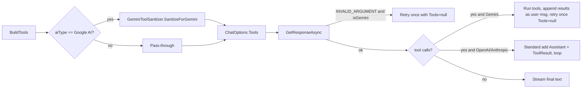
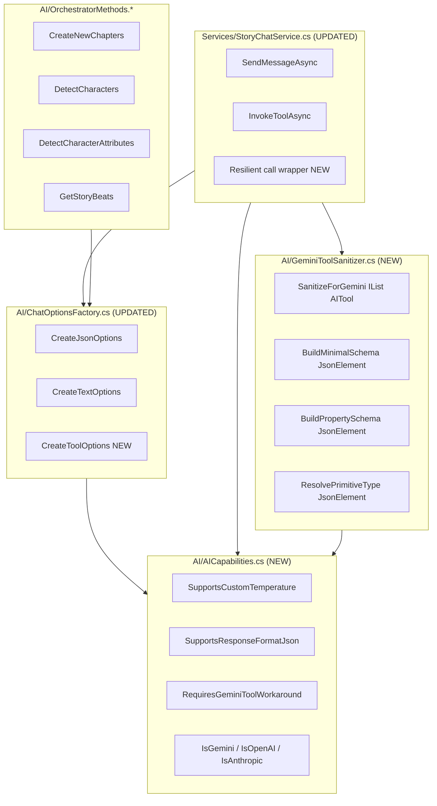
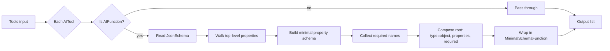
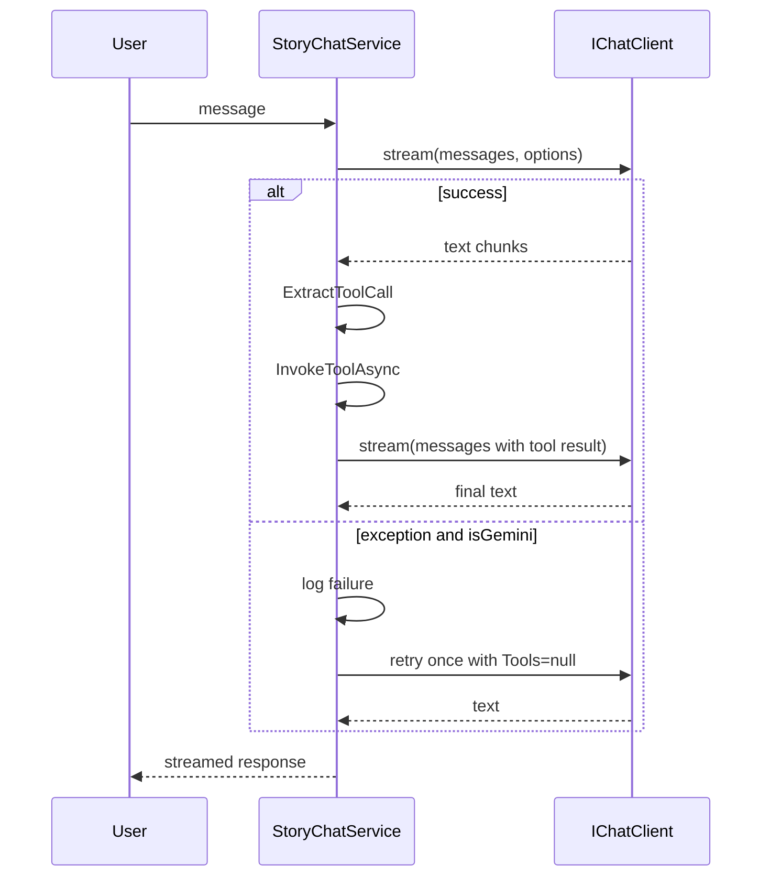
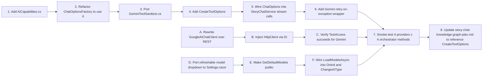
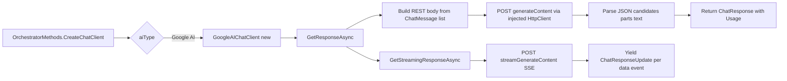
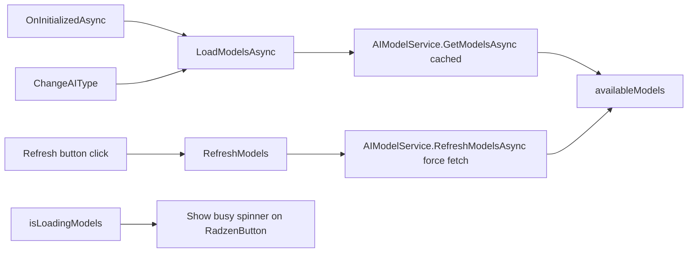

# AI Tool Calling Cross-Provider Compatibility Plan

## 1. Overview

The desktop AIStoryBuilders project recently landed commit [`fad7661`](https://github.com/AIStoryBuilders/AIStoryBuilders/commit/fad76614f1c6c5de11048a1df6433c16b63f4528) titled *"Gemini tool schema compatibility and error handling"*. That change addresses a class of cross-provider issues that AIStoryBuildersOnline is also exposed to:

1. Google Gemini's `parametersJsonSchema` validator rejects function/tool declarations that OpenAI and Anthropic accept (additional keywords, `oneOf`, `nullable`, type arrays, `additionalProperties`, missing `items`, etc.).
2. OpenAI's GPT‑5 family and `o`‑series reasoning models reject any non‑default `Temperature` value.
3. Gemini's follow‑up turn after a tool call is fragile: the SDK does not always emit thought‑signatures correctly, producing `INVALID_ARGUMENT` on the second round‑trip.
4. When a Gemini tool call fails outright, the user currently gets nothing — there is no "retry without tools" fallback.

In addition to those, AIStoryBuildersOnline has **two Online‑specific Google AI defects** that this document also addresses:

5. **Google AI doesn't work at all in the browser.** Saving Google AI on the Settings page throws `System.PlatformNotSupportedException: Arg_PlatformNotSupported`. The cause is `GoogleAIChatClient` using the `Mscc.GenerativeAI` SDK, which internally touches `HttpClientHandler` / socket / proxy APIs that are not implemented in the Blazor WebAssembly runtime. The fix is to bypass the SDK on this surface and call the Gemini REST endpoint directly with the injected `HttpClient` (the same approach `AIModelService.FetchFromGoogle` already uses successfully).
6. **The Settings page model list is not refreshable.** The desktop project's [`Settings.razor`](https://github.com/AIStoryBuilders/AIStoryBuilders/blob/main/Components/Pages/Settings.razor) replaces the per‑provider hard‑coded `colModels` / `colAnthropicModels` / `colGoogleModels` lists with a single dynamic `availableModels` collection populated from `AIModelService.GetModelsAsync` and exposes a `RefreshModels` button (Radzen icon button next to the dropdown) that calls `AIModelService.RefreshModelsAsync`. The Online project still uses the hard‑coded lists. The fix is to port the dynamic list, the loading state, and the refresh button.

This document proposes the equivalent mitigations for AIStoryBuildersOnline. The Online project has two distinct surfaces affected:

| Surface | Tool calling style | Affected by |
|---|---|---|
| `Services/StoryChatService.cs` (chat / knowledge‑graph mutations) | Custom JSON‑in‑text protocol (` ```tool ` blocks) — no `ChatOptions.Tools` | Issues 2, 4 |
| `AI/ChatOptionsFactory.cs` + orchestrator JSON callers | `Microsoft.Extensions.AI` `ChatOptions` (no `Tools`, but uses `ResponseFormat`, `Temperature`) | Issue 2, plus a Gemini JSON‑mode variant of issue 1 |
| Future tool‑calling work (planned in `docs/story-chat-knowledge-graph-plan.md`) | Native `AITool` / `AIFunction` via `Microsoft.Extensions.AI` | Issues 1, 3, 4 |

The plan therefore has five deliverables:

- **D1.** Port a `GeminiToolSanitizer` equivalent so any future native tool calling is Gemini‑safe from day one, and apply the same defensive subset to JSON‑schema response formats today.
- **D2.** Centralise *all* model‑capability gates (`SupportsCustomTemperature`, `SupportsResponseFormatJson`, `RequiresGeminiToolWorkaround`) in one helper class.
- **D3.** Add a tool‑call resilience layer (retry‑without‑tools, append‑results‑as‑user‑message for Gemini) to whichever service first introduces native tool calling, plus the JSON‑tool‑protocol equivalent for `StoryChatService`.
- **D4.** Replace the WebAssembly‑incompatible `Mscc.GenerativeAI` calls in `GoogleAIChatClient` with direct REST calls to the Gemini `generateContent` endpoint, eliminating `Arg_PlatformNotSupported` on Save.
- **D5.** Port the desktop Settings page's dynamic, refreshable model dropdown to the Online `Settings.razor`, replacing the three hard‑coded model lists.

---

## 2. Current State (Online repo)

### 2.1 `AI/ChatOptionsFactory.cs`

```csharp
private static bool SupportsExplicitTemperature(string model)
{
    return !string.IsNullOrWhiteSpace(model)
        && !model.StartsWith("gpt-5", StringComparison.OrdinalIgnoreCase);
}
```

Issues:
- Does **not** exclude OpenAI `o1`, `o3`, `o4`, or any future reasoning model that bans `temperature`.
- `Temperature = 0.0f` is also unsafe with the GPT‑5 family — currently this branch is *only* skipped for explicit‑temperature models, which is correct, but the gate name and semantics belong on a single capability service shared with chat.
- No equivalent guard for Anthropic models that ignore `TopP`/`FrequencyPenalty` (low priority, but worth one place to add it).

### 2.2 `Services/StoryChatService.cs`

- Sends prompts via `_client.GetStreamingResponseAsync(messages)` with **no** `ChatOptions` — meaning provider defaults are used. So this surface is *not* currently broken for GPT‑5 / Gemini today.
- Uses a markdown‑fenced JSON tool block protocol, parsed by `ExtractToolCall`. There is no JSON schema sent to the model, so Gemini's strict parameter validator is not invoked for this path. The risk surfaces only when/if this is migrated to native `ChatOptions.Tools` (see `docs/story-chat-knowledge-graph-plan.md`).
- There is **no fallback** when a model errors mid‑stream. A failed call surfaces a raw exception to the UI.

### 2.3 Orchestrator JSON callers

All four orchestrator partials (`CreateNewChapters`, `DetectCharacterAttributes`, `DetectCharacters`, `GetStoryBeats`) take `ChatOptions` from `ChatOptionsFactory`. They inherit the temperature gap above, and they set `ChatResponseFormatJson(null)` for Google AI — Gemini accepts this, but newer Gemini models tighten `responseSchema` validation in the same way they tighten `parametersJsonSchema`, so the same minimal‑schema rebuild logic is the safe long‑term answer when a structured `responseSchema` is added.

---

## 3. Desktop Reference Behaviour (commit `fad7661`)



Key elements:

- **`GeminiToolSanitizer.SanitizeForGemini(IList<AITool> tools)`** — wraps each `AIFunction` and **rebuilds** its parameter schema from scratch into the safe subset:
  - Root: `{ "type": "object", "properties": {...}, "required": [...] }`.
  - Property types: `string | number | integer | boolean | array | object`.
  - Arrays must include a primitive `items` schema (string fallback).
  - String enums pass through with `format: "enum"`.
  - Anything unknown / nullable / `oneOf` / `$ref` collapses to `string`.
- **`SupportsCustomTemperature(string modelId)`** — false for `gpt-5*`, `o1*`, `o3*`, `o4*`.
- **Gemini retry on exception** — when `aiType == "Google AI"` and an exception is thrown, retry once with `Tools = null`, log the failure, but still answer the user.
- **Gemini "no second tool turn"** — when Gemini returns tool calls, run them locally, format the results as a single user message, and ask the model again with `Tools = null` for the final answer (avoids fragile thought‑signature handling).
- **`SerializeToolResult(object)`** — uniform JSON serialization of tool outputs with `WriteIndented = true`.

---

## 4. Target Architecture for Online



Edge labels avoid leading numbers per the renderer's quirk.

---

## 5. Detailed Changes

### 5.1 New file: `AI/AICapabilities.cs`

Centralises every "does this provider/model support X" rule. Replaces the local `SupportsExplicitTemperature` in `ChatOptionsFactory` and pre‑creates the helpers `StoryChatService` will need once it adopts `ChatOptions`.

```csharp
namespace AIStoryBuilders.AI;

internal static class AICapabilities
{
    public static bool IsGemini(string aiType) =>
        string.Equals(aiType, "Google AI", StringComparison.OrdinalIgnoreCase);

    public static bool IsAnthropic(string aiType) =>
        string.Equals(aiType, "Anthropic", StringComparison.OrdinalIgnoreCase);

    public static bool IsOpenAI(string aiType) =>
        string.Equals(aiType, "OpenAI", StringComparison.OrdinalIgnoreCase)
        || string.Equals(aiType, "Azure OpenAI", StringComparison.OrdinalIgnoreCase);

    /// <summary>
    /// OpenAI GPT-5 and o-series reasoning models reject any explicit
    /// temperature (must be the provider default of 1.0).
    /// </summary>
    public static bool SupportsCustomTemperature(string modelId)
    {
        if (string.IsNullOrWhiteSpace(modelId)) return true;
        var id = modelId.Trim().ToLowerInvariant();
        if (id.StartsWith("gpt-5")) return false;
        if (id.StartsWith("o1") || id.StartsWith("o3") || id.StartsWith("o4")) return false;
        return true;
    }

    /// <summary>
    /// Whether the provider needs the "run tools locally and re-ask without
    /// Tools" workaround documented for Gemini in commit fad7661.
    /// </summary>
    public static bool RequiresGeminiToolWorkaround(string aiType) => IsGemini(aiType);
}
```

### 5.2 Updated file: `AI/ChatOptionsFactory.cs`

- Replace the local `SupportsExplicitTemperature` with `AICapabilities.SupportsCustomTemperature`.
- Add `CreateToolOptions(aiType, model, IList<AITool> tools)` for future native‑tool callers.
- Apply `GeminiToolSanitizer.SanitizeForGemini` inside `CreateToolOptions` when `aiType == "Google AI"`.

```csharp
public static ChatOptions CreateToolOptions(string aiType, string model, IList<AITool> tools)
{
    var safeTools = AICapabilities.IsGemini(aiType)
        ? GeminiToolSanitizer.SanitizeForGemini(tools)
        : tools;

    var options = new ChatOptions
    {
        ModelId = model,
        Tools = safeTools,
        TopP = 1.0f
    };

    if (AICapabilities.SupportsCustomTemperature(model))
    {
        options.Temperature = 0.7f;
    }

    return options;
}
```

### 5.3 New file: `AI/GeminiToolSanitizer.cs`

Direct port of the desktop class. Copy verbatim, with the namespace updated to `AIStoryBuilders.AI`. Behaviour:



Allowed property types: `string`, `number`, `integer`, `boolean`, `array` (with primitive `items`), `object` (empty). String enums pass through with `format: "enum"`. Anything else degrades to `string`.

### 5.4 Updated file: `Services/StoryChatService.cs`

Even though the chat path uses the JSON‑in‑text tool protocol, two small mitigations apply now:

**A. Pass `ChatOptions` to `GetStreamingResponseAsync`** so the temperature gate kicks in for GPT‑5 / o‑series:

```csharp
var aiType = SettingsService.AIType;
var modelId = SettingsService.AIModel;
var options = ChatOptionsFactory.CreateTextOptions(aiType, modelId);

await foreach (var update in _client.GetStreamingResponseAsync(messages, options, cancellationToken))
{
    // ...
}
```

**B. Add a non‑streaming resilience wrapper** for the *next* turn after a tool result is appended (this is where Gemini most often INVALID_ARGUMENT‑s in practice). On exception, retry once with the same options minus any future `Tools` and log via `LogService`.



**C. (Optional, when migrating to native tools)** mirror desktop's "Gemini: run tools, append results as a user message, ask once more without Tools" branch in the tool loop. Code lives behind `AICapabilities.RequiresGeminiToolWorkaround(aiType)`.

### 5.5 Updated files: `OrchestratorMethods.*.cs`

No code changes required beyond a re‑build, because `ChatOptionsFactory` is the single point of change. Verify by smoke‑testing each method against:

- `gpt-5-mini` (must omit temperature),
- `o1-mini` (must omit temperature — currently broken),
- `gemini-2.0-flash` (response format JSON must still work),
- `claude-3-5-sonnet-latest` (sanity check).

---

## 6. Mapping: Desktop commit → Online change

| Desktop change | Online equivalent | File |
|---|---|---|
| `AI/GeminiToolSanitizer.cs` (new, 192 lines) | Port verbatim | `AI/GeminiToolSanitizer.cs` |
| `SupportsCustomTemperature` in `StoryChatService` | Move to shared helper | `AI/AICapabilities.cs` |
| Conditional `options.Temperature = 0.7f` | Same gate, applied in factory | `AI/ChatOptionsFactory.cs` |
| Sanitize tools when `aiType == "Google AI"` | Same gate | `AI/ChatOptionsFactory.CreateToolOptions` |
| `try/catch` Gemini retry without tools | Same gate | `Services/StoryChatService.SendMessageAsync` |
| Gemini "run tools locally, append as user msg" | Behind capability flag, applies to native tools branch only | `Services/StoryChatService` (when native tools land) |
| `SerializeToolResult` helper | Already exists (`SerializeToolResult` and the `confirmResult` JSON path) | Keep as is |

---

## 7. Risks and Edge Cases

- **Schema loss.** The sanitizer collapses unknown shapes to `string`. Tools that depend on nested objects or `oneOf` will lose fidelity *for Gemini only*. Document this in each tool's XML doc.
- **Capability drift.** When OpenAI ships `o5` / `gpt-6`, the gate must be updated. Add a unit test in a new `AIStoryBuildersOnline.Tests` project (if/when it exists) covering the model‑id table.
- **`ResponseFormat` and Gemini.** If `responseSchema` is ever added to `ChatResponseFormatJson`, it needs the same minimal‑subset treatment. Track as a follow‑up.
- **Streaming + retry.** The current chat surface streams tokens to the UI. If the first call throws *after* yielding partial text, the retry will produce duplicate text. The wrapper must only retry when nothing has been yielded yet.
- **Logging.** Use `LogService.WriteToLog` (sync where async is unavailable) for retry events so users can self‑diagnose. Match the desktop log message format: `"Gemini call failed with tools attached. Retrying without tools. Model={modelId}. Round={round}. Error={ex.Message}"`.

---

## 8. Implementation Order



Tracks A–C and D–F are independent of each other and of the tool‑calling work, so they can be done in any order or in parallel. **Track A–C should ship first** — it unblocks any Gemini usage at all.

---

## 9. Acceptance Criteria

- [ ] `gpt-5`, `gpt-5-mini`, `o1-*`, `o3-*`, `o4-*` calls succeed in all four orchestrator methods (no `Temperature is not supported` errors).
- [ ] `gemini-2.0-flash` and `gemini-1.5-pro` succeed in all four orchestrator methods and in `StoryChatService.SendMessageAsync`.
- [ ] When Gemini throws mid‑call, the user sees a coherent answer (or a logged graceful failure), never an unhandled exception.
- [ ] When native tools are introduced, `ChatOptions.Tools` for Gemini is the sanitized list — verifiable by serializing `tool.JsonSchema` and asserting only `type / properties / required` are present at the root.
- [ ] `AICapabilities` is the *only* file that names specific model‑id prefixes.
- [ ] No regressions for OpenAI `gpt-4o*` or Anthropic `claude-3-*`.

---

---

## 10. Google AI on Blazor WebAssembly: Fix `Arg_PlatformNotSupported`

### 10.1 Symptom

On the Settings page, with `AIType = "Google AI"` selected, clicking **Save** raises:

```
System.PlatformNotSupportedException: Arg_PlatformNotSupported
```

`SettingsSave` calls `OrchestratorMethods.TestAccess`, which builds an `IChatClient` via `OrchestratorMethods.CreateChatClient`. For Google that returns `GoogleAIChatClient`, which calls into `Mscc.GenerativeAI`:

```csharp
_googleAI = new GoogleAI(apiKey);
// ...
var model = _googleAI.GenerativeModel(model: _modelId, ...);
var response = await model.GenerateContent(prompt, generationConfig);
```

### 10.2 Root cause

`Mscc.GenerativeAI`'s request pipeline configures an `HttpClientHandler` (proxy / cookies / automatic decompression / SocketsHttpHandler properties), and on Blazor WebAssembly the runtime's `BrowserHttpHandler` throws `PlatformNotSupportedException` on those properties. Anthropic and OpenAI work because their clients in this repo (`AnthropicChatClient`, the `Microsoft.Extensions.AI` OpenAI adapter) talk over the injected `HttpClient`, which is configured to use `BrowserHttpHandler` natively.

There is no flag on `Mscc.GenerativeAI` that disables the unsupported handler properties, so the SDK is unsuitable for the WASM head.

### 10.3 Fix: replace SDK calls with direct REST

Rewrite `AI/GoogleAIChatClient.cs` to call Gemini's REST endpoint directly using the constructor‑injected `HttpClient`:

```
POST https://generativelanguage.googleapis.com/v1beta/models/{model}:generateContent?key={apiKey}
```

Streaming uses:

```
POST https://generativelanguage.googleapis.com/v1beta/models/{model}:streamGenerateContent?alt=sse&key={apiKey}
```

Body shape (only the keys we need):

```json
{
  "systemInstruction": { "parts": [ { "text": "<system>" } ] },
  "contents": [
    { "role": "user",  "parts": [ { "text": "..." } ] },
    { "role": "model", "parts": [ { "text": "..." } ] }
  ],
  "generationConfig": {
    "temperature": 0.7,
    "topP": 1.0,
    "responseMimeType": "application/json"
  }
}
```

Mapping rules:

| `Microsoft.Extensions.AI` value | Gemini REST value |
|---|---|
| `ChatRole.System` | top‑level `systemInstruction` (not in `contents`) |
| `ChatRole.User` | `contents[].role = "user"` |
| `ChatRole.Assistant` | `contents[].role = "model"` |
| `options.Temperature` | `generationConfig.temperature` (omit when `AICapabilities.SupportsCustomTemperature` is false — though Gemini accepts any value, this keeps the gate centralized) |
| `options.TopP` | `generationConfig.topP` |
| `options.ResponseFormat is ChatResponseFormatJson` | `generationConfig.responseMimeType = "application/json"` |
| `response.candidates[0].content.parts[*].text` (concatenated) | `ChatResponse.Messages[0].Text` |
| `response.usageMetadata.{prompt,candidates,total}TokenCount` | `ChatResponse.Usage` |

### 10.4 Streaming

`GetStreamingResponseAsync` currently does `yield break;`, which means *no* streaming for Gemini today. The REST replacement should use `streamGenerateContent?alt=sse`, parse Server‑Sent‑Events (`data: { ... }` lines), and `yield return new ChatResponseUpdate(ChatRole.Assistant, partText)` per chunk. Until the SSE plumbing lands, fall back to: call `GetResponseAsync` non‑streamingly, then `yield return` the full text once. That is still strictly better than the current `yield break;`.

### 10.5 Diagram



### 10.6 Constructor change

Inject `HttpClient` so the same DI‑configured client (with `BrowserHttpHandler`) is reused:

```csharp
public GoogleAIChatClient(string apiKey, string modelId, HttpClient httpClient)
{
    _apiKey = apiKey ?? throw new ArgumentNullException(nameof(apiKey));
    _modelId = modelId ?? throw new ArgumentNullException(nameof(modelId));
    _httpClient = httpClient ?? throw new ArgumentNullException(nameof(httpClient));
}
```

`OrchestratorMethods.CreateChatClient` must therefore inject `HttpClient` from DI when constructing the Google client. Audit `Program.cs` to confirm `HttpClient` is registered (`builder.Services.AddScoped(sp => new HttpClient { ... })`) — if not, add it.

### 10.7 Acceptance criteria for Google REST

- [ ] Saving Google AI on Settings no longer throws `PlatformNotSupportedException`.
- [ ] `TestAccess` returns `true` for at least `gemini-2.0-flash`, `gemini-2.5-flash`, `gemini-1.5-pro`.
- [ ] `OrchestratorMethods.CreateNewChapters` (JSON path) returns valid JSON for Google AI.
- [ ] No reference to `Mscc.GenerativeAI` remains in `GoogleAIChatClient.cs`. The package can stay referenced (other surfaces may use it) but this client is independent of it.
- [ ] Streaming yields at least one `ChatResponseUpdate` for `StoryChatService` Gemini calls (full‑text fallback acceptable until SSE is wired).

### 10.8 Risks

- **Tool calling.** Once native tool calling lands (per Section 5), the REST body must be extended with `tools` and `toolConfig`, and the response must be inspected for `functionCall` parts. That is a follow‑up; this phase is text/JSON only.
- **Safety filters.** Gemini may return `promptFeedback.blockReason` with no `candidates`. Treat that as an error and surface the reason to the user instead of returning empty text.
- **Quota / 429.** Detect `429` and throw a typed exception so the resilience wrapper in Section 5.4 can decide whether to retry.

---

## 11. Settings Page: Refreshable Model Dropdown

### 11.1 Current state

`Components/Pages/Settings.razor` hard‑codes three lists:

```csharp
List<string> colModels          = new() { "gpt-4o", "gpt-4o-mini", ... "o4-mini" };
List<string> colAnthropicModels = new() { "claude-sonnet-4-...", ... };
List<string> colGoogleModels    = new() { "gemini-2.5-pro", "gemini-2.5-flash", ... };
```

…and selects which list to bind to a `RadzenDropDown` based on `AIType`. There is no API‑backed refresh — when Anthropic ships a new model the user has to wait for a code update.

The desktop [`Settings.razor`](https://github.com/AIStoryBuilders/AIStoryBuilders/blob/main/Components/Pages/Settings.razor) already does the right thing: a single `availableModels` list, an `AIModelService` injection, and a Radzen refresh icon button.

`AIStoryBuildersOnline` already has `AI/AIModelService.cs` with `GetModelsAsync` (cached) and `RefreshModelsAsync` (force fetch). The service is **already correct** — it talks to OpenAI's and Google's REST APIs over the WASM‑safe `HttpClient`. Only the UI needs to be ported.

### 11.2 Target UI



### 11.3 Razor changes

Replace the three per‑type `RadzenFormField` blocks with one shared block:

```razor
<RadzenFormField Text="@ModelFieldLabel" Variant="@variant">
    <RadzenStack Orientation="Orientation.Horizontal" Gap="4" AlignItems="AlignItems.Center">
        <RadzenDropDown Data="@availableModels"
                        @bind-Value="@AIModel"
                        Style="width:350px;"
                        AllowFiltering="true"
                        FilterCaseSensitivity="FilterCaseSensitivity.CaseInsensitive"
                        AllowClear="true"
                        Placeholder="Select or type a model..." />
        <RadzenButton Icon="refresh"
                      ButtonStyle="ButtonStyle.Light"
                      Size="ButtonSize.Small"
                      Click="@RefreshModels"
                      IsBusy="@isLoadingModels"
                      title="Refresh models from API" />
    </RadzenStack>
</RadzenFormField>

@if (isLoadingModels)
{
    <RadzenText TextStyle="TextStyle.Caption" Style="color: #6b7280;">
        <RadzenIcon Icon="hourglass_empty" Style="font-size: 14px;" />
        Loading available models...
    </RadzenText>
}
```

Keep the Azure OpenAI Endpoint / API Version fields above this block (Azure is a deployment‑name field, not a model dropdown — but the desktop port reuses the same dropdown bound to `AIModelService.GetDefaultModels("Azure OpenAI")`, which returns an empty list, so the user types into the filter field; that behaviour is acceptable here too).

### 11.4 Code changes

Add `@inject AIModelService AIModelService` (already registered in DI per `Program.cs`).

Replace the three list fields with:

```csharp
List<string> availableModels = new();
bool isLoadingModels = false;

string ModelFieldLabel => AIType switch
{
    "Azure OpenAI" => "Azure OpenAI Model Deployment Name:",
    "Anthropic"   => "Anthropic Model:",
    "Google AI"   => "Google AI Model:",
    _             => "Default AI Model:"
};
```

Add `LoadModelsAsync` and `RefreshModels` (port verbatim from desktop, switching the desktop signature `(aiType, apiKey, endpoint, apiVersion)` to the Online `AIModelService.GetModelsAsync(string, string, string)` signature — Online's service does not take `apiVersion`):

```csharp
private async Task LoadModelsAsync()
{
    isLoadingModels = true;
    StateHasChanged();
    try
    {
        availableModels = await AIModelService.GetModelsAsync(AIType, ApiKey, Endpoint);
        if (!string.IsNullOrWhiteSpace(AIModel) && !availableModels.Contains(AIModel))
            availableModels.Insert(0, AIModel);
    }
    catch
    {
        availableModels = AIModelService.GetDefaultModels(AIType);
    }
    finally
    {
        isLoadingModels = false;
        StateHasChanged();
    }
}

private async Task RefreshModels()
{
    if (string.IsNullOrWhiteSpace(ApiKey))
    {
        NotificationService.Notify(new NotificationMessage
        {
            Severity = NotificationSeverity.Warning,
            Summary = "API Key Required",
            Detail = "Enter an API key first to fetch available models.",
            Duration = 3000
        });
        return;
    }

    isLoadingModels = true;
    StateHasChanged();
    try
    {
        availableModels = await AIModelService.RefreshModelsAsync(AIType, ApiKey, Endpoint);
        if (!string.IsNullOrWhiteSpace(AIModel) && !availableModels.Contains(AIModel))
            availableModels.Insert(0, AIModel);

        NotificationService.Notify(new NotificationMessage
        {
            Severity = NotificationSeverity.Success,
            Summary = "Models Refreshed",
            Detail = $"Found {availableModels.Count} available models.",
            Duration = 3000
        });
    }
    catch (Exception ex)
    {
        NotificationService.Notify(new NotificationMessage
        {
            Severity = NotificationSeverity.Error,
            Summary = "Refresh Failed",
            Detail = $"Could not fetch models: {ex.Message}",
            Duration = 4000
        });
        availableModels = AIModelService.GetDefaultModels(AIType);
    }
    finally
    {
        isLoadingModels = false;
        StateHasChanged();
    }
}
```

Make `AIModelService.GetDefaultModels` `public` (currently `private`) so the catch branches can fall back to it. This is a one‑word change.

Wire `OnInitializedAsync` (after settings load) and `ChangeAIType` to call `await LoadModelsAsync()`. `ChangeAIType` must become `async Task` rather than `void`.

### 11.5 DI sanity check

Confirm in `Program.cs`:

```csharp
builder.Services.AddBlazoredLocalStorage();
builder.Services.AddScoped(sp => new HttpClient { ... });
builder.Services.AddScoped<AIModelService>();
```

If `AIModelService` is not yet registered, add it. Same for `HttpClient` (required for both this change and Section 10).

### 11.6 Acceptance criteria for Settings refresh

- [ ] No `colModels`, `colAnthropicModels`, `colGoogleModels` references remain in `Settings.razor`.
- [ ] A refresh icon button appears next to the model dropdown for every provider.
- [ ] Clicking refresh shows a busy state, calls `RefreshModelsAsync`, and notifies success or failure.
- [ ] On first visit, `OnInitializedAsync` populates the dropdown from cache without a network round trip when cache is fresh (≤ 24 h per `AIModelService.CacheDuration`).
- [ ] Switching AI provider re‑populates the dropdown from cache or the network without page reload.
- [ ] When `ApiKey` is empty, refresh shows a warning toast instead of throwing.

---

## 12. Out of Scope

- Migrating `StoryChatService` from the markdown JSON tool protocol to native `Microsoft.Extensions.AI` `AITool` / `AIFunction`. That is tracked separately in [`docs/story-chat-knowledge-graph-plan.md`](story-chat-knowledge-graph-plan.md). This plan only ensures the substrate is ready when that migration begins.
- Anthropic prompt‑caching headers and Bedrock/Vertex routing — unrelated to the tool‑schema problem.
- Replacing the JSON tool protocol's prompt template — it works on all three providers today and is provider‑agnostic by construction.
