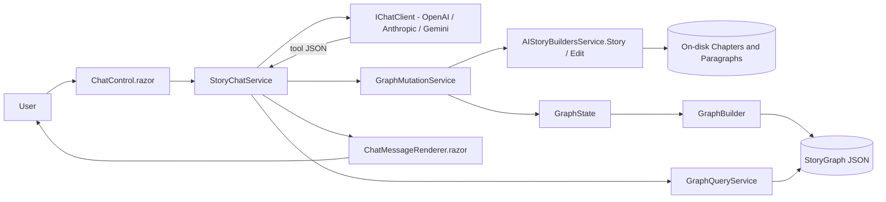
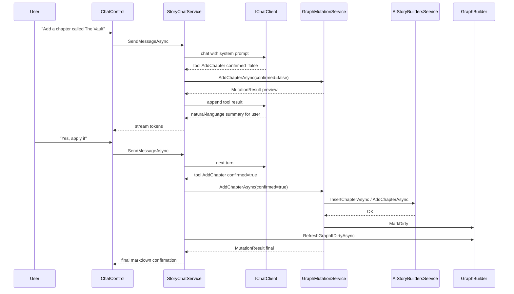
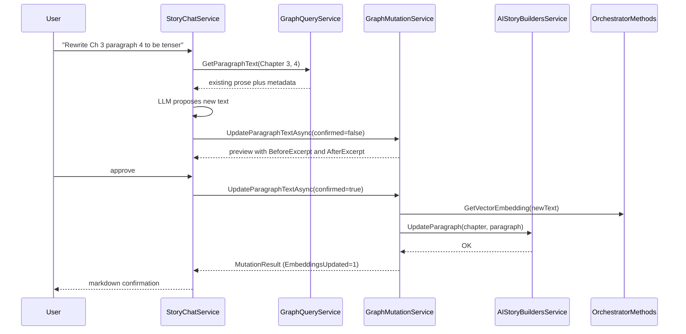
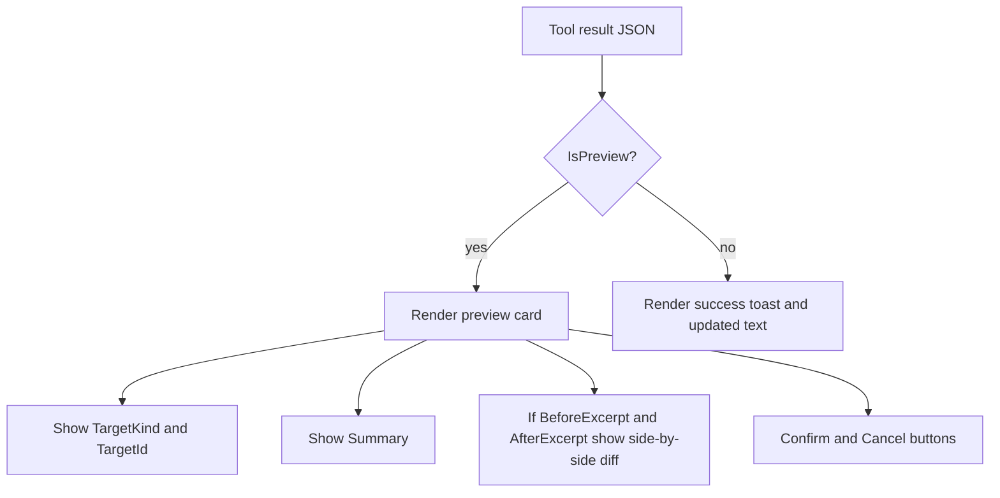

# Chat-Driven Chapter & Paragraph Authoring Plan

> Extend the existing **Story Chat Assistant** so that it can **add / edit chapters** and **add / edit paragraph text within chapters** directly from chat, using the same preview + confirm mutation protocol already used for characters, locations, timelines, and world facts.

This document builds on [story-chat-knowledge-graph-plan.md](story-chat-knowledge-graph-plan.md). It describes every new artifact, wiring change, tool schema, prompt update, and UX touch-point required so that a developer can begin implementation directly from this plan.

---

## 1. Goals

1. Let users manipulate **structural** story content (chapters, paragraphs) from chat, not only metadata.
2. Keep the chat **safe**: every write goes through a `confirmed=false` preview step before it is applied.
3. Re-use existing filesystem primitives in [Services/AIStoryBuildersService.Story.cs](Services/AIStoryBuildersService.Story.cs) and [Services/AIStoryBuildersService.Edit.cs](Services/AIStoryBuildersService.Edit.cs) — `AddChapterAsync`, `InsertChapterAsync`, `UpdateChapterAsync`, `DeleteChapter`, `AddParagraph`, `UpdateParagraph`, `RestructureChapters`, `RestructureParagraphs`.
4. Keep the **knowledge graph**, **vector embeddings**, and **master-story index** in sync after every mutation.
5. Ship with an expanded system prompt, new `IGraphMutationService` methods, new `StoryChatService` tool dispatcher entries, and a bumped `ChatControl` preview UI.

## 2. Non-Goals

- Generating prose with the writing pipeline from chat (that stays in the paragraph UI).
- Reordering paragraphs beyond the `Sequence` field semantics already supported by `RestructureParagraphs`.
- Multi-document / cross-story edits.

---

## 3. Feature Inventory

| # | Feature | New / Modified Artifacts |
|---|---------|--------------------------|
| 1 | New mutation methods on the mutation service | [Services/IGraphMutationService.cs](Services/IGraphMutationService.cs), [Services/GraphMutationService.cs](Services/GraphMutationService.cs) |
| 2 | New write tools in the chat dispatcher | [Services/StoryChatService.cs](Services/StoryChatService.cs) |
| 3 | Updated system prompt (tool catalog) | [Services/StoryChatService.cs](Services/StoryChatService.cs) |
| 4 | Paragraph read helper for chat context | [Services/GraphQueryService.cs](Services/GraphQueryService.cs), [Services/IGraphQueryService.cs](Services/IGraphQueryService.cs) |
| 5 | Chapter / paragraph resolver helpers | [Services/AIStoryBuildersService.Story.cs](Services/AIStoryBuildersService.Story.cs) |
| 6 | Inline preview renderer (diff / before-after) | [Components/Pages/Controls/Chat/ChatMessageRenderer.razor](Components/Pages/Controls/Chat/ChatMessageRenderer.razor) |
| 7 | Chat tool-call log entries for chapter/paragraph edits | [Services/LogService.cs](Services/LogService.cs) |
| 8 | Re-embed + graph refresh after paragraph edits | [Services/AIStoryBuildersService.ReEmbed.cs](Services/AIStoryBuildersService.ReEmbed.cs), `GraphState.MarkDirty()` |

---

## 4. High-Level Architecture



### Layering rules

- `StoryChatService` only talks to `IGraphQueryService` / `IGraphMutationService`; it never calls `AIStoryBuildersService` directly for chapter or paragraph writes.
- `GraphMutationService` is the only place that calls the chapter / paragraph write helpers on `AIStoryBuildersService`.
- Every write path ends with `GraphState.MarkDirty()` so the next chat turn auto-rebuilds the graph via `RefreshGraphIfDirtyAsync`.

---

## 5. Tool Schema (additions)

All tools follow the existing protocol: the LLM emits a fenced block with language `tool` containing `{ "name": "...", "args": { ... } }`. Every write is called twice — first with `"confirmed": false` (preview), then with `"confirmed": true` (apply) after explicit user approval.

### 5.1 Read tools

| Tool | Args | Returns |
|------|------|---------|
| `GetChapter` (already exists) | `title` | `ChapterGraphNode` |
| `ListChapters` (already exists) | — | `ChapterGraphNode[]` |
| `GetParagraph` (already exists) | `chapter`, `index` | `ParagraphGraphNode` |
| `ListParagraphs` (new) | `chapter` | `ParagraphGraphNode[]` — ordered by `Sequence` |
| `GetParagraphText` (new) | `chapter`, `index` | `{ text, location, timeline, characters[] }` |

### 5.2 Write tools (preview + confirm)

| Tool | Args | Behavior |
|------|------|----------|
| `AddChapter` | `title`, `synopsis`, `sequence?`, `confirmed` | If `sequence` omitted, append. Otherwise insert and shift. |
| `UpdateChapter` | `title`, `newTitle?`, `synopsis?`, `confirmed` | Rename or rewrite synopsis (re-embeds synopsis). |
| `DeleteChapter` | `title`, `confirmed` | Remove chapter folder and compact numbering. |
| `AddParagraph` | `chapter`, `sequence?`, `text`, `location?`, `timeline?`, `characters?[]`, `confirmed` | Append or insert; shifts later paragraphs. |
| `UpdateParagraphText` | `chapter`, `index`, `text`, `confirmed` | Rewrites prose, re-embeds, preserves metadata. |
| `UpdateParagraphMetadata` | `chapter`, `index`, `location?`, `timeline?`, `characters?[]`, `confirmed` | Metadata-only update, no re-embed. |
| `DeleteParagraph` | `chapter`, `index`, `confirmed` | Deletes and compacts numbering. |

### 5.3 JSON example (UpdateParagraphText)

```tool
{
  "name": "UpdateParagraphText",
  "args": {
    "chapter": "Chapter 3",
    "index": 4,
    "text": "The corridor smelled of rain and copper...",
    "confirmed": false
  }
}
```

Preview response shape (`MutationResult`):

```json
{
  "IsPreview": true,
  "Success": true,
  "Summary": "Will replace Chapter 3 / Paragraph 4 text (812 -> 734 chars). Embedding will be regenerated.",
  "BeforeExcerpt": "The corridor smelled of dust ...",
  "AfterExcerpt":  "The corridor smelled of rain ...",
  "EmbeddingsUpdated": 0,
  "GraphRefreshed": false
}
```

---

## 6. New / Extended Types

### 6.1 `MutationResult` additions

Add optional diagnostic fields (non-breaking for existing callers):

```csharp
public class MutationResult
{
    public bool IsPreview { get; set; }
    public bool Success { get; set; }
    public string Summary { get; set; }
    public int EmbeddingsUpdated { get; set; }
    public bool GraphRefreshed { get; set; }

    // New:
    public string BeforeExcerpt { get; set; }
    public string AfterExcerpt { get; set; }
    public string TargetKind { get; set; }   // "Chapter" | "Paragraph"
    public string TargetId { get; set; }     // e.g. "Chapter 3 / Paragraph 4"
}
```

### 6.2 `IGraphMutationService` additions

```csharp
Task<MutationResult> AddChapterAsync(string title, string synopsis, int? sequence, bool confirmed);
Task<MutationResult> UpdateChapterAsync(string title, string newTitle, string synopsis, bool confirmed);
Task<MutationResult> DeleteChapterAsync(string title, bool confirmed);

Task<MutationResult> AddParagraphAsync(string chapter, int? sequence, string text,
    string location, string timeline, IEnumerable<string> characters, bool confirmed);
Task<MutationResult> UpdateParagraphTextAsync(string chapter, int index, string text, bool confirmed);
Task<MutationResult> UpdateParagraphMetadataAsync(string chapter, int index,
    string location, string timeline, IEnumerable<string> characters, bool confirmed);
Task<MutationResult> DeleteParagraphAsync(string chapter, int index, bool confirmed);
```

### 6.3 `IGraphQueryService` additions

```csharp
IReadOnlyList<ParagraphGraphNode> ListParagraphs(string chapter);
ParagraphTextDto GetParagraphText(string chapter, int index);
```

`ParagraphTextDto` is a thin record: `(string Text, string Location, string Timeline, string[] Characters)`.

---

## 7. Write Pipelines (sequence diagrams)

### 7.1 Add Chapter



### 7.2 Update Paragraph Text



---

## 8. Filesystem Layout Impact

No new on-disk structure. Existing convention is reused:

```
{BasePath}/{StoryTitle}/Chapters/
    ChapterN/
        ChapterN.txt          <- synopsis + embedding
        Paragraph1.txt        <- "location|timeline|[chars]|text|embedding"
        Paragraph2.txt
        ...
```

Key invariants enforced by the mutation service:

- Chapter folder name is `"Chapter" + Sequence` (no space), matching `objChapter.ChapterName.Replace(" ", "")`.
- Paragraph files are `Paragraph{n}.txt` with contiguous numbering starting at 1.
- `RestructureChapters(..., Add|Delete)` runs before/after chapter inserts/deletes to keep numbering contiguous.
- `RestructureParagraphs(chapter, n, Add|Delete)` does the same per-chapter.
- Embedding is regenerated **only** for text changes (paragraph text, chapter synopsis).

---

## 9. `GraphMutationService` Implementation Notes

Pattern for every new method mirrors the existing `RenameCharacterAsync`:

1. If `!confirmed`, compute a summary string plus `BeforeExcerpt` / `AfterExcerpt` and return `IsPreview = true` **without** touching disk.
2. Validate (`CurrentStory != null`, chapter/paragraph exists, numeric bounds) and return `Fail(...)` on error.
3. Call the corresponding `AIStoryBuildersService` helper.
4. For text-mutating operations, call `OrchestratorMethods.GetVectorEmbedding` and set `EmbeddingsUpdated`.
5. Call `GraphState.MarkDirty()`.
6. Return `MutationResult` with `IsPreview = false`, `Success = true`, a user-facing `Summary`, and the populated diagnostic fields.
7. Log via `_log.WriteToLogAsync(nameof(Method) + ": ...")` on every exception.

### 9.1 Validation helpers (new, private in `GraphMutationService`)

```csharp
private async Task<Chapter> ResolveChapterAsync(string title);
private async Task<(Chapter chapter, Paragraph paragraph)> ResolveParagraphAsync(string chapterTitle, int index);
private static string Excerpt(string text, int max = 160);
```

`ResolveChapterAsync` does case-insensitive match against `ListChapters()` results. `ResolveParagraphAsync` loads the chapter's paragraphs via `AIStoryBuildersService.GetParagraphs` and indexes by `Sequence`.

---

## 10. System Prompt Update

Append the following block to the output of `BuildSystemPrompt()` in [Services/StoryChatService.cs](Services/StoryChatService.cs), immediately after the existing write-tool list:

```
- AddChapter(title, synopsis, sequence, confirmed)
- UpdateChapter(title, newTitle, synopsis, confirmed)
- DeleteChapter(title, confirmed)
- AddParagraph(chapter, sequence, text, location, timeline, characters, confirmed)
- UpdateParagraphText(chapter, index, text, confirmed)
- UpdateParagraphMetadata(chapter, index, location, timeline, characters, confirmed)
- DeleteParagraph(chapter, index, confirmed)

Rules for structural edits:
- Before UpdateParagraphText, always call GetParagraphText first to anchor the new prose to current metadata.
- Paragraph index is 1-based, matching the Sequence field.
- If the user asks to "replace" or "rewrite" a paragraph, prefer UpdateParagraphText.
- If the user asks to reorder paragraphs, express it as DeleteParagraph then AddParagraph with the desired sequence.
- Omit the sequence arg to append.
```

Also expand the read-tool list with `ListParagraphs(chapter)` and `GetParagraphText(chapter, index)`.

---

## 11. Dispatcher Additions (`InvokeToolAsync` switch)

```csharp
"ListParagraphs"           => _query.ListParagraphs(A(args, "chapter")),
"GetParagraphText"         => _query.GetParagraphText(A(args, "chapter"), I(args, "index")),

"AddChapter"               => await _mutation.AddChapterAsync(
                                 A(args, "title"), A(args, "synopsis"),
                                 IOpt(args, "sequence"), B(args, "confirmed")),
"UpdateChapter"            => await _mutation.UpdateChapterAsync(
                                 A(args, "title"), A(args, "newTitle"),
                                 A(args, "synopsis"), B(args, "confirmed")),
"DeleteChapter"            => await _mutation.DeleteChapterAsync(
                                 A(args, "title"), B(args, "confirmed")),

"AddParagraph"             => await _mutation.AddParagraphAsync(
                                 A(args, "chapter"), IOpt(args, "sequence"),
                                 A(args, "text"), A(args, "location"),
                                 A(args, "timeline"), SArr(args, "characters"),
                                 B(args, "confirmed")),
"UpdateParagraphText"      => await _mutation.UpdateParagraphTextAsync(
                                 A(args, "chapter"), I(args, "index"),
                                 A(args, "text"), B(args, "confirmed")),
"UpdateParagraphMetadata"  => await _mutation.UpdateParagraphMetadataAsync(
                                 A(args, "chapter"), I(args, "index"),
                                 A(args, "location"), A(args, "timeline"),
                                 SArr(args, "characters"), B(args, "confirmed")),
"DeleteParagraph"          => await _mutation.DeleteParagraphAsync(
                                 A(args, "chapter"), I(args, "index"),
                                 B(args, "confirmed")),
```

Add two new argument helpers alongside the existing `A`/`I`/`B`:

- `IOpt(args, key)` — nullable int (returns `null` if absent).
- `SArr(args, key)` — `IEnumerable<string>` parsed from a JSON array or comma-separated string.

---

## 12. UI / Preview Rendering

### 12.1 ChatMessageRenderer preview card

When the assistant streams a tool-result block from any structural mutation, render a **preview card** above the assistant text:



- Confirm sends a synthetic user turn: `"Yes, apply it."` (feeds the LLM so it re-emits the same tool call with `confirmed=true`).
- Cancel sends: `"Cancel, do not apply."`.
- Buttons are only active until the next user turn, then they disappear.

### 12.2 ChatControl surfacing

No structural change to `ChatControl.razor`; the existing streaming pipeline is reused. Add one scoped CSS class `.tool-preview-card` to style the diff panel.

---

## 13. Graph & Embedding Sync Flow


Rules:

- Chapter synopsis edits regenerate only the chapter-level embedding file.
- Paragraph text edits regenerate only that paragraph's embedding.
- Chapter delete / insert triggers `RestructureChapters`, which does not need embedding regeneration but **does** invalidate graph state.
- Paragraph delete / insert triggers `RestructureParagraphs`, same note.

---

## 14. Error Handling & Edge Cases

| Case | Behavior |
|------|----------|
| Chapter title not found | `MutationResult.Success = false`, `Summary = "Chapter '<x>' not found."` |
| Paragraph index out of range | Fail with explicit 1..N bounds in the message |
| `sequence` greater than `count + 1` on Add | Clamp to `count + 1` and note the clamp in `Summary` |
| Missing `text` on Add/Update paragraph | Fail — never write an empty paragraph |
| Embedding call throws | Write prose anyway, mark `EmbeddingsUpdated = 0`, and surface the error in `Summary` with `Success = true` (partial) — **do not** roll back the prose edit |
| `CurrentStory == null` | Fail — chat must have an active story |
| Concurrent chat sessions | `GraphState` is a static singleton; serialize structural writes via a `SemaphoreSlim` in `GraphMutationService` |

---

## 15. Logging

Every structural tool call writes one line through `LogService`:

```
CHAT-TOOL <name> story="<title>" args=<redacted-json> result=<Success|Fail> preview=<bool> updated=<n>
```

Long `text` arguments are truncated to 200 chars with `...`. This matches the existing chat-tool log format referenced in [story-chat-knowledge-graph-plan.md](story-chat-knowledge-graph-plan.md).

---

## 16. Testing Strategy

### 16.1 Unit tests (new, under a `Tests/Services` project if one exists; otherwise an xUnit test project)

- `GraphMutationService.AddChapterAsync` preview vs. confirm — asserts folder/file presence changes only on confirm.
- `UpdateParagraphTextAsync` — verifies `File.ReadAllText` contains the new text and a non-empty embedding, and that pipe-delimited metadata is preserved byte-for-byte.
- `DeleteParagraphAsync` — asserts files are renumbered contiguously.
- `InsertChapterAsync` path — asserts later chapters are shifted.
- Validation: unknown chapter title, negative sequence, empty text.

### 16.2 Integration tests

- Full round-trip: AddChapter, AddParagraph, UpdateParagraphText, then `GraphBuilder.RebuildAsync` and confirm nodes appear in the graph JSON.
- Chat-level: feed a scripted `IChatClient` (stub) through `StoryChatService` to validate preview + confirm dispatch.

### 16.3 Manual QA checklist

1. Add a chapter via chat, confirm, reload story, verify chapter tree.
2. Append a paragraph, confirm, verify prose and embedding on disk.
3. Rewrite a paragraph, confirm, reload the paragraph editor, verify prose matches.
4. Delete a middle paragraph, verify later paragraphs renumber.
5. Try each write with `confirmed=false` and Cancel — no disk changes.

---

## 17. Rollout Steps (order of implementation)

1. Extend `MutationResult` with diagnostic fields.
2. Add `ResolveChapterAsync` / `ResolveParagraphAsync` / `Excerpt` helpers to `GraphMutationService`.
3. Add chapter mutation methods (`Add`, `Update`, `Delete`) plus interface entries.
4. Add paragraph mutation methods plus interface entries.
5. Add `ListParagraphs` / `GetParagraphText` to `IGraphQueryService` and implementation.
6. Wire new tools into `StoryChatService.InvokeToolAsync` and extend `BuildSystemPrompt`.
7. Extend `ChatMessageRenderer` with the preview card + Confirm/Cancel affordances.
8. Add logging lines.
9. Add unit + integration tests.
10. Manual QA pass; update [README.md](README.md) chat section with the new verbs.

---

## 18. Security & Safety Considerations

- **Preview-then-confirm** is mandatory for every destructive or text-replacing tool. The dispatcher must reject a `confirmed=true` call unless the previous assistant turn in the same session contained a matching `confirmed=false` preview for the same `TargetKind` + `TargetId`. This mitigates prompt-injection that tries to bypass confirmation.
- All user-provided `chapter` / paragraph `text` strings are treated as data, never interpolated into LLM prompts without escaping.
- Filesystem writes remain sandboxed under `BasePath`; resolver helpers must reject titles containing `..`, `/`, `\`, or other path separators.
- Embedding generation failures never leave the story in a half-written state — prose writes happen first, embeddings second.

---

## 19. Open Questions

1. Should `UpdateChapter` with a `newTitle` cascade-rename the folder, or is renaming a separate tool? (Recommendation: separate `RenameChapter(title, newTitle)` to keep the metadata-only update simple.)
2. Should the chat be allowed to generate prose via the existing `WriteParagraph` orchestrator when the user asks "write the next paragraph", or must the user always supply text? (Recommendation: add a follow-up feature; out of scope here.)
3. Do we expose `DeleteChapter` at all, given its destructiveness? (Recommendation: yes, behind the same preview + confirm gate, and log at a higher severity.)
