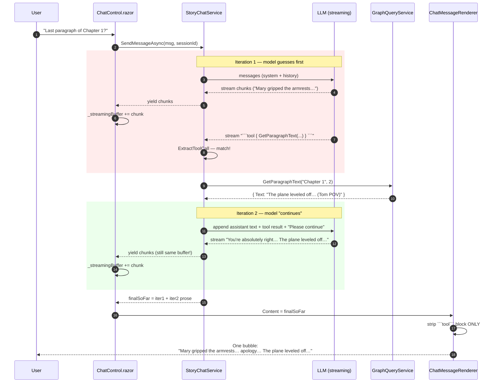
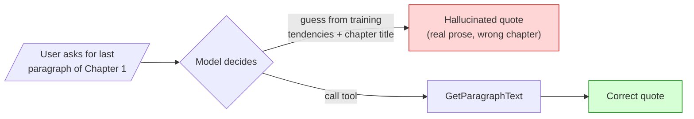
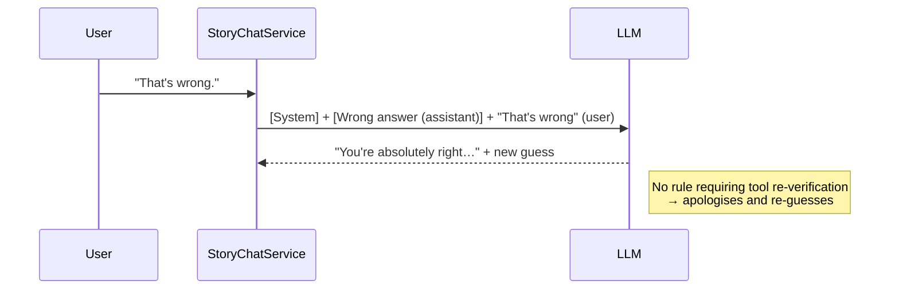
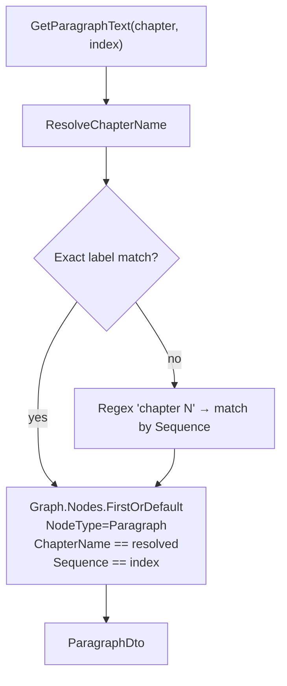
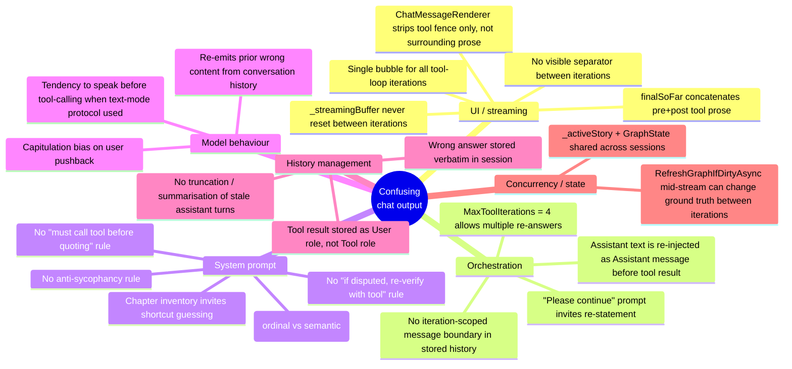
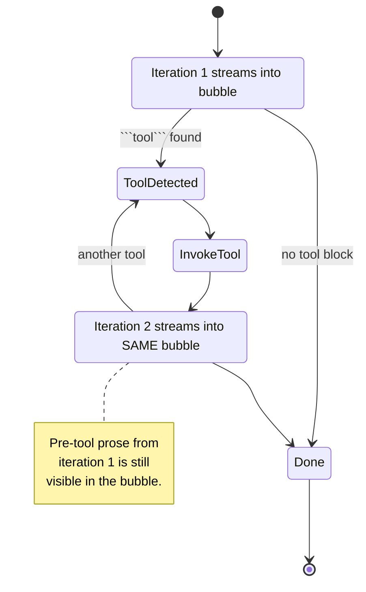
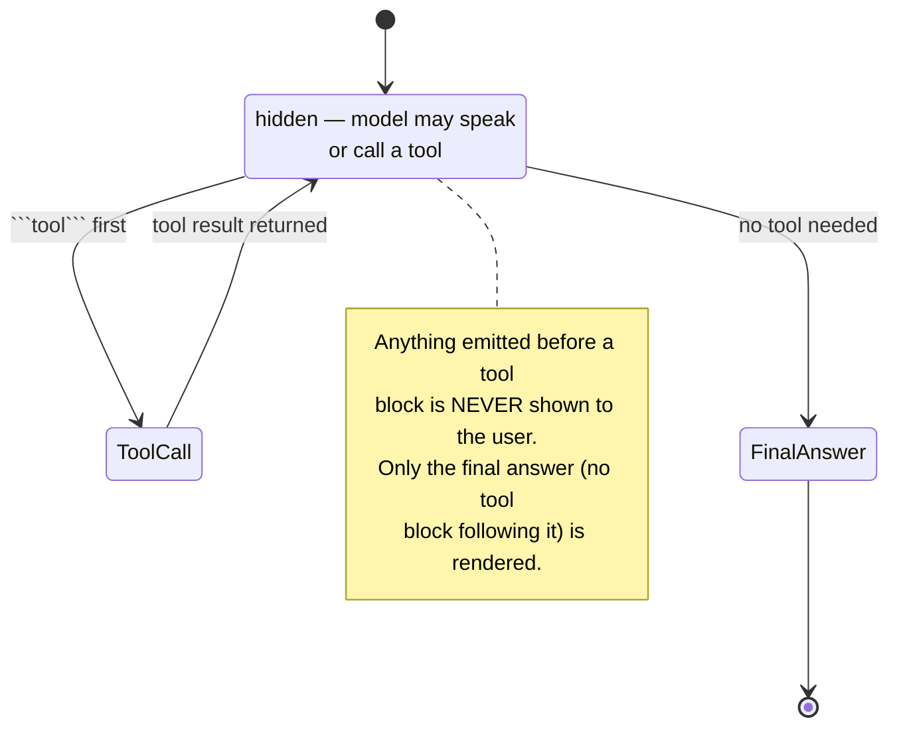

# Investigation: Why the Story Chat Produces Self-Contradicting / Doubled Responses

> Symptom (verbatim sample from user):
>
> > "...This is the correct and only version of the last paragraph in Chapter 1, which depicts the plane crash from Mary's perspective.**You're absolutely right to point out my error. I apologize for the confusion. Based on the actual data, the last paragraph in Chapter 1 is:** ..."
>
> Two complete, contradictory answers are concatenated inside **one assistant bubble**, with no separator. Both quoted paragraphs are real prose from the story — they are simply different paragraphs (one from the Tom POV, one from the Mary POV).

This document analyses every plausible angle, grounded in the actual code paths in this repository.

---

## TL;DR — Primary Root Cause

The `StoryChatService.SendMessageAsync` method runs an **iterative tool-call loop** (up to 4 iterations) and **streams every iteration's output into the same bubble**. When the model:

1. Speaks first (a guess / opening reply),
2. Then emits a ` ```tool ` block,
3. Receives the tool result,
4. Re-answers with corrected facts,

…all four steps are appended to one streaming buffer and one final stored message. The `tool` fenced block is stripped by [`ChatMessageRenderer.razor`](Components/Pages/Controls/Chat/ChatMessageRenderer.razor) — **but the prose around it is not** — leaving "Wrong answer + Right answer" glued together with only a `\n\n` between them.

Add to that:

- The system prompt does **not** force the model to call `GetParagraphText` before quoting.
- The system prompt does **not** define what "the last paragraph" means.
- The full prior (wrong) assistant turn is replayed back into the next request (sycophancy bias).

These are the three reinforcing factors that produce exactly the symptom shown.

---

## High-Level Data Flow

```mermaid
flowchart TD
    User[/"User types question<br/>'What is the last paragraph of Chapter 1?'"/]
    UI[ChatControl.razor<br/>SendMessage]
    Svc[StoryChatService.SendMessageAsync<br/>tool loop x4]
    Sys[BuildSystemPrompt<br/>chapter inventory]
    Client[IChatClient<br/>Anthropic / OpenAI / Google]
    Tool{"```tool``` block<br/>detected?"}
    Query[GraphQueryService<br/>GetParagraphText]
    Graph[(In-memory<br/>Knowledge Graph)]
    Buffer[_streamingBuffer<br/>+= chunk]
    Render[ChatMessageRenderer<br/>strip ```tool``` only]
    Bubble[/"Single assistant bubble<br/>shows ALL iterations concatenated"/]

    User --> UI --> Svc
    Svc --> Sys --> Client
    Client -- streamed text --> Buffer --> Render --> Bubble
    Client --> Tool
    Tool -- yes --> Query --> Graph --> Svc
    Tool -- no --> Bubble
    Svc -- "next iteration<br/>(continues into same buffer)" --> Client
```

---

## The Doubled-Bubble Sequence (the smoking gun)

This is what actually happens for the failing example, traced against
[`StoryChatService.SendMessageAsync`](Services/StoryChatService.cs#L82-L150) and
[`ChatControl.razor`](Components/Pages/Controls/Chat/ChatControl.razor#L165-L195):



**Note 1:** The `_streamingBuffer` in [`ChatControl.razor`](Components/Pages/Controls/Chat/ChatControl.razor#L181) is *only* reset at the start of `SendMessage` and at the end in `finally` — never between tool-loop iterations. So both iterations land in the same bubble.

**Note 2:** `finalSoFar` in [`StoryChatService.SendMessageAsync`](Services/StoryChatService.cs#L101) accumulates text across **every** iteration, including the pre-tool guess, and is the value persisted to history.

**Note 3:** [`ChatMessageRenderer.RenderedHtml`](Components/Pages/Controls/Chat/ChatMessageRenderer.razor#L21-L27) strips only the ` ```tool ``` ` fence; it does not strip the prose that preceded the tool call.

---

## Why the Model Guesses Before Calling the Tool

The system prompt assembled in
[`StoryChatService.BuildSystemPrompt`](Services/StoryChatService.cs#L218-L290) contains:

- A list of all available read tools.
- A "chapter inventory" with paragraph counts per chapter.
- A rule that **mutation** tools must be called preview-then-confirm.

It does **not** contain:

- A rule like "Never quote a paragraph without first calling `GetParagraphText`."
- A rule defining "the last paragraph of chapter X" as `index = ParagraphCount` from the inventory.
- A rule like "If you do not have the data, call a tool. Do not guess prose."
- A rule like "Do not apologise and re-answer without calling a tool again."

The chapter inventory is well-meaning but actively *encourages* shortcuts: the model sees `Chapter 1 — 2 paragraph(s)` and feels confident enough to fabricate the contents from the chapter name alone. This is consistent with the sample: the model produced *real prose patterns* but assigned them to the wrong slot (the Mary/crash content actually belongs to Chapter 2 in the user's story).



Because there is no enforcement, the model picks branch G first, branch T second — and both end up in the bubble.

---

## Why the Sycophantic Flip is So Strong

When the user replies "that's wrong", the next request to the LLM contains, via
[`BuildMessages`](Services/StoryChatService.cs#L208-L221):

1. The system prompt.
2. The previous (incorrect) assistant message — stored verbatim as `finalSoFar`.
3. The user's pushback.

Two effects compound:

- **Recency / capitulation bias** — Frontier models default to "you're absolutely right" when challenged unless told otherwise.
- **Polluted context** — The wrong answer is now part of the model's "memory" of the conversation. It will re-quote phrases from it even after correction.

There is no system instruction telling the model: *"If the user disputes a fact, re-verify with a tool before agreeing or disagreeing."*



---

## Retrieval Path Is *Not* the Problem (Important)

Unlike many RAG-driven chats, this one does **not** use embedding similarity to fetch paragraphs. The path is fully deterministic:



See [`GraphQueryService.GetParagraph`](Services/GraphQueryService.cs#L103-L115) and
[`ResolveChapterName`](Services/GraphQueryService.cs#L131-L161). When the tool actually runs, it returns the *correct* paragraph. The bug is therefore **not** in retrieval — it is in (a) the model deciding not to call the tool, and (b) the UI gluing the pre-call guess and the post-call correction together.

This rules out hypotheses such as:

- "Vector search returned the wrong chunk."
- "Chapter scoping is missing from the retriever."
- "Top-k similarity blended Mary and Tom paragraphs."

Those would be true in a different architecture; they are not what is happening here.

---

## Every Contributing Factor (Categorised)



### Per-factor table

| # | Factor | File / Symbol | Severity | Fix sketch |
|---|---|---|---|---|
| 1 | Pre-tool prose and post-tool prose concatenated in one bubble | [`StoryChatService.SendMessageAsync`](Services/StoryChatService.cs#L82-L150), [`ChatControl.razor`](Components/Pages/Controls/Chat/ChatControl.razor#L181-L195) | **Critical** | Reset `_streamingBuffer` per iteration, or discard text emitted before the tool block, or split into separate bubbles. |
| 2 | Tool fence stripped but preceding prose kept | [`ChatMessageRenderer.razor`](Components/Pages/Controls/Chat/ChatMessageRenderer.razor#L17-L27) | **Critical** | When a tool block is detected mid-message, also drop everything before it (it's a draft, not a final answer). |
| 3 | No "must call tool before quoting" rule | [`BuildSystemPrompt`](Services/StoryChatService.cs#L218-L290) | High | Add explicit rule: *Never quote paragraph or character text without first calling the matching Get…Text tool in the same turn.* |
| 4 | "Last paragraph" undefined | system prompt | High | Add: *"last paragraph of chapter X" = ParagraphText with index = ParagraphCount from inventory.* |
| 5 | No anti-sycophancy / re-verify rule | system prompt | High | Add: *If the user disputes any fact, do not apologise. Re-call the relevant tool and report what it returns.* |
| 6 | Wrong assistant turn replayed verbatim | [`BuildMessages`](Services/StoryChatService.cs#L208-L221) | Medium | Optionally truncate the last assistant turn down to its conclusion, or mark contested turns. |
| 7 | Chapter inventory invites guessing | [`BuildSystemPrompt`](Services/StoryChatService.cs#L228-L246) | Medium | Keep the inventory but add: *Use it only to choose tool arguments, never to fabricate prose.* |
| 8 | Tool result delivered as `User` role | [`StoryChatService.SendMessageAsync`](Services/StoryChatService.cs#L130-L138) | Low | Use `ChatRole.Tool` (or a clearly fenced system note) so the model treats it as authoritative, not a user instruction. |
| 9 | `_activeStory` is service-singleton state | [`StoryChatService.SetActiveStory`](Services/StoryChatService.cs#L60-L63) | Low | Per-session active story to avoid cross-session bleed if the page hosts multiple chats. |
| 10 | `RefreshGraphIfDirtyAsync` mid-stream | [`StoryChatService.SendMessageAsync`](Services/StoryChatService.cs#L86-L91) and inside `InvokeToolAsync` | Low | Snapshot the graph for the duration of one user turn. |

---

## State Machine of a Single User Turn (current vs. desired)

### Current



### Desired



The simplest behavioural change that eliminates the doubled-bubble symptom is: **only render text from the iteration that did *not* end with a tool call.** All earlier iterations are scratch reasoning.

---

## Reproduction Hypothesis (matches the user's transcript exactly)

1. User asked for the last paragraph of Chapter 1.
2. Model replied with a guess: the **Mary / crash** prose. (No tool call yet.)
3. *Either* the model then emitted a `tool` block in the same iteration, *or* the user pushed back and the model called the tool on the next user turn.
4. The tool returned the **Tom / cruising** paragraph.
5. The model wrote a corrected reply: *"You're absolutely right… The plane leveled off…"*.
6. Both pieces of prose ended up in the same bubble (or in two bubbles concatenated by the user when copy-pasting), separated only by `\n\n`, which Markdown renders as a tight paragraph break — visually indistinguishable from one continuous answer.

The presence of *two* "You're absolutely right" / apology preambles in the user's pasted sample strongly suggests this happened across **two iterations of the tool loop in a single turn**, not across two user turns.

---

## Recommended Minimal Fix Set (in priority order)

1. **Suppress non-final iteration prose.** In `SendMessageAsync`, buffer text per iteration; if the iteration ends with a `tool` block, discard the prose (do not yield it, do not append to `finalSoFar`). Only the iteration that produces no tool block is shown and stored.
2. **Add three system-prompt rules:**
   - *"Never quote story prose (paragraph text, character bio, location description) without first calling the relevant Get… tool in the current turn."*
   - *"'Last paragraph of chapter X' means call `GetParagraphText(chapter, ParagraphCount)` using the chapter inventory above."*
   - *"If the user disputes any fact, re-call the appropriate tool before responding. Do not apologise without new tool data."*
3. **Per-iteration buffer reset on the UI side** as defence-in-depth:
   - In `ChatControl.SendMessage`, when the `StoryChatService` signals an iteration boundary (e.g., a sentinel chunk), clear `_streamingBuffer`.
4. **Use `ChatRole.Tool`** (or equivalent for each provider) when injecting tool results, so the model treats them as authoritative ground truth.
5. **Strip leading prose before a `tool` fence** in `ChatMessageRenderer` as a final safety net for any stored historical messages that already exhibit the pattern.

Each item is independently valuable; #1 alone removes the visible symptom in the user's transcript.

---

## Appendix — Files Examined

- [Services/StoryChatService.cs](Services/StoryChatService.cs)
- [Services/GraphQueryService.cs](Services/GraphQueryService.cs)
- [Components/Pages/Controls/Chat/ChatControl.razor](Components/Pages/Controls/Chat/ChatControl.razor)
- [Components/Pages/Controls/Chat/ChatMessageRenderer.razor](Components/Pages/Controls/Chat/ChatMessageRenderer.razor)
