# AIStoryBuildersOnline — Detailed Migration Implementation Plan

> **Document purpose**: Provide a step-by-step, developer-ready implementation plan for migrating the **AIStoryBuildersOnline** (Blazor WebAssembly) codebase to parity with the **AIStoryBuilders Desktop** (MAUI) codebase.
>
> _Based on the gap analysis in `ai-settings-and-story-creation-comparison-plan.md`._
>
> _Generated 2026-03-25_

---

## Table of Contents

1. [Migration Overview](#1-migration-overview)
2. [Dependency Graph & Phase Ordering](#2-dependency-graph--phase-ordering)
3. [Phase 1 — Foundation: AI Client Abstraction](#3-phase-1--foundation-ai-client-abstraction)
4. [Phase 2 — Prompt & JSON Infrastructure](#4-phase-2--prompt--json-infrastructure)
5. [Phase 3 — Orchestrator Method Rewrite](#5-phase-3--orchestrator-method-rewrite)
6. [Phase 4 — Token & Model Management](#6-phase-4--token--model-management)
7. [Phase 5 — UI & Settings Update](#7-phase-5--ui--settings-update)
8. [Phase 6 — Local Browser Embeddings via ONNX JS Interop](#8-phase-6--local-browser-embeddings-via-onnx-js-interop)
9. [Verification & Testing Checklist](#9-verification--testing-checklist)
10. [Risk Register & Rollback Strategy](#10-risk-register--rollback-strategy)
11. [Appendix A — File Change Inventory](#11-appendix-a--file-change-inventory)
12. [Appendix B — Namespace & Using Statement Migration Map](#12-appendix-b--namespace--using-statement-migration-map)

---

## 1. Migration Overview

### 1.1 Current State

The Online codebase relies on the legacy `OpenAI-DotNet 8.8.7` package and exposes two concrete client factories:

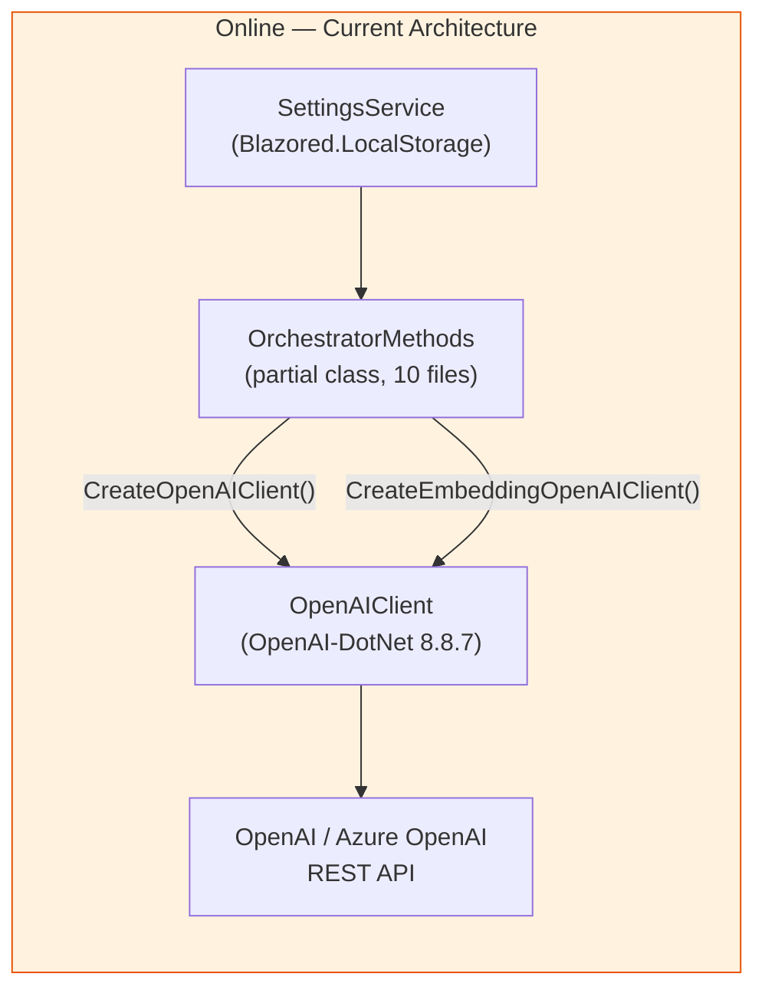
```mermaid
graph LR
    subgraph Current["Online — Current Architecture"]
        direction TB
        Settings["SettingsService<br/>(Blazored.LocalStorage)"]
        Orch["OrchestratorMethods<br/>(partial class, 10 files)"]
        Client["OpenAIClient<br/>(OpenAI-DotNet 8.8.7)"]
        API["OpenAI / Azure OpenAI<br/>REST API"]

        Settings --> Orch
        Orch -->|"CreateOpenAIClient()"| Client
        Orch -->|"CreateEmbeddingOpenAIClient()"| Client
        Client --> API
    end

    style Current fill:#fff3e0,stroke:#e65100
```

**Pain points:**

| # | Issue | Consequence |
|---|-------|-------------|
| 1 | Only OpenAI + Azure OpenAI supported | No Anthropic or Google AI |
| 2 | Concrete `OpenAIClient` — no abstraction | Every method couples to one library |
| 3 | Prompts built inline via string concatenation | Hard to maintain; inconsistent formatting |
| 4 | No JSON repair — uses LLM `CleanJSON` fallback | Extra cost + latency + unreliable |
| 5 | No retry logic | Single failures cause empty results |
| 6 | No token budgeting | Large stories overflow context windows |
| 7 | Hard-coded model list | Cannot discover new models dynamically |

### 1.2 Target State

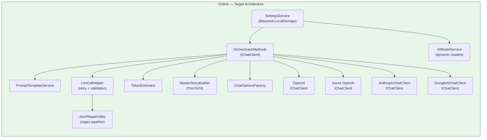
```mermaid
graph LR
    subgraph Target["Online — Target Architecture"]
        direction TB
        Settings["SettingsService<br/>(Blazored.LocalStorage)"]
        Orch["OrchestratorMethods<br/>(IChatClient)"]
        Prompt["PromptTemplateService"]
        LLM["LlmCallHelper<br/>(retry + validation)"]
        JSON["JsonRepairUtility<br/>(regex pipeline)"]
        Token["TokenEstimator"]
        Trim["MasterStoryBuilder<br/>(TrimToFit)"]
        ModelSvc["AIModelService<br/>(dynamic models)"]
        ChatOpts["ChatOptionsFactory"]

        OpenAI["OpenAI<br/>IChatClient"]
        Azure["Azure OpenAI<br/>IChatClient"]
        Anthro["AnthropicChatClient<br/>IChatClient"]
        Google["GoogleAIChatClient<br/>IChatClient"]

        Settings --> Orch
        Orch --> Prompt
        Orch --> LLM
        LLM --> JSON
        Orch --> Token
        Orch --> Trim
        Orch --> ChatOpts
        Orch --> OpenAI
        Orch --> Azure
        Orch --> Anthro
        Orch --> Google
        Settings --> ModelSvc
    end

    style Target fill:#e8f5e9,stroke:#2e7d32
```

### 1.3 Guiding Principles

1. **One phase at a time** — each phase compiles and runs before the next begins.
2. **Phase 1 + Phase 3 are tightly coupled** — NuGet swap breaks all `using` statements, so orchestrator methods must be updated in the same working branch.
3. **No runtime regressions** — every intermediate state must pass the existing `TestAccess` flow.
4. **Blazor WASM constraints respected** — no file-system I/O for caches; use `Blazored.LocalStorage`.

---

## 2. Dependency Graph & Phase Ordering

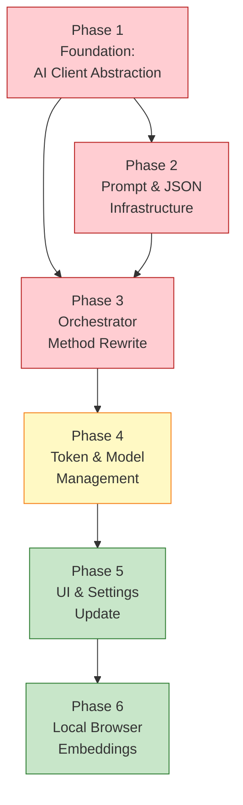
```mermaid
graph TD
    P1["Phase 1<br/>Foundation:<br/>AI Client Abstraction"]
    P2["Phase 2<br/>Prompt & JSON<br/>Infrastructure"]
    P3["Phase 3<br/>Orchestrator<br/>Method Rewrite"]
    P4["Phase 4<br/>Token & Model<br/>Management"]
    P5["Phase 5<br/>UI & Settings<br/>Update"]
    P6["Phase 6<br/>Local Browser<br/>Embeddings"]

    P1 --> P3
    P2 --> P3
    P3 --> P4
    P4 --> P5
    P5 --> P6

    P1 --> P2

    classDef critical fill:#ffcdd2,stroke:#b71c1c
    classDef high fill:#fff9c4,stroke:#f57f17
    classDef medium fill:#c8e6c9,stroke:#2e7d32

    class P1 critical
    class P2 critical
    class P3 critical
    class P4 high
    class P5 medium
    class P6 medium
```

> **Legend**: 🔴 Critical (must ship together) · 🟡 High · 🟢 Medium

### Recommended Merge Strategy

| PR | Contents | Prerequisite |
|----|----------|------------|
| **PR #1** | Phase 1 + Phase 2 + Phase 3 | None |
| **PR #2** | Phase 4 | PR #1 merged |
| **PR #3** | Phase 5 | PR #2 merged |
| **PR #4** | Phase 6 (Local Browser Embeddings via ONNX JS Interop) | PR #3 merged |

> Phases 1–3 form a single **atomic change set** because replacing the NuGet package invalidates every file that references `OpenAI-DotNet` types. They should live on a single feature branch and merge as one pull request.

---

## 3. Phase 1 — Foundation: AI Client Abstraction

### 3.1 Objective

Replace the legacy `OpenAI-DotNet` NuGet package with the official Microsoft AI abstractions and add multi-provider support (OpenAI, Azure OpenAI, Anthropic, Google AI).

### 3.2 NuGet Changes

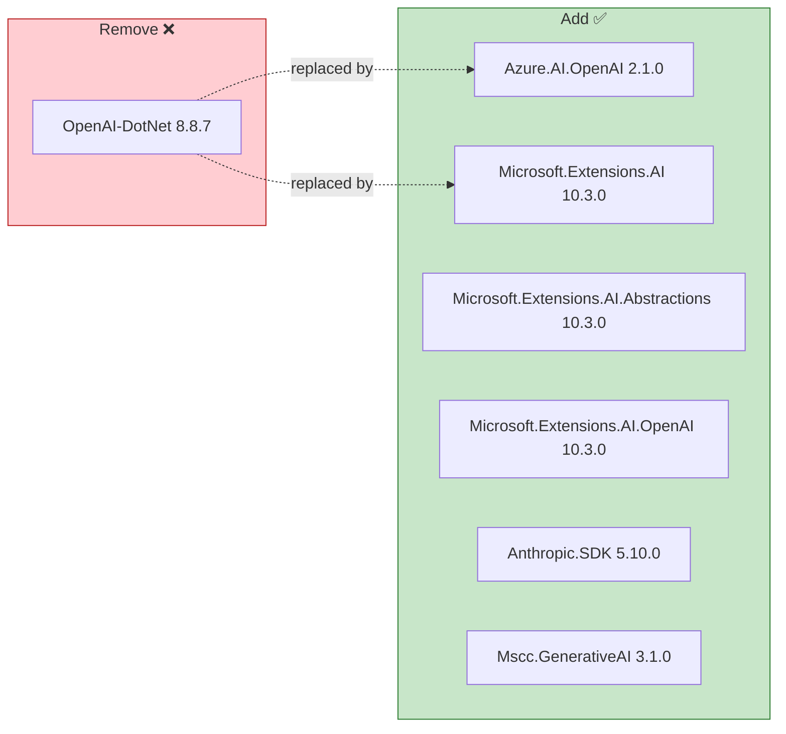
```mermaid
graph LR
    subgraph Remove["Remove ❌"]
        OD["OpenAI-DotNet 8.8.7"]
    end

    subgraph Add["Add ✅"]
        AO["Azure.AI.OpenAI 2.1.0"]
        MEA["Microsoft.Extensions.AI 10.3.0"]
        MEAA["Microsoft.Extensions.AI.Abstractions 10.3.0"]
        MEAO["Microsoft.Extensions.AI.OpenAI 10.3.0"]
        ASDK["Anthropic.SDK 5.10.0"]
        GEN["Mscc.GenerativeAI 3.1.0"]
    end

    OD -.->|replaced by| AO
    OD -.->|replaced by| MEA

    style Remove fill:#ffcdd2,stroke:#b71c1c
    style Add fill:#c8e6c9,stroke:#2e7d32
```

#### Step 1.1 — Edit `AIStoryBuildersOnline.csproj`

**Remove** the following `<PackageReference>`:

```xml
<PackageReference Include="OpenAI-DotNet" Version="8.8.7" />
```

**Add** the following `<PackageReference>` items:

```xml
<PackageReference Include="Azure.AI.OpenAI" Version="2.1.0" />
<PackageReference Include="Microsoft.Extensions.AI" Version="10.3.0" />
<PackageReference Include="Microsoft.Extensions.AI.Abstractions" Version="10.3.0" />
<PackageReference Include="Microsoft.Extensions.AI.OpenAI" Version="10.3.0" />
<PackageReference Include="Anthropic.SDK" Version="5.10.0" />
<PackageReference Include="Mscc.GenerativeAI" Version="3.1.0" />
```

### 3.3 New Files to Create

#### Step 1.2 — `AI/AnthropicChatClient.cs`

Port from the Desktop codebase. This class implements `IChatClient` and wraps `Anthropic.SDK`.

**Key responsibilities:**

- Constructor accepts `(string apiKey, string modelId)`.
- `GetResponseAsync()` maps `ChatMessage` roles (`System`, `User`, `Assistant`) to Anthropic's native types.
- Returns `ChatResponse` with populated `UsageDetails` (input tokens, output tokens).
- `GetStreamingResponseAsync()` throws `NotSupportedException` (streaming is not used).
- Implements `IDisposable`.

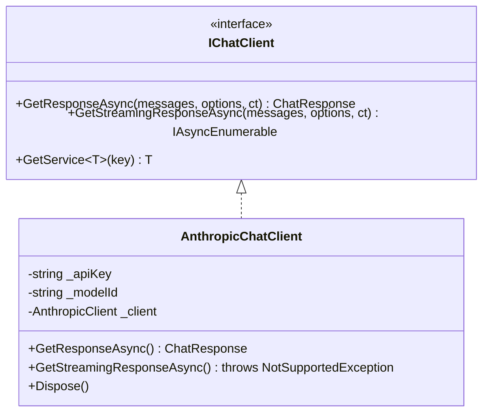
```mermaid
classDiagram
    class IChatClient {
        <<interface>>
        +GetResponseAsync(messages, options, ct) ChatResponse
        +GetStreamingResponseAsync(messages, options, ct) IAsyncEnumerable
        +GetService~T~(key) T
    }

    class AnthropicChatClient {
        -string _apiKey
        -string _modelId
        -AnthropicClient _client
        +GetResponseAsync() ChatResponse
        +GetStreamingResponseAsync() throws NotSupportedException
        +Dispose()
    }

    IChatClient <|.. AnthropicChatClient
```

**Role mapping logic:**

| `Microsoft.Extensions.AI` Role | Anthropic SDK Role |
|---|---|
| `ChatRole.System` | System prompt parameter (separate from messages) |
| `ChatRole.User` | `RoleType.User` |
| `ChatRole.Assistant` | `RoleType.Assistant` |

#### Step 1.3 — `AI/GoogleAIChatClient.cs`

Port from the Desktop codebase. This class implements `IChatClient` and wraps `Mscc.GenerativeAI`.

**Key responsibilities:**

- Constructor accepts `(string apiKey, string modelId)`.
- Maps `ChatMessage` roles to Google Generative AI content types.
- Extracts system instruction from the message list (if `ChatRole.System` is present).
- Returns `ChatResponse` with `UsageDetails`.
- `GetStreamingResponseAsync()` throws `NotSupportedException`.
- Implements `IDisposable`.

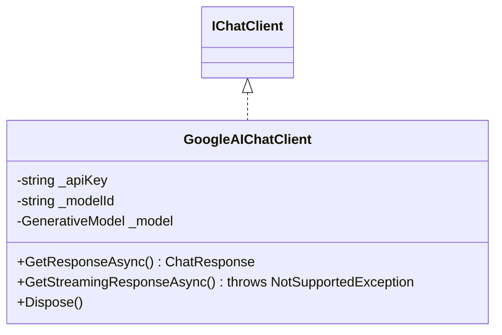
```mermaid
classDiagram
    class GoogleAIChatClient {
        -string _apiKey
        -string _modelId
        -GenerativeModel _model
        +GetResponseAsync() ChatResponse
        +GetStreamingResponseAsync() throws NotSupportedException
        +Dispose()
    }

    IChatClient <|.. GoogleAIChatClient
```

#### Step 1.4 — `AI/ChatOptionsFactory.cs`

Port from the Desktop codebase. This static helper creates `ChatOptions` with appropriate JSON response format settings per provider.

**Key responsibilities:**

- `CreateJsonOptions(string aiType, string model)` returns `ChatOptions` with:
  - `ResponseFormat = ChatResponseFormat.Json` for providers that support it.
  - `Temperature`, `TopP`, `FrequencyPenalty`, `PresencePenalty` defaults.
- Provider-specific handling:
  - **OpenAI / Azure OpenAI**: Use native JSON response format.
  - **Anthropic**: Append JSON-instruction to the system prompt (Anthropic does not have a JSON mode toggle).
  - **Google AI**: Use response MIME type `application/json`.

### 3.4 Rewrite `CreateOpenAIClient()` — Step 1.5

Transform the existing method from returning `OpenAIClient` to returning `IChatClient`.

**Current signature:**

```csharp
public async Task<OpenAIClient> CreateOpenAIClient()
```

**New signature:**

```csharp
public IChatClient CreateChatClient()
```

> Note: The method becomes **synchronous** because the `IChatClient` instantiation does not require awaiting. Settings are loaded once beforehand.

**New implementation logic (pseudocode):**

```
switch (SettingsService.AIType)
    "OpenAI"       → new OpenAIClient(ApiKey)
                       .GetChatClient(model)
                       .AsIChatClient()

    "Azure OpenAI" → new AzureOpenAIClient(endpoint, credential)
                       .GetChatClient(model)
                       .AsIChatClient()

    "Anthropic"    → new AnthropicChatClient(apiKey, model)

    "Google AI"    → new GoogleAIChatClient(apiKey, model)
```

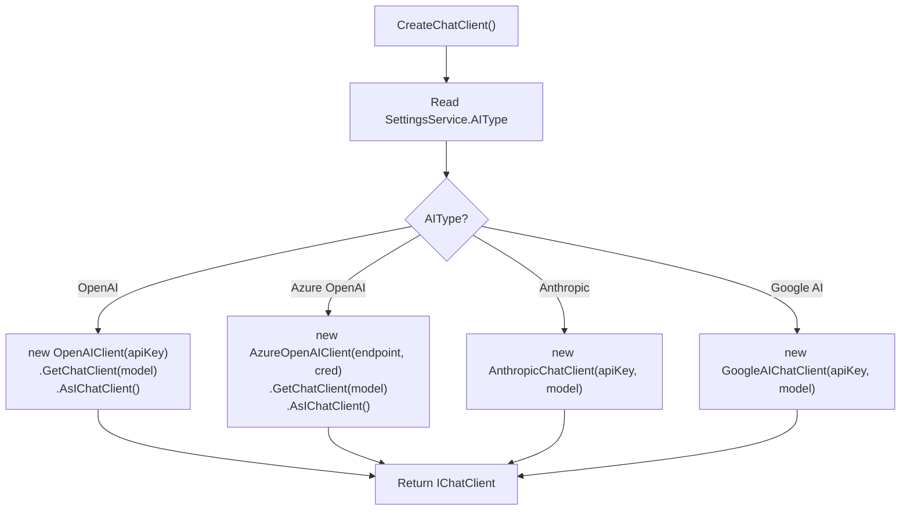
```mermaid
flowchart TD
    Start["CreateChatClient()"] --> Read["Read SettingsService.AIType"]
    Read --> Switch{AIType?}

    Switch -->|"OpenAI"| OAI["new OpenAIClient(apiKey)<br/>.GetChatClient(model)<br/>.AsIChatClient()"]
    Switch -->|"Azure OpenAI"| AOAI["new AzureOpenAIClient(endpoint, cred)<br/>.GetChatClient(model)<br/>.AsIChatClient()"]
    Switch -->|"Anthropic"| ANT["new AnthropicChatClient(apiKey, model)"]
    Switch -->|"Google AI"| GOOG["new GoogleAIChatClient(apiKey, model)"]

    OAI --> Return["Return IChatClient"]
    AOAI --> Return
    ANT --> Return
    GOOG --> Return
```

### 3.5 Remove `CreateEmbeddingOpenAIClient()` — Step 1.6

Delete the `CreateEmbeddingOpenAIClient()` method entirely. Embedding calls will continue to use the current cloud-based approach temporarily (Phase 6 addresses local embeddings). The embedding methods (`GetVectorEmbedding`, `GetVectorEmbeddingAsFloats`) will need a separate, simpler client construction that directly uses the OpenAI/Azure SDKs without the `IChatClient` abstraction.

**Action:** Create a small private helper:

```csharp
private OpenAI.OpenAIClient CreateEmbeddingClient()
```

This uses `Azure.AI.OpenAI` types (not the old `OpenAI-DotNet` types).

### 3.6 Update All `using` Statements — Step 1.7

Every file in the `AI/` folder currently has one or more of these `using` directives that must be **removed**:

```
using OpenAI;
using OpenAI.Chat;
using OpenAI.Files;
using OpenAI.FineTuning;
using OpenAI.Models;
using OpenAI.Moderations;
```

And replaced with:

```
using Microsoft.Extensions.AI;
using OpenAI;                        // Azure.AI.OpenAI package
using Azure.AI.OpenAI;
```

**Files affected (exhaustive list):**

| File | Old `using` statements to remove | New `using` statements to add |
|------|----------------------------------|-------------------------------|
| `AI/OrchestratorMethods.cs` | `OpenAI`, `OpenAI.Chat`, `OpenAI.Files`, `OpenAI.FineTuning`, `OpenAI.Models` | `Microsoft.Extensions.AI`, `OpenAI`, `Azure.AI.OpenAI` |
| `AI/OrchestratorMethods.WriteParagraph.cs` | `OpenAI`, `OpenAI.Chat`, `OpenAI.Moderations` | `Microsoft.Extensions.AI` |
| `AI/OrchestratorMethods.ParseNewStory.cs` | `OpenAI`, `OpenAI.Chat`, `OpenAI.Files`, `OpenAI.Models`, `OpenAI.Moderations` | `Microsoft.Extensions.AI` |
| `AI/OrchestratorMethods.CreateNewChapters.cs` | `OpenAI`, `OpenAI.Chat`, `OpenAI.Moderations` | `Microsoft.Extensions.AI` |
| `AI/OrchestratorMethods.DetectCharacters.cs` | `OpenAI`, `OpenAI.Chat`, `OpenAI.Moderations` | `Microsoft.Extensions.AI` |
| `AI/OrchestratorMethods.DetectCharacterAttributes.cs` | `OpenAI`, `OpenAI.Chat`, `OpenAI.Moderations` | `Microsoft.Extensions.AI` |
| `AI/OrchestratorMethods.GetStoryBeats.cs` | `OpenAI`, `OpenAI.Chat`, `OpenAI.Moderations` | `Microsoft.Extensions.AI` |
| `AI/OrchestratorMethods.TestAccess.cs` | `OpenAI`, `OpenAI.Chat` | `Microsoft.Extensions.AI` |
| `AI/OrchestratorMethods.CleanJSON.cs` | `OpenAI`, `OpenAI.Chat`, `OpenAI.Moderations` | _(file will be deleted in Phase 2)_ |
| `AI/OrchestratorMethods.Models.cs` | `OpenAI`, `OpenAI.Chat`, `OpenAI.Files`, `OpenAI.FineTuning`, `OpenAI.Models` | `Microsoft.Extensions.AI` |
| `Services/SettingsService.cs` | `OpenAI.Files` | _(remove — no replacement needed)_ |
| `Services/AIStoryBuildersService.Story.cs` | `OpenAI.Chat` (via `OpenAI.Chat.Message` type reference) | `Microsoft.Extensions.AI` |

### 3.7 Caller-Side Type Migration

Callers in `Services/AIStoryBuildersService.Story.cs` reference `OpenAI.Chat.Message` explicitly:

```csharp
OpenAI.Chat.Message ParsedStoryJSON = await OrchestratorMethods.ParseNewStory(...);
OpenAI.Chat.Message ParsedChaptersJSON = await OrchestratorMethods.CreateNewChapters(...);
```

These must change because `ParseNewStory` and `CreateNewChapters` will return `string` (raw JSON) in the new architecture (see Phase 3 §5.4).

### 3.8 Phase 1 Deliverables Checklist

- [ ] `.csproj` updated — `OpenAI-DotNet` removed, 6 packages added
- [ ] `AI/AnthropicChatClient.cs` created
- [ ] `AI/GoogleAIChatClient.cs` created
- [ ] `AI/ChatOptionsFactory.cs` created
- [ ] `CreateOpenAIClient()` → `CreateChatClient()` returning `IChatClient`
- [ ] `CreateEmbeddingOpenAIClient()` removed, replaced with `CreateEmbeddingClient()`
- [ ] All `using` statements updated across `AI/` and `Services/`
- [ ] Project compiles (with temporary stubs where needed for Phase 3 changes)

---

## 4. Phase 2 — Prompt & JSON Infrastructure

### 4.1 Objective

Centralise prompt construction, add deterministic JSON repair, and create a retry-capable LLM call helper.

### 4.2 New Files to Create

#### Step 2.1 — `AI/PromptTemplateService.cs`

Port from the Desktop codebase. This service centralises all LLM prompt templates.

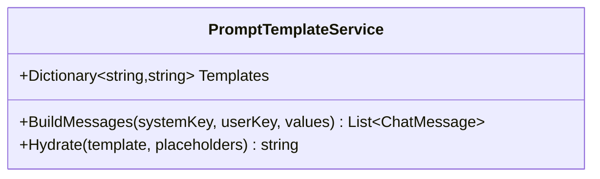
```mermaid
classDiagram
    class PromptTemplateService {
        +Dictionary~string,string~ Templates
        +BuildMessages(systemKey, userKey, values) List~ChatMessage~
        +Hydrate(template, placeholders) string
    }
```

**Template constants to port:**

| Constant | Used By |
|----------|---------|
| `WriteParagraph_System` | `OrchestratorMethods.WriteParagraph` |
| `WriteParagraph_User` | `OrchestratorMethods.WriteParagraph` |
| `ParseNewStory_System` | `OrchestratorMethods.ParseNewStory` |
| `ParseNewStory_User` | `OrchestratorMethods.ParseNewStory` |
| `CreateNewChapters_System` | `OrchestratorMethods.CreateNewChapters` |
| `CreateNewChapters_User` | `OrchestratorMethods.CreateNewChapters` |
| `DetectCharacters_System` | `OrchestratorMethods.DetectCharacters` |
| `DetectCharacters_User` | `OrchestratorMethods.DetectCharacters` |
| `DetectCharacterAttributes_System` | `OrchestratorMethods.DetectCharacterAttributes` |
| `DetectCharacterAttributes_User` | `OrchestratorMethods.DetectCharacterAttributes` |
| `GetStoryBeats_System` | `OrchestratorMethods.GetStoryBeats` |
| `GetStoryBeats_User` | `OrchestratorMethods.GetStoryBeats` |

**Template format:**

Templates use XML-style tags and `{Placeholder}` tokens:

```xml
<story_title>{StoryTitle}</story_title>
<story_style>{StoryStyle}</story_style>
<chapter_synopsis>{ChapterSynopsis}</chapter_synopsis>
<paragraph>{ParagraphContent}</paragraph>
```

**`BuildMessages()` flow:**

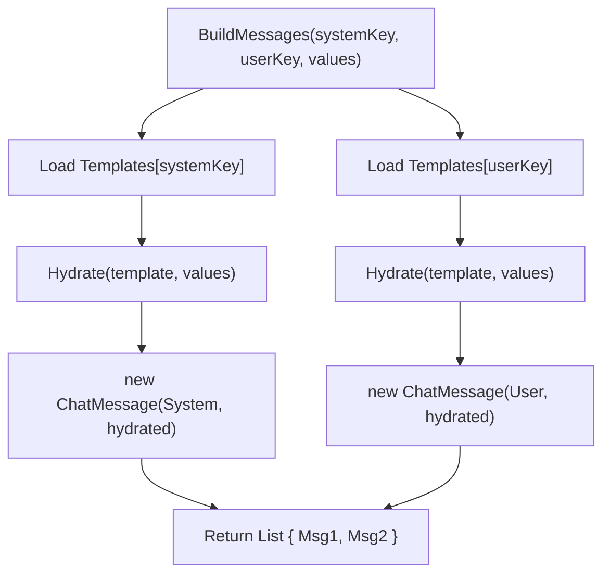
```mermaid
flowchart TD
    Start["BuildMessages(systemKey, userKey, values)"]
    Start --> LoadSys["Load Templates[systemKey]"]
    Start --> LoadUsr["Load Templates[userKey]"]
    LoadSys --> HydSys["Hydrate(template, values)"]
    LoadUsr --> HydUsr["Hydrate(template, values)"]
    HydSys --> Msg1["new ChatMessage(System, hydrated)"]
    HydUsr --> Msg2["new ChatMessage(User, hydrated)"]
    Msg1 --> Return["Return List { Msg1, Msg2 }"]
    Msg2 --> Return
```

#### Step 2.2 — `AI/JsonRepairUtility.cs`

Port from the Desktop codebase. This is a **zero-cost, deterministic** regex pipeline for repairing malformed LLM JSON output.

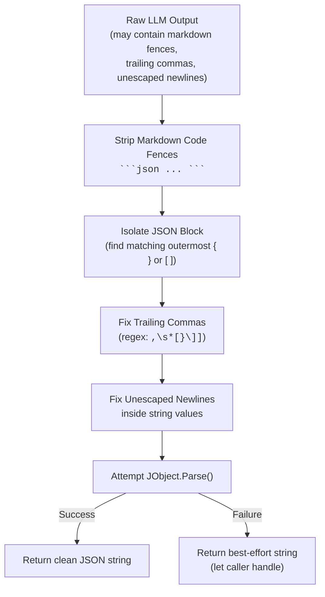
```mermaid
flowchart TD
    Raw["Raw LLM Output<br/>(may contain markdown fences,<br/>trailing commas, unescaped newlines)"]
    Raw --> StripFences["Strip Markdown Code Fences<br/><code>```json ... ```</code>"]
    StripFences --> Isolate["Isolate JSON Block<br/>(find matching outermost { } or [ ])"]
    Isolate --> TrailingCommas["Fix Trailing Commas<br/>(regex: <code>,\s*[}\]]</code>)"]
    TrailingCommas --> Newlines["Fix Unescaped Newlines<br/>inside string values"]
    Newlines --> Validate["Attempt JObject.Parse()"]
    Validate -->|Success| Return["Return clean JSON string"]
    Validate -->|Failure| ReturnOriginal["Return best-effort string<br/>(let caller handle)"]
```

**Public API:**

```csharp
public static class JsonRepairUtility
{
    public static string ExtractAndRepair(string rawLlmOutput);
}
```

#### Step 2.3 — `AI/LlmCallHelper.cs`

Port from the Desktop codebase. Provides retry logic with structured error recovery.

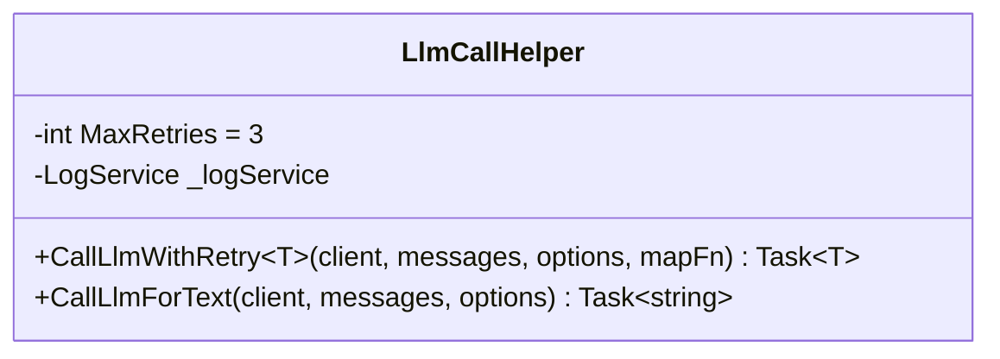
```mermaid
classDiagram
    class LlmCallHelper {
        -int MaxRetries = 3
        -LogService _logService
        +CallLlmWithRetry~T~(client, messages, options, mapFn) Task~T~
        +CallLlmForText(client, messages, options) Task~string~
    }
```

**`CallLlmWithRetry<T>` algorithm:**

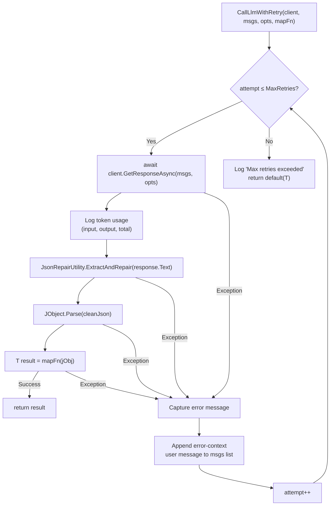
```mermaid
flowchart TD
    Start["CallLlmWithRetry<T>(client, msgs, opts, mapFn)"]
    Start --> Loop{"attempt ≤ MaxRetries?"}
    Loop -->|Yes| Call["await client.GetResponseAsync(msgs, opts)"]
    Call --> LogUsage["Log token usage<br/>(input, output, total)"]
    LogUsage --> Repair["JsonRepairUtility.ExtractAndRepair(response.Text)"]
    Repair --> Parse["JObject.Parse(cleanJson)"]
    Parse --> Map["T result = mapFn(jObj)"]
    Map -->|Success| Return["return result"]
    Map -->|Exception| CaptureErr["Capture error message"]
    Parse -->|Exception| CaptureErr
    Repair -->|Exception| CaptureErr
    Call -->|Exception| CaptureErr
    CaptureErr --> Append["Append error-context<br/>user message to msgs list"]
    Append --> Increment["attempt++"]
    Increment --> Loop
    Loop -->|No| Fail["Log 'Max retries exceeded'<br/>return default(T)"]
```

**Key design points:**

- The retry appends the error message as a new `ChatMessage(User, ...)` so the LLM can correct itself.
- Token usage is logged after every call (success or failure).
- `CallLlmForText()` is a simplified variant that does NOT parse JSON — used for plain-text responses like `GetStoryBeats`.

### 4.3 Delete `OrchestratorMethods.CleanJSON.cs` — Step 2.4

This file contains the LLM-based JSON repair method. Once `JsonRepairUtility` is in place, this file is **entirely redundant**.

**Also update `AIStoryBuildersService.Story.cs`** which calls `CleanJSON`:

```csharp
// BEFORE (line ~171):
ParsedChaptersJSON = await OrchestratorMethods.CleanJSON(
    GetOnlyJSON(ParsedChaptersJSON.Content.ToString()), GPTModelId);

// AFTER:
// This call is removed — JsonRepairUtility handles it inside LlmCallHelper
```

### 4.4 Wire Up in DI — Step 2.5

Register the new services in `Program.cs`:

```csharp
builder.Services.AddSingleton<PromptTemplateService>();
// LlmCallHelper is instantiated per-use (no DI needed, or register as Scoped)
// JsonRepairUtility is static — no registration needed
```

### 4.5 Phase 2 Deliverables Checklist

- [ ] `AI/PromptTemplateService.cs` created with all 12 template constants
- [ ] `AI/JsonRepairUtility.cs` created with `ExtractAndRepair()` method
- [ ] `AI/LlmCallHelper.cs` created with `CallLlmWithRetry<T>()` and `CallLlmForText()`
- [ ] `AI/OrchestratorMethods.CleanJSON.cs` deleted
- [ ] `AIStoryBuildersService.Story.cs` — `CleanJSON` call removed
- [ ] `Program.cs` — new services registered

---

## 5. Phase 3 — Orchestrator Method Rewrite

### 5.1 Objective

Rewrite every orchestrator method to use `IChatClient`, `PromptTemplateService`, `LlmCallHelper`, and `ChatOptionsFactory`.

### 5.2 Structural Pattern for All Methods

Every orchestrator method currently follows this pattern:

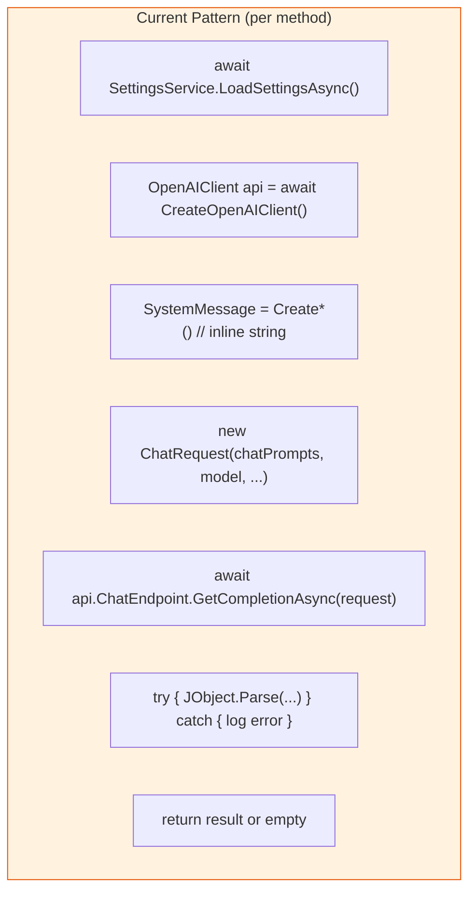
```mermaid
flowchart TD
    subgraph Current["Current Pattern (per method)"]
        LoadSettings["await SettingsService.LoadSettingsAsync()"]
        CreateClient["OpenAIClient api = await CreateOpenAIClient()"]
        BuildPrompt["SystemMessage = Create*() // inline string"]
        BuildRequest["new ChatRequest(chatPrompts, model, ...)"]
        Call["await api.ChatEndpoint.GetCompletionAsync(request)"]
        Parse["try { JObject.Parse(...) } catch { log error }"]
        Return["return result or empty"]
    end

    style Current fill:#fff3e0,stroke:#e65100
```

The new pattern:

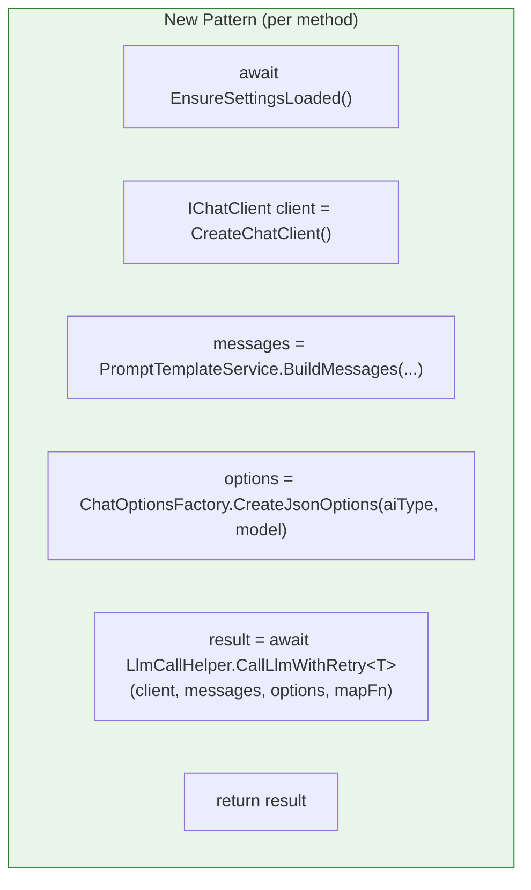
```mermaid
flowchart TD
    subgraph New["New Pattern (per method)"]
        EnsureSettings["await EnsureSettingsLoaded()"]
        CreateClient["IChatClient client = CreateChatClient()"]
        BuildPrompt["messages = PromptTemplateService.BuildMessages(...)"]
        CreateOpts["options = ChatOptionsFactory.CreateJsonOptions(aiType, model)"]
        CallRetry["result = await LlmCallHelper.CallLlmWithRetry&lt;T&gt;(client, messages, options, mapFn)"]
        Return["return result"]
    end

    style New fill:#e8f5e9,stroke:#2e7d32
```

### 5.3 Settings Loading Strategy

**Current problem:** Every method calls `await SettingsService.LoadSettingsAsync()` redundantly.

**Solution:** Add a private helper method:

```csharp
private bool _settingsLoaded = false;

private async Task EnsureSettingsLoaded()
{
    if (!_settingsLoaded)
    {
        await SettingsService.LoadSettingsAsync();
        _settingsLoaded = true;
    }
}
```

> Note: `_settingsLoaded` resets per request because `OrchestratorMethods` is registered as `Scoped`.

### 5.4 Method-by-Method Rewrite Specifications

#### 5.4.1 `WriteParagraph`

| Aspect | Before | After |
|--------|--------|-------|
| **Signature** | `Task<string> WriteParagraph(JSONMasterStory, AIPrompt, string GPTModel)` | _Same_ |
| **Client** | `OpenAIClient` | `IChatClient` |
| **Prompt** | `CreateWriteParagraph()` inline builder (73 lines) | `PromptTemplateService.BuildMessages("WriteParagraph_System", "WriteParagraph_User", values)` |
| **Call** | `api.ChatEndpoint.GetCompletionAsync(request)` | `LlmCallHelper.CallLlmWithRetry<string>(client, messages, options, mapFn)` |
| **Map function** | Manual `JObject.Parse` + `data.paragraph_content` | `jObj => jObj["paragraph_content"]?.ToString()` |
| **JSON mode** | `TextResponseFormat.JsonSchema` | `ChatOptionsFactory.CreateJsonOptions(aiType, model)` |
| **Error handling** | `try/catch` returning empty string | Handled by `LlmCallHelper` retry |

**Inline helpers to remove:**
- `CreateWriteParagraph()` (method body: ~73 lines in `WriteParagraph.cs`)

#### 5.4.2 `ParseNewStory`

| Aspect | Before | After |
|--------|--------|-------|
| **Signature** | `Task<Message> ParseNewStory(string, string, string)` | **`Task<string> ParseNewStory(string, string, string)`** |
| **Return** | `OpenAI.Chat.Message` | `string` (raw JSON) |
| **Prompt** | `CreateSystemMessageParseNewStory()` | `PromptTemplateService.BuildMessages(...)` |
| **Call** | Direct `GetCompletionAsync` | `LlmCallHelper.CallLlmWithRetry<string>(...)` |

> ⚠️ **Breaking change:** Return type changes from `Message` to `string`. The caller in `AIStoryBuildersService.Story.cs` (line 64) must change from `ParsedStoryJSON.Content.ToString()` to just `ParsedStoryJSON`.

**Inline helpers to remove:**
- `CreateSystemMessageParseNewStory()`

#### 5.4.3 `CreateNewChapters`

| Aspect | Before | After |
|--------|--------|-------|
| **Signature** | `Task<Message> CreateNewChapters(string, string, string)` | **`Task<string> CreateNewChapters(string, string, string)`** |
| **Return** | `OpenAI.Chat.Message` | `string` (raw JSON) |
| **Prompt** | `CreateSystemMessageCreateNewChapters()` | `PromptTemplateService.BuildMessages(...)` |

> ⚠️ **Breaking change:** Same as `ParseNewStory`. Callers update accordingly.

**Inline helpers to remove:**
- `CreateSystemMessageCreateNewChapters()`

#### 5.4.4 `DetectCharacters`

| Aspect | Before | After |
|--------|--------|-------|
| **Signature** | `Task<List<Character>> DetectCharacters(Paragraph)` | _Same_ |
| **Prompt** | `CreateDetectCharacters()` | `PromptTemplateService.BuildMessages(...)` |
| **Call** | Single `GetCompletionAsync` + `try/catch` | `LlmCallHelper.CallLlmWithRetry<List<Character>>(...)` |
| **Map function** | Manual loop over `data.characters` | Lambda that parses `jObj["characters"]` |

**Inline helpers to remove:**
- `CreateDetectCharacters()`

#### 5.4.5 `DetectCharacterAttributes`

| Aspect | Before | After |
|--------|--------|-------|
| **Signature** | `Task<List<SimpleCharacterSelector>> DetectCharacterAttributes(Paragraph, List<Character>, string)` | _Same_ |
| **Prompt** | `CreateDetectCharacterAttributes()` | `PromptTemplateService.BuildMessages(...)` |
| **Call** | Single `GetCompletionAsync` + `try/catch` | `LlmCallHelper.CallLlmWithRetry<List<SimpleCharacterSelector>>(...)` |

**Inline helpers to remove:**
- `CreateDetectCharacterAttributes()`

> Note: The `ProcessCharacters()` and `CharacterJsonSerializer` utility methods remain — they are used to build template placeholder values.

#### 5.4.6 `GetStoryBeats`

| Aspect | Before | After |
|--------|--------|-------|
| **Signature** | `Task<string> GetStoryBeats(string)` | _Same_ |
| **Prompt** | `CreateStoryBeats()` | `PromptTemplateService.BuildMessages(...)` |
| **Call** | `GetCompletionAsync` | **`LlmCallHelper.CallLlmForText()`** (no JSON parsing) |
| **Response format** | JSON mode (incorrect — returns plain text) | No JSON mode |

> Note: The current code incorrectly uses `TextResponseFormat.JsonSchema` for a plain-text response. This is fixed in the rewrite.

**Inline helpers to remove:**
- `CreateStoryBeats()`

#### 5.4.7 `TestAccess`

| Aspect | Before | After |
|--------|--------|-------|
| **Signature** | `Task<bool> TestAccess(string GPTModel)` | _Same_ |
| **Client** | `OpenAIClient` | `IChatClient` |
| **Embedding test** | Tests cloud embeddings for Azure only | Tests cloud embeddings for Azure only (Phase 6 changes this) |

**Rewrite logic:**

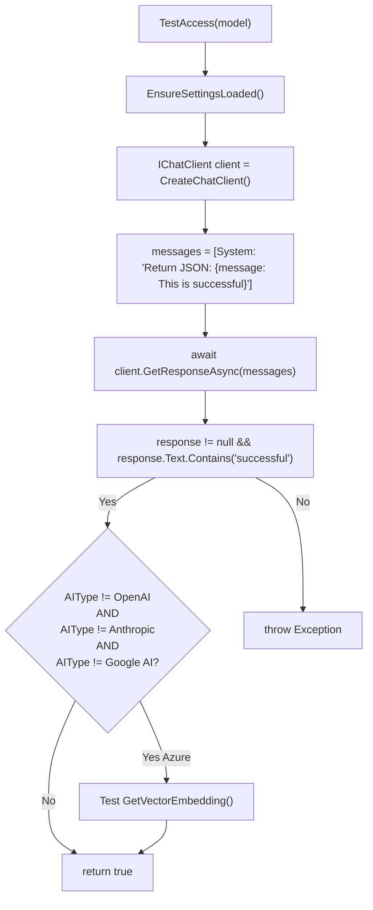
```mermaid
flowchart TD
    Start["TestAccess(model)"]
    Start --> LoadSettings["EnsureSettingsLoaded()"]
    LoadSettings --> CreateClient["IChatClient client = CreateChatClient()"]
    CreateClient --> BuildMsg["messages = [System: 'Return JSON: {message: This is successful}']"]
    BuildMsg --> Call["await client.GetResponseAsync(messages)"]
    Call --> CheckResponse["response != null && response.Text.Contains('successful')"]
    CheckResponse -->|Yes| TestEmbed{"AIType != OpenAI<br/>AND<br/>AIType != Anthropic<br/>AND<br/>AIType != Google AI?"}
    CheckResponse -->|No| Throw["throw Exception"]
    TestEmbed -->|Yes Azure| EmbedTest["Test GetVectorEmbedding()"]
    TestEmbed -->|No| ReturnTrue["return true"]
    EmbedTest --> ReturnTrue
```

### 5.5 Caller Updates in Service Layer

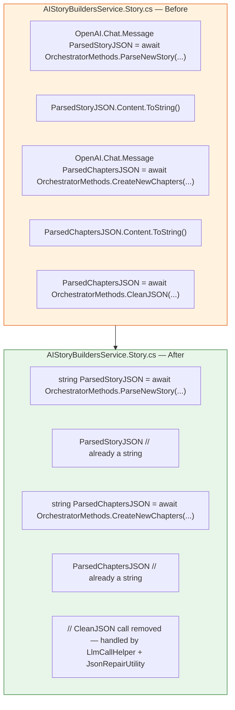
```mermaid
flowchart TD
    subgraph Before["AIStoryBuildersService.Story.cs — Before"]
        B1["OpenAI.Chat.Message ParsedStoryJSON = await OrchestratorMethods.ParseNewStory(...)"]
        B2["ParsedStoryJSON.Content.ToString()"]
        B3["OpenAI.Chat.Message ParsedChaptersJSON = await OrchestratorMethods.CreateNewChapters(...)"]
        B4["ParsedChaptersJSON.Content.ToString()"]
        B5["ParsedChaptersJSON = await OrchestratorMethods.CleanJSON(...)"]
    end

    subgraph After["AIStoryBuildersService.Story.cs — After"]
        A1["string ParsedStoryJSON = await OrchestratorMethods.ParseNewStory(...)"]
        A2["ParsedStoryJSON // already a string"]
        A3["string ParsedChaptersJSON = await OrchestratorMethods.CreateNewChapters(...)"]
        A4["ParsedChaptersJSON // already a string"]
        A5["// CleanJSON call removed — handled by LlmCallHelper + JsonRepairUtility"]
    end

    Before --> After

    style Before fill:#fff3e0,stroke:#e65100
    style After fill:#e8f5e9,stroke:#2e7d32
```

### 5.6 Phase 3 Deliverables Checklist

- [ ] `EnsureSettingsLoaded()` helper added to `OrchestratorMethods.cs`
- [ ] `WriteParagraph` rewritten
- [ ] `ParseNewStory` rewritten (return type: `string`)
- [ ] `CreateNewChapters` rewritten (return type: `string`)
- [ ] `DetectCharacters` rewritten
- [ ] `DetectCharacterAttributes` rewritten
- [ ] `GetStoryBeats` rewritten (no JSON mode)
- [ ] `TestAccess` rewritten
- [ ] All inline `Create*()` prompt builder methods removed
- [ ] `AIStoryBuildersService.Story.cs` updated for new return types
- [ ] `AIStoryBuildersService.Story.cs` — `CleanJSON` call removed
- [ ] All `using OpenAI.*` references eliminated from the codebase
- [ ] Project compiles and `TestAccess` succeeds

---

## 6. Phase 4 — Token & Model Management

### 6.1 Objective

Add token estimation, context-window trimming, and dynamic model listing.

### 6.2 New Files to Create

#### Step 4.1 — `AI/TokenEstimator.cs`

Port from the Desktop codebase.

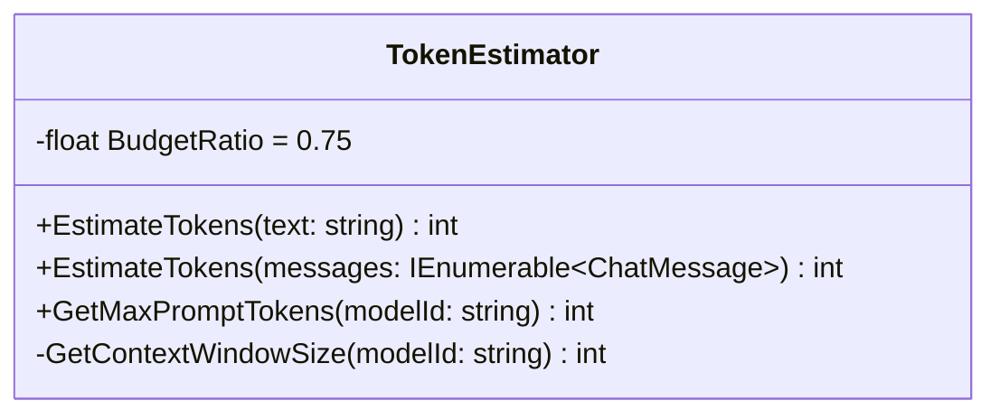
```mermaid
classDiagram
    class TokenEstimator {
        +EstimateTokens(text: string) int
        +EstimateTokens(messages: IEnumerable~ChatMessage~) int
        +GetMaxPromptTokens(modelId: string) int
        -GetContextWindowSize(modelId: string) int
        -float BudgetRatio = 0.75
    }
```

**Token estimation heuristic:**

```
tokens ≈ characterCount / 4.0
```

**Context window lookup (built-in table):**

| Model Pattern | Context Window |
|---------------|----------------|
| `gpt-5` | 128,000 |
| `gpt-5-mini` | 128,000 |
| `gpt-4o` | 128,000 |
| `gpt-4-turbo` | 128,000 |
| `gpt-4` | 8,192 |
| `gpt-3.5-turbo` | 16,384 |
| `claude-*` | 200,000 |
| `gemini-*` | 1,000,000 |
| _default_ | 8,192 |

**Max prompt tokens** = `ContextWindow × BudgetRatio (0.75)`.

#### Step 4.2 — `Services/MasterStoryBuilder.cs`

Port from the Desktop codebase. Handles context-window budget trimming for `WriteParagraph`.

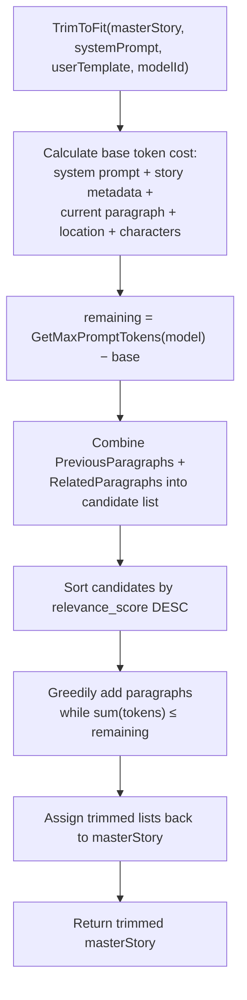
```mermaid
flowchart TD
    Start["TrimToFit(masterStory, systemPrompt, userTemplate, modelId)"]
    Start --> CalcBase["Calculate base token cost:<br/>system prompt + story metadata +<br/>current paragraph + location + characters"]
    CalcBase --> CalcBudget["remaining = GetMaxPromptTokens(model) − base"]
    CalcBudget --> Combine["Combine PreviousParagraphs +<br/>RelatedParagraphs into candidate list"]
    Combine --> Sort["Sort candidates by relevance_score DESC"]
    Sort --> Greedy["Greedily add paragraphs<br/>while sum(tokens) ≤ remaining"]
    Greedy --> Assign["Assign trimmed lists back to masterStory"]
    Assign --> Return["Return trimmed masterStory"]
```

**Key integration point:** Called at the top of `WriteParagraph` before prompt construction:

```csharp
objJSONMasterStory = MasterStoryBuilder.TrimToFit(
    objJSONMasterStory, systemPrompt, userTemplate, GPTModel);
```

#### Step 4.3 — `AI/AIModelService.cs`

Port from the Desktop codebase, **adapted for Blazor WASM** (replace file-system cache with `ILocalStorageService`).

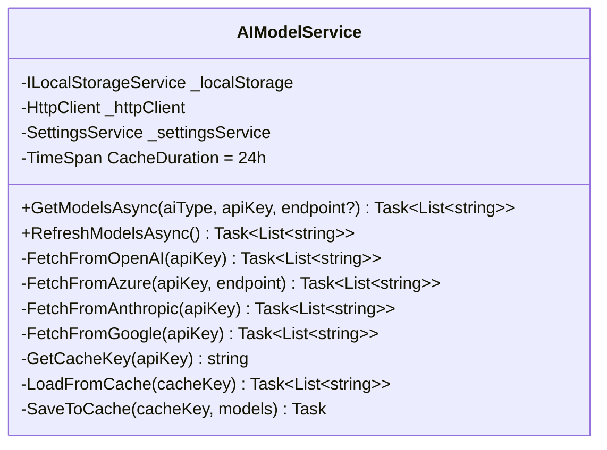
```mermaid
classDiagram
    class AIModelService {
        -ILocalStorageService _localStorage
        -HttpClient _httpClient
        -SettingsService _settingsService
        -TimeSpan CacheDuration = 24h
        +GetModelsAsync(aiType, apiKey, endpoint?) Task~List~string~~
        +RefreshModelsAsync() Task~List~string~~
        -FetchFromOpenAI(apiKey) Task~List~string~~
        -FetchFromAzure(apiKey, endpoint) Task~List~string~~
        -FetchFromAnthropic(apiKey) Task~List~string~~
        -FetchFromGoogle(apiKey) Task~List~string~~
        -GetCacheKey(apiKey) string
        -LoadFromCache(cacheKey) Task~List~string~~
        -SaveToCache(cacheKey, models) Task
    }
```

**Cache storage format (in `Blazored.LocalStorage`):**

```json
{
  "key": "ModelCache_{sha256(apiKey)}",
  "value": {
    "models": ["gpt-5", "gpt-5-mini", "gpt-4o", ...],
    "cachedAt": "2026-03-25T12:00:00Z"
  }
}
```

**Provider-specific fetch strategies:**

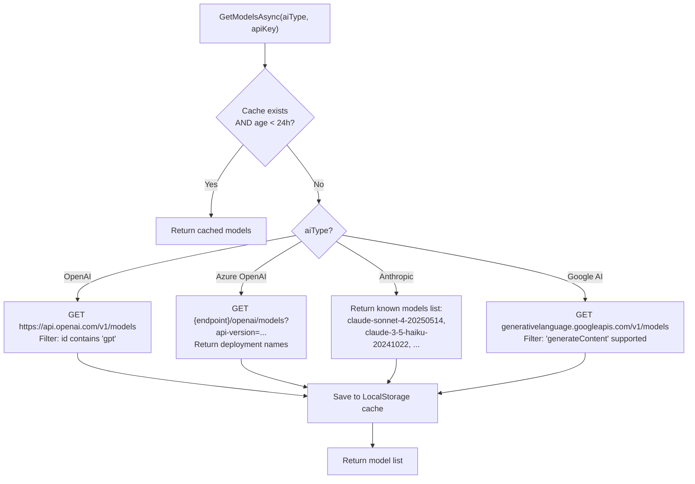
```mermaid
flowchart TD
    GetModels["GetModelsAsync(aiType, apiKey)"]
    GetModels --> CheckCache{"Cache exists<br/>AND age < 24h?"}
    CheckCache -->|Yes| ReturnCached["Return cached models"]
    CheckCache -->|No| Switch{aiType?}

    Switch -->|OpenAI| FetchOAI["GET https://api.openai.com/v1/models<br/>Filter: id contains 'gpt'"]
    Switch -->|Azure OpenAI| FetchAzure["GET {endpoint}/openai/models?api-version=...<br/>Return deployment names"]
    Switch -->|Anthropic| FetchAnthro["Return known models list:<br/>claude-sonnet-4-20250514,<br/>claude-3-5-haiku-20241022, ..."]
    Switch -->|Google AI| FetchGoogle["GET generativelanguage.googleapis.com/v1/models<br/>Filter: 'generateContent' supported"]

    FetchOAI --> Cache["Save to LocalStorage cache"]
    FetchAzure --> Cache
    FetchAnthro --> Cache
    FetchGoogle --> Cache
    Cache --> Return["Return model list"]
```

#### Step 4.4 — `Models/ModelCacheEntry.cs`

```csharp
public class ModelCacheEntry
{
    public List<string> Models { get; set; }
    public DateTime CachedAt { get; set; }
}
```

#### Step 4.5 — Register in DI (`Program.cs`)

```csharp
builder.Services.AddScoped<AIModelService>();
builder.Services.AddSingleton<TokenEstimator>();
// MasterStoryBuilder is used as a static utility — no DI needed
```

### 6.3 Phase 4 Deliverables Checklist

- [ ] `AI/TokenEstimator.cs` created
- [ ] `Services/MasterStoryBuilder.cs` created
- [ ] `AI/AIModelService.cs` created (with `ILocalStorageService` cache)
- [ ] `Models/ModelCacheEntry.cs` created
- [ ] `Program.cs` updated with new DI registrations
- [ ] `WriteParagraph` updated to call `MasterStoryBuilder.TrimToFit()`
- [ ] Token budgeting validated with a large story test

---

## 7. Phase 5 — UI & Settings Update

### 7.1 Objective

Update the Settings page to support all four AI providers, dynamic model listing, and remove the embedding model field.

### 7.2 Settings Page Changes

```mermaid
graph TD
    subgraph Before["Settings.razor — Before"]
        B_Types["AI Types: OpenAI, Azure OpenAI"]
        B_Models["Models: hard-coded<br/>(gpt-4o, gpt-5, gpt-5-mini)"]
        B_Embed["Embedding Model field: visible for Azure"]
        B_Links["API Key links: OpenAI, Azure"]
    end

    subgraph After["Settings.razor — After"]
        A_Types["AI Types: OpenAI, Azure OpenAI,<br/>Anthropic, Google AI"]
        A_Models["Models: dynamic from AIModelService<br/>+ refresh button + loading indicator"]
        A_Embed["Embedding Model field: removed"]
        A_Links["API Key links: OpenAI, Azure,<br/>Anthropic, Google AI"]
        A_Filter["Model dropdown: filterable"]
        A_Label["Dynamic ModelFieldLabel<br/>per provider"]
    end

    Before --> After

    style Before fill:#fff3e0,stroke:#e65100
    style After fill:#e8f5e9,stroke:#2e7d32
```

#### Step 5.1 — Add New AI Types

```csharp
// BEFORE:
List<string> colAITypes = new List<string>() { "OpenAI", "Azure OpenAI" };

// AFTER:
List<string> colAITypes = new List<string>()
{
    "OpenAI", "Azure OpenAI", "Anthropic", "Google AI"
};
```

#### Step 5.2 — Dynamic Model Dropdown

Replace the hard-coded `colModels` with a dynamically populated list:

```csharp
// BEFORE:
List<string> colModels = new List<string>() { "gpt-4o", "gpt-5", "gpt-5-mini" };

// AFTER:
List<string> availableModels = new List<string>();
bool isLoadingModels = false;
```

**On initialization and when `AIType` changes:**

```csharp
private async Task LoadModels()
{
    isLoadingModels = true;
    StateHasChanged();

    availableModels = await AIModelService.GetModelsAsync(
        AIType, ApiKey, Endpoint);

    isLoadingModels = false;
    StateHasChanged();
}
```

#### Step 5.3 — Refresh Button + Loading State

Add a refresh button next to the model dropdown:

```html
<RadzenButton Icon="refresh" ButtonStyle="ButtonStyle.Light"
              Click="RefreshModels" Disabled="@isLoadingModels" />
```

```csharp
private async Task RefreshModels()
{
    isLoadingModels = true;
    StateHasChanged();
    availableModels = await AIModelService.RefreshModelsAsync();
    isLoadingModels = false;
    StateHasChanged();
}
```

#### Step 5.4 — Provider-Specific UI Sections

```mermaid
flowchart TD
    AIType{AIType?}

    AIType -->|OpenAI| OAI["Show:<br/>• Model dropdown (filterable)<br/>• Refresh button<br/>• API Key link to platform.openai.com"]

    AIType -->|Azure OpenAI| Azure["Show:<br/>• Model text input (deployment name)<br/>• Endpoint text input<br/>• ApiVersion text input<br/>• API Key link to learn.microsoft.com"]

    AIType -->|Anthropic| Anthro["Show:<br/>• Model dropdown (filterable)<br/>• Refresh button<br/>• API Key link to console.anthropic.com"]

    AIType -->|Google AI| Google["Show:<br/>• Model dropdown (filterable)<br/>• Refresh button<br/>• API Key link to aistudio.google.com"]
```

#### Step 5.5 — Dynamic Model Field Label

```csharp
private string ModelFieldLabel => AIType switch
{
    "OpenAI" => "Default AI Model:",
    "Azure OpenAI" => "Azure OpenAI Model Deployment Name:",
    "Anthropic" => "Anthropic Model:",
    "Google AI" => "Google AI Model:",
    _ => "AI Model:"
};
```

#### Step 5.6 — API Key Links for New Providers

```csharp
private async Task GetAnthropicAPIKey()
{
    await JSRuntime.InvokeVoidAsync("open",
        "https://console.anthropic.com/settings/keys");
}

private async Task GetGoogleAIAPIKey()
{
    await JSRuntime.InvokeVoidAsync("open",
        "https://aistudio.google.com/app/apikey");
}
```

#### Step 5.7 — Remove `AIEmbeddingModel` Field

- Remove the `AIEmbeddingModel` text input from the UI.
- Remove the `AIEmbeddingModel` parameter from `SaveSettingsAsync()`.
- In `SettingsService.cs`, keep the property for backward compatibility during deserialization but stop requiring it in the UI.

#### Step 5.8 — API Key Validation per Provider

Update the `SettingsSave()` validation:

```csharp
// BEFORE:
if ((AIType == "OpenAI") && (!ApiKey.StartsWith("sk-"))) { ... }

// AFTER:
var validationError = AIType switch
{
    "OpenAI" when !ApiKey.StartsWith("sk-")
        => "Invalid API Key — must start with: sk-",
    "Anthropic" when !ApiKey.StartsWith("sk-ant-")
        => "Invalid API Key — must start with: sk-ant-",
    _ => null
};

if (validationError != null) { /* show error notification */ }
```

### 7.3 Phase 5 Deliverables Checklist

- [ ] `colAITypes` expanded to 4 providers
- [ ] Hard-coded `colModels` replaced with dynamic `availableModels`
- [ ] Refresh button and loading indicator added
- [ ] `AllowFiltering="true"` added to model dropdowns
- [ ] Provider-specific conditional UI sections added (Anthropic, Google AI)
- [ ] API key links added for Anthropic and Google AI
- [ ] Dynamic `ModelFieldLabel` property added
- [ ] `AIEmbeddingModel` field removed from UI
- [ ] `SettingsService.SaveSettingsAsync` updated (remove or deprecate `AIEmbeddingModel` param)
- [ ] API key validation updated for Anthropic prefix
- [ ] `ChangeAIType` handler triggers `LoadModels()`
- [ ] `AIModelService` injected into `Settings.razor`

---

## 8. Phase 6 — Local Browser Embeddings via ONNX JS Interop

### 8.1 Objective

Replace the cloud-based OpenAI embedding calls (`text-embedding-ada-002`) with a **local, in-browser** ONNX embedding model (`all-MiniLM-L6-v2`) using `onnxruntime-web` via Blazor JS interop. This eliminates per-token API costs, removes the dependency on an embedding API key, and produces **384-dimensional** vectors that match the Desktop codebase.

### 8.2 Architecture Overview

```mermaid
graph LR
    subgraph Before["Current — Cloud Embeddings"]
        direction TB
        OrcB["OrchestratorMethods<br/>GetVectorEmbedding()<br/>GetVectorEmbeddingAsFloats()"]
        ClientB["OpenAIClient<br/>(CreateEmbeddingOpenAIClient)"]
        APIB["OpenAI / Azure OpenAI<br/>Embeddings API"]

        OrcB --> ClientB --> APIB
    end

    subgraph After["Target — Local Browser Embeddings"]
        direction TB
        OrcA["OrchestratorMethods<br/>GetVectorEmbedding()<br/>GetVectorEmbeddingAsFloats()"]
        WrapA["BrowserEmbeddingGenerator<br/>(C# — IJSRuntime)"]
        JSA["embedding.js<br/>(onnxruntime-web + tokenizer)"]
        ONNXA["all-MiniLM-L6-v2.onnx<br/>(23MB, cached by browser)"]

        OrcA --> WrapA -->|"JSInterop"| JSA --> ONNXA
    end

    Before -.->|"replaced by"| After

    style Before fill:#fff3e0,stroke:#e65100
    style After fill:#e8f5e9,stroke:#2e7d32
```

### 8.3 Vector Dimension Migration Strategy

> ⚠️ **Critical consideration:** Existing stories store **1536-dimensional** vectors (from `text-embedding-ada-002`). The new model produces **384-dimensional** vectors. These are **incompatible** — cosine similarity between vectors of different dimensions is undefined.

```mermaid
flowchart TD
    Start["Phase 6 Deployed"]
    Start --> NewStories{"New stories<br/>created after migration?"}
    NewStories -->|Yes| Use384["Use 384-d vectors<br/>(all-MiniLM-L6-v2)"]
    NewStories -->|No — Existing stories| Check{"Story has stored<br/>vector data?"}
    Check -->|"Yes (1536-d)"| Reembed["Re-embed on first access:<br/>BrowserEmbeddingGenerator<br/>regenerates 384-d vectors"]
    Check -->|"No vectors"| Skip["No action needed"]
    Use384 --> Consistent["✅ All vectors are 384-d<br/>Cosine similarity works"]
    Reembed --> Consistent
```

**Strategy: Lazy re-embedding.**

- When `GetRelatedParagraphs()` loads paragraph vectors from storage, check the vector dimension.
- If the vector length is **not 384**, discard the stored vector and re-embed using the local model.
- New embeddings are saved back to storage, replacing the old 1536-d vectors.
- This is a **one-time cost per paragraph** on first access after migration.

### 8.4 Model & Tokenizer Assets

#### 8.4.1 Model Selection

| Property | Value |
|----------|-------|
| **Model** | `all-MiniLM-L6-v2` (sentence-transformers) |
| **ONNX variant** | Quantized (int8) — `all-MiniLM-L6-v2-quantized.onnx` |
| **Output dimensions** | 384 |
| **Max sequence length** | 256 tokens |
| **Quantized model size** | ~23 MB |
| **Vocabulary file** | `vocab.txt` (~226 KB, WordPiece tokenizer, 30,522 tokens) |
| **Source** | [Hugging Face: sentence-transformers/all-MiniLM-L6-v2](https://huggingface.co/sentence-transformers/all-MiniLM-L6-v2) |
| **ONNX export** | [Xenova/all-MiniLM-L6-v2 (ONNX)](https://huggingface.co/Xenova/all-MiniLM-L6-v2) |
| **License** | Apache 2.0 |

#### 8.4.2 Files to Download and Bundle

| File | Target Path | Size | Source |
|------|-------------|------|--------|
| `model_quantized.onnx` | `wwwroot/models/all-MiniLM-L6-v2/model_quantized.onnx` | ~23 MB | Xenova/all-MiniLM-L6-v2 on HuggingFace |
| `vocab.txt` | `wwwroot/models/all-MiniLM-L6-v2/vocab.txt` | ~226 KB | Xenova/all-MiniLM-L6-v2 on HuggingFace |
| `tokenizer.json` | `wwwroot/models/all-MiniLM-L6-v2/tokenizer.json` | ~700 KB | Xenova/all-MiniLM-L6-v2 on HuggingFace |
| `tokenizer_config.json` | `wwwroot/models/all-MiniLM-L6-v2/tokenizer_config.json` | ~1 KB | Xenova/all-MiniLM-L6-v2 on HuggingFace |

> These files are served as static assets from `wwwroot/` and will be cached by the service worker for offline use.

#### 8.4.3 Service Worker Update

Update `wwwroot/service-worker.published.js` to include the ONNX model files in the offline cache:

```javascript
// Add to offlineAssetsInclude:
const offlineAssetsInclude = [
    /\.dll$/, /\.pdb$/, /\.wasm/, /\.html/, /\.js$/, /\.json$/,
    /\.css$/, /\.woff$/, /\.png$/, /\.jpe?g$/, /\.gif$/, /\.ico$/,
    /\.blat$/, /\.dat$/,
    /\.onnx$/,   // ← NEW: ONNX model files
    /\.txt$/     // ← NEW: vocab.txt
];
```

### 8.5 New Files to Create

#### Step 6.1 — `wwwroot/js/tokenizer.js`

A lightweight WordPiece tokenizer implemented in JavaScript. This avoids pulling in the full `@xenova/transformers` library (~40 MB) and keeps the WASM bundle lean.

**Key responsibilities:**

- Load `vocab.txt` and build a token → ID lookup map.
- Implement `BasicTokenizer` (lowercase, accent stripping, punctuation splitting, whitespace splitting).
- Implement `WordPieceTokenizer` (greedy longest-match-first using `##` subword prefixes).
- Produce `input_ids`, `attention_mask`, and `token_type_ids` tensors.
- Respect `max_length = 256` with truncation and `[CLS]` / `[SEP]` special tokens.

```mermaid
flowchart TD
    Input["Input text string"]
    Input --> Basic["BasicTokenizer<br/>• lowercase<br/>• strip accents<br/>• split on whitespace + punctuation"]
    Basic --> WP["WordPieceTokenizer<br/>• greedy longest-match-first<br/>• unknown token → [UNK] (id=100)"]
    WP --> Special["Add special tokens:<br/>[CLS] (id=101) + tokens + [SEP] (id=102)"]
    Special --> Truncate["Truncate to max_length=256"]
    Truncate --> Pad["Pad to max_length with [PAD] (id=0)"]
    Pad --> Output["Return:<br/>input_ids: Int64Array<br/>attention_mask: Int64Array<br/>token_type_ids: Int64Array"]
```

**Public API:**

```javascript
// wwwroot/js/tokenizer.js

export class WordPieceTokenizer {
    constructor() {
        this.vocab = null;       // Map<string, number>
        this.idsToTokens = null; // Map<number, string>
        this.maxLength = 256;
        this.loaded = false;
    }

    /**
     * Load vocabulary from a URL (vocab.txt).
     * @param {string} vocabUrl - URL to vocab.txt
     */
    async load(vocabUrl) { /* ... */ }

    /**
     * Tokenize input text into model-ready tensors.
     * @param {string} text - Input text
     * @returns {{ inputIds: BigInt64Array, attentionMask: BigInt64Array, tokenTypeIds: BigInt64Array }}
     */
    tokenize(text) { /* ... */ }
}
```

**Detailed tokenization algorithm:**

1. **Lowercase** the entire input string.
2. **Strip accents** using Unicode NFD normalization + regex removal of combining marks (`\u0300-\u036f`).
3. **Insert whitespace around punctuation** characters (CJK characters are also space-separated).
4. **Split on whitespace** to produce a list of raw tokens.
5. For each raw token, apply **WordPiece**:
   - Start with the full token. Look it up in `vocab`.
   - If found → emit token ID.
   - If not found → try progressively shorter prefixes; when a prefix matches, emit it and continue with the remainder prefixed by `##`.
   - If no subword match → emit `[UNK]` (ID 100).
6. **Prepend** `[CLS]` (ID 101) and **append** `[SEP]` (ID 102).
7. **Truncate** to `max_length` (256) if needed (truncate from the end, keeping `[CLS]` and `[SEP]`).
8. **Pad** with `[PAD]` (ID 0) to reach `max_length`.
9. Build `attention_mask`: `1` for real tokens, `0` for padding.
10. Build `token_type_ids`: all `0` (single-sentence input).
11. Return all three as `BigInt64Array` (ONNX Runtime requires int64 tensors).

#### Step 6.2 — `wwwroot/js/embedding.js`

The main embedding module that loads the ONNX model, runs inference, and performs mean pooling.

**Key responsibilities:**

- Lazy-load `onnxruntime-web` from CDN.
- Lazy-load the ONNX model file into an `InferenceSession`.
- Accept tokenized inputs and run model inference.
- Perform **mean pooling** over token embeddings (masked by `attention_mask`).
- **L2-normalize** the resulting 384-d vector.
- Return the float array back to C# via JS interop.

```mermaid
flowchart TD
    subgraph Init["Initialization (once)"]
        LoadORT["Load onnxruntime-web<br/>from CDN (ort.min.js)"]
        LoadModel["Load ONNX model<br/>into InferenceSession"]
        LoadVocab["Load vocab.txt<br/>into WordPieceTokenizer"]
    end

    subgraph Inference["Per-Call Inference"]
        Input["C# calls<br/>window.generateEmbedding(text)"]
        Input --> Tokenize["tokenizer.tokenize(text)<br/>→ input_ids, attention_mask, token_type_ids"]
        Tokenize --> CreateTensors["Create ort.Tensor objects<br/>(int64, shape: [1, 256])"]
        CreateTensors --> Run["session.run({<br/>  input_ids,<br/>  attention_mask,<br/>  token_type_ids<br/>})"]
        Run --> Output["Raw output: last_hidden_state<br/>shape: [1, 256, 384]"]
        Output --> MeanPool["Mean Pooling:<br/>sum(hidden * mask) / sum(mask)<br/>→ shape: [384]"]
        MeanPool --> Normalize["L2 Normalize:<br/>v / ||v||₂<br/>→ shape: [384]"]
        Normalize --> Return["Return Float32Array(384)<br/>to C# via JS interop"]
    end

    Init --> Inference

    style Init fill:#e3f2fd,stroke:#1565c0
    style Inference fill:#e8f5e9,stroke:#2e7d32
```

**Public API:**

```javascript
// wwwroot/js/embedding.js

import { WordPieceTokenizer } from './tokenizer.js';

let session = null;
let tokenizer = null;
let initialized = false;

/**
 * Initialize ONNX Runtime and load the model + tokenizer.
 * Called once on first use. Subsequent calls are no-ops.
 */
export async function initializeEmbeddingModel() {
    if (initialized) return;

    // 1. Load ONNX Runtime Web (WASM backend)
    const ort = await import(
        'https://cdn.jsdelivr.net/npm/onnxruntime-web@1.21.0/dist/ort.min.mjs'
    );

    // Configure WASM paths
    ort.env.wasm.wasmPaths =
        'https://cdn.jsdelivr.net/npm/onnxruntime-web@1.21.0/dist/';

    // 2. Load the ONNX model
    session = await ort.InferenceSession.create(
        './models/all-MiniLM-L6-v2/model_quantized.onnx',
        { executionProviders: ['wasm'] }
    );

    // 3. Load the tokenizer vocabulary
    tokenizer = new WordPieceTokenizer();
    await tokenizer.load('./models/all-MiniLM-L6-v2/vocab.txt');

    initialized = true;
}

/**
 * Generate a 384-d embedding for the given text.
 * @param {string} text - Input text to embed
 * @returns {Promise<number[]>} - 384-dimensional normalized embedding vector
 */
export async function generateEmbedding(text) {
    await initializeEmbeddingModel();

    const ort = await import(
        'https://cdn.jsdelivr.net/npm/onnxruntime-web@1.21.0/dist/ort.min.mjs'
    );

    // Tokenize
    const { inputIds, attentionMask, tokenTypeIds } = tokenizer.tokenize(text);

    // Create tensors [1, 256] (batch size = 1)
    const inputIdsTensor = new ort.Tensor('int64', inputIds, [1, 256]);
    const attentionMaskTensor = new ort.Tensor('int64', attentionMask, [1, 256]);
    const tokenTypeIdsTensor = new ort.Tensor('int64', tokenTypeIds, [1, 256]);

    // Run inference
    const feeds = {
        input_ids: inputIdsTensor,
        attention_mask: attentionMaskTensor,
        token_type_ids: tokenTypeIdsTensor
    };

    const results = await session.run(feeds);

    // Extract last_hidden_state: shape [1, 256, 384]
    const lastHiddenState = results['last_hidden_state'].data; // Float32Array
    const seqLen = 256;
    const hiddenDim = 384;

    // Mean pooling (masked)
    const embedding = new Float32Array(hiddenDim);
    let maskSum = 0;

    for (let i = 0; i < seqLen; i++) {
        const mask = Number(attentionMask[i]); // 0 or 1
        maskSum += mask;
        for (let j = 0; j < hiddenDim; j++) {
            embedding[j] += lastHiddenState[i * hiddenDim + j] * mask;
        }
    }

    // Divide by mask sum
    for (let j = 0; j < hiddenDim; j++) {
        embedding[j] /= maskSum;
    }

    // L2 normalize
    let norm = 0;
    for (let j = 0; j < hiddenDim; j++) {
        norm += embedding[j] * embedding[j];
    }
    norm = Math.sqrt(norm);
    for (let j = 0; j < hiddenDim; j++) {
        embedding[j] /= norm;
    }

    // Return as a plain number array (for JS interop)
    return Array.from(embedding);
}

/**
 * Generate embeddings for multiple texts in sequence.
 * @param {string[]} texts - Array of input texts
 * @returns {Promise<number[][]>} - Array of 384-d embedding vectors
 */
export async function generateEmbeddings(texts) {
    const results = [];
    for (const text of texts) {
        results.push(await generateEmbedding(text));
    }
    return results;
}
```

**Mean pooling algorithm detail:**

Given the model output `last_hidden_state` of shape `[1, seq_len, 384]` and the `attention_mask` of shape `[1, seq_len]`:

$$
\text{embedding}_j = \frac{\sum_{i=0}^{\text{seq\_len}-1} \text{hidden}_{i,j} \times \text{mask}_i}{\sum_{i=0}^{\text{seq\_len}-1} \text{mask}_i}
$$

Then L2-normalize:

$$
\hat{v}_j = \frac{v_j}{\sqrt{\sum_{k=0}^{383} v_k^2}}
$$

#### Step 6.3 — Update `wwwroot/index.html`

Add the module script imports before the closing `</body>` tag:

```html
<!-- Local Embedding Engine (ONNX) -->
<script type="module">
    import { initializeEmbeddingModel, generateEmbedding, generateEmbeddings }
        from './js/embedding.js';

    // Expose to global scope for Blazor JS interop
    window.EmbeddingEngine = {
        initialize: initializeEmbeddingModel,
        generateEmbedding: generateEmbedding,
        generateEmbeddings: generateEmbeddings
    };
</script>
```

> **Placement:** After the `_framework/blazor.webassembly.js` script tag and before the service worker registration. The `type="module"` ensures the `import` statement works.

#### Step 6.4 — `AI/BrowserEmbeddingGenerator.cs`

C# wrapper class that calls the JavaScript embedding engine via `IJSRuntime`.

```mermaid
classDiagram
    class BrowserEmbeddingGenerator {
        -IJSRuntime _jsRuntime
        -LogService _logService
        -bool _initialized
        +InitializeAsync() Task
        +GenerateEmbeddingAsync(text: string) Task~float[]~
        +GenerateEmbeddingsAsync(texts: string[]) Task~float[][]~
        +IsInitialized bool
        +VectorDimension int = 384
    }
```

**Full implementation specification:**

```csharp
// AI/BrowserEmbeddingGenerator.cs

using Microsoft.JSInterop;
using AIStoryBuilders.Services;

namespace AIStoryBuilders.AI
{
    /// <summary>
    /// Generates text embeddings locally in the browser using
    /// ONNX Runtime Web (all-MiniLM-L6-v2 model).
    /// Produces 384-dimensional normalized vectors.
    /// </summary>
    public class BrowserEmbeddingGenerator
    {
        private readonly IJSRuntime _jsRuntime;
        private readonly LogService _logService;
        private bool _initialized = false;

        /// <summary>
        /// The output dimensionality of the embedding model.
        /// </summary>
        public const int VectorDimension = 384;

        public bool IsInitialized => _initialized;

        public BrowserEmbeddingGenerator(
            IJSRuntime jsRuntime,
            LogService logService)
        {
            _jsRuntime = jsRuntime;
            _logService = logService;
        }

        /// <summary>
        /// Initializes the ONNX model and tokenizer in the browser.
        /// Safe to call multiple times — subsequent calls are no-ops
        /// (guarded on the JS side).
        /// First call downloads ~23 MB model + ~226 KB vocab.
        /// </summary>
        public async Task InitializeAsync()
        {
            if (_initialized) return;

            try
            {
                await _jsRuntime.InvokeVoidAsync(
                    "EmbeddingEngine.initialize");
                _initialized = true;

                await _logService.WriteToLogAsync(
                    "BrowserEmbeddingGenerator: ONNX model initialized.");
            }
            catch (Exception ex)
            {
                await _logService.WriteToLogAsync(
                    $"BrowserEmbeddingGenerator: Init failed — {ex.Message}");
                throw;
            }
        }

        /// <summary>
        /// Generate a 384-d normalized embedding for a single text.
        /// Automatically initializes the model on first call.
        /// </summary>
        /// <param name="text">The text to embed.</param>
        /// <returns>A 384-element float array.</returns>
        public async Task<float[]> GenerateEmbeddingAsync(string text)
        {
            if (!_initialized)
            {
                await InitializeAsync();
            }

            if (string.IsNullOrWhiteSpace(text))
            {
                return new float[VectorDimension]; // zero vector
            }

            try
            {
                // JS returns number[] which deserializes to float[]
                var embedding = await _jsRuntime
                    .InvokeAsync<float[]>(
                        "EmbeddingEngine.generateEmbedding",
                        text);

                return embedding;
            }
            catch (Exception ex)
            {
                await _logService.WriteToLogAsync(
                    $"BrowserEmbeddingGenerator: Embedding failed — {ex.Message}");
                return new float[VectorDimension]; // fallback zero vector
            }
        }

        /// <summary>
        /// Generate embeddings for multiple texts.
        /// Processes sequentially to avoid overwhelming the browser thread.
        /// </summary>
        public async Task<float[][]> GenerateEmbeddingsAsync(string[] texts)
        {
            if (!_initialized)
            {
                await InitializeAsync();
            }

            try
            {
                var results = await _jsRuntime
                    .InvokeAsync<float[][]>(
                        "EmbeddingEngine.generateEmbeddings",
                        (object)texts);

                return results;
            }
            catch (Exception ex)
            {
                await _logService.WriteToLogAsync(
                    $"BrowserEmbeddingGenerator: Batch embedding failed — {ex.Message}");
                // Return zero vectors as fallback
                return texts.Select(_ => new float[VectorDimension]).ToArray();
            }
        }
    }
}
```

### 8.6 Modifications to Existing Files

#### Step 6.5 — Register in DI (`Program.cs`)

```csharp
// Add after existing service registrations:
builder.Services.AddScoped<BrowserEmbeddingGenerator>();
```

#### Step 6.6 — Inject into `OrchestratorMethods`

Add the `BrowserEmbeddingGenerator` as a dependency of `OrchestratorMethods`:

```csharp
// AI/OrchestratorMethods.cs

public partial class OrchestratorMethods
{
    // ... existing properties ...
    public BrowserEmbeddingGenerator EmbeddingGenerator { get; set; }

    // Updated constructor:
    public OrchestratorMethods(
        SettingsService _SettingsService,
        LogService _LogService,
        DatabaseService _DatabaseService,
        HttpClient _HttpClient,
        BrowserEmbeddingGenerator _EmbeddingGenerator)  // ← NEW
    {
        SettingsService = _SettingsService;
        LogService = _LogService;
        DatabaseService = _DatabaseService;
        HttpClient = _HttpClient;
        EmbeddingGenerator = _EmbeddingGenerator;  // ← NEW
    }
}
```

#### Step 6.7 — Rewrite `GetVectorEmbedding()`

Replace the cloud-based implementation with the local browser embedding:

```csharp
// AI/OrchestratorMethods.cs — REPLACE existing method

public async Task<string> GetVectorEmbedding(
    string EmbeddingContent, bool Combine)
{
    // Get embeddings locally via ONNX in the browser
    float[] EmbeddingVectors =
        await EmbeddingGenerator.GenerateEmbeddingAsync(EmbeddingContent);

    // Convert the floats to a JSON array string
    var VectorsToSave = "["
        + string.Join(",", EmbeddingVectors.Select(v => v.ToString("G")))
        + "]";

    if (Combine)
    {
        return EmbeddingContent + "|" + VectorsToSave;
    }
    else
    {
        return VectorsToSave;
    }
}
```

#### Step 6.8 — Rewrite `GetVectorEmbeddingAsFloats()`

```csharp
// AI/OrchestratorMethods.cs — REPLACE existing method

public async Task<float[]> GetVectorEmbeddingAsFloats(
    string EmbeddingContent)
{
    // Get embeddings locally via ONNX in the browser
    return await EmbeddingGenerator
        .GenerateEmbeddingAsync(EmbeddingContent);
}
```

#### Step 6.9 — Delete `CreateEmbeddingOpenAIClient()`

The `CreateEmbeddingOpenAIClient()` method in `OrchestratorMethods.cs` is no longer needed. **Delete it entirely** (lines ~88–130 of the current file). No callers remain after Steps 6.7 and 6.8.

#### Step 6.10 — Update `CosineSimilarity()` for Dimension Mismatch

Add a guard in `CosineSimilarity()` to handle the case where stored vectors (1536-d) do not match the new dimension (384-d):

```csharp
// AI/OrchestratorMethods.cs — UPDATE existing method

public float CosineSimilarity(float[] vector1, float[] vector2)
{
    // Dimension mismatch guard — cannot compare vectors of
    // different dimensions (e.g. 1536-d vs 384-d after migration)
    if (vector1 == null || vector2 == null) return 0f;
    if (vector1.Length != vector2.Length) return 0f;

    float dotProduct = 0;
    float magnitude1 = 0;
    float magnitude2 = 0;

    for (int i = 0; i < vector1.Length; i++)
    {
        dotProduct += vector1[i] * vector2[i];
        magnitude1 += vector1[i] * vector1[i];
        magnitude2 += vector2[i] * vector2[i];
    }

    magnitude1 = (float)Math.Sqrt(magnitude1);
    magnitude2 = (float)Math.Sqrt(magnitude2);

    if (magnitude1 == 0 || magnitude2 == 0) return 0f;

    return dotProduct / (magnitude1 * magnitude2);
}
```

#### Step 6.11 — Update `GetRelatedParagraphs()` for Lazy Re-embedding

In `Services/AIStoryBuildersService.MasterStory.cs`, add logic to detect and re-embed paragraphs with stale 1536-d vectors:

```csharp
// Services/AIStoryBuildersService.MasterStory.cs
// Inside the GetRelatedParagraphs() method, where paragraph vectors are loaded:

foreach (var embedding in AIStoryBuildersMemory)
{
    if (embedding.Value != null && embedding.Value != "")
    {
        var ConvertEmbeddingToFloats =
            JsonConvert.DeserializeObject<List<float>>(embedding.Value);

        // Check for dimension mismatch (stale 1536-d vectors)
        float[] vectorArray;
        if (ConvertEmbeddingToFloats.Count
            != BrowserEmbeddingGenerator.VectorDimension)
        {
            // Re-embed with local model
            vectorArray = await OrchestratorMethods
                .GetVectorEmbeddingAsFloats(embedding.Key);
        }
        else
        {
            vectorArray = ConvertEmbeddingToFloats.ToArray();
        }

        var similarity = OrchestratorMethods.CosineSimilarity(
            ParagraphContentEmbeddingVectors,
            vectorArray);

        similarities.Add((embedding.Key, similarity));
    }
}
```

#### Step 6.12 — Update `TestAccess()` Embedding Test

In `OrchestratorMethods.TestAccess.cs`, replace the cloud embedding test with a local embedding test:

```csharp
// Instead of testing cloud embedding API:
// Test the local BrowserEmbeddingGenerator

await EmbeddingGenerator.InitializeAsync();
float[] testEmbedding =
    await EmbeddingGenerator.GenerateEmbeddingAsync("test embedding");

if (testEmbedding == null || testEmbedding.Length != 384)
{
    throw new Exception("Local embedding model failed to produce 384-d vector.");
}
```

> This means `TestAccess` no longer needs to skip the embedding test for Anthropic and Google AI providers — the local embedding model works regardless of the LLM provider.

#### Step 6.13 — Remove `AIEmbeddingModel` from Settings

Since embeddings are now local, the `AIEmbeddingModel` setting is no longer needed:

| File | Change |
|------|--------|
| `Services/SettingsService.cs` | Keep `AIEmbeddingModel` property for backward compatibility during deserialization but stop writing it. Remove from `SaveSettingsAsync` parameters. |
| `Components/Pages/Settings.razor` | Remove the `AIEmbeddingModel` text input field from the UI. |

### 8.7 ONNX Runtime Loading Strategy

```mermaid
sequenceDiagram
    participant Blazor as Blazor C#
    participant JSInterop as JS Interop
    participant EmbJS as embedding.js
    participant ORT as onnxruntime-web (CDN)
    participant Model as model_quantized.onnx

    Note over Blazor: First call to GetVectorEmbedding()
    Blazor->>JSInterop: InvokeVoidAsync("EmbeddingEngine.initialize")
    JSInterop->>EmbJS: initializeEmbeddingModel()
    EmbJS->>ORT: import('onnxruntime-web@1.21.0')
    ORT-->>EmbJS: ort module loaded (~200KB JS + ~4MB WASM)
    EmbJS->>Model: fetch('./models/.../model_quantized.onnx')
    Model-->>EmbJS: ArrayBuffer (~23MB, cached by SW)
    EmbJS->>EmbJS: InferenceSession.create(model)
    EmbJS->>EmbJS: Load vocab.txt into WordPieceTokenizer
    EmbJS-->>JSInterop: initialized = true
    JSInterop-->>Blazor: void (success)

    Note over Blazor: Subsequent calls (fast)
    Blazor->>JSInterop: InvokeAsync("EmbeddingEngine.generateEmbedding", text)
    JSInterop->>EmbJS: generateEmbedding(text)
    EmbJS->>EmbJS: tokenize(text) → tensors
    EmbJS->>EmbJS: session.run(feeds)
    EmbJS->>EmbJS: meanPool + L2Normalize
    EmbJS-->>JSInterop: float[384]
    JSInterop-->>Blazor: float[384]
```

**Performance expectations:**

| Operation | First Call | Subsequent Calls |
|-----------|-----------|-----------------|
| Model download | ~3–8 sec (23 MB, depends on connection) | 0 ms (cached by service worker) |
| Model initialization | ~1–2 sec (WASM session creation) | 0 ms (session reused) |
| Tokenization | ~1 ms | ~1 ms |
| Inference | ~50–150 ms (depends on text length) | ~50–150 ms |
| **Total per embedding** | ~5–10 sec (first time) | **~50–150 ms** |

### 8.8 CDN Fallback & Offline Support

```mermaid
flowchart TD
    Start["Import onnxruntime-web"]
    Start --> CDN{"CDN available?<br/>(cdn.jsdelivr.net)"}
    CDN -->|Yes| LoadCDN["Load from CDN<br/>ort.min.mjs + ort-wasm-simd.wasm"]
    CDN -->|No| SW{"Service Worker cache<br/>has previous version?"}
    SW -->|Yes| LoadSW["Load from SW cache"]
    SW -->|No| Fail["Embedding unavailable<br/>→ Use zero vectors<br/>(graceful degradation)"]
    LoadCDN --> Cache["Service Worker caches<br/>for next offline use"]
    Cache --> Ready["✅ Ready"]
    LoadSW --> Ready
```

**Consideration:** For a fully offline-first app, the ONNX runtime WASM files should also be bundled in `wwwroot/js/ort/` as a local fallback. This adds ~4 MB to the published output.

**Optional local fallback configuration:**

```javascript
// In embedding.js — attempt local fallback if CDN fails
let ort;
try {
    ort = await import(
        'https://cdn.jsdelivr.net/npm/onnxruntime-web@1.21.0/dist/ort.min.mjs'
    );
} catch {
    // Fallback to local bundle
    ort = await import('./ort/ort.min.mjs');
}
```

If the local fallback is desired, add these files:

| File | Target Path | Size |
|------|-------------|------|
| `ort.min.mjs` | `wwwroot/js/ort/ort.min.mjs` | ~200 KB |
| `ort-wasm-simd.wasm` | `wwwroot/js/ort/ort-wasm-simd.wasm` | ~4 MB |
| `ort-wasm-simd.jsep.wasm` | `wwwroot/js/ort/ort-wasm-simd.jsep.wasm` | ~4 MB |

### 8.9 Bundle Size Impact Analysis

| Asset | Size | Loaded When | Cached |
|-------|------|-------------|--------|
| `model_quantized.onnx` | ~23 MB | First embedding call | ✅ Service Worker |
| `vocab.txt` | ~226 KB | First embedding call | ✅ Service Worker |
| `tokenizer.json` | ~700 KB | First embedding call | ✅ Service Worker |
| `embedding.js` | ~5 KB | Page load (module) | ✅ Service Worker |
| `tokenizer.js` | ~8 KB | First embedding call (import) | ✅ Service Worker |
| `onnxruntime-web` (CDN) | ~4 MB (WASM) | First embedding call | ✅ Browser HTTP cache |
| **Total new payload** | **~28 MB** | **Lazy-loaded** | **Yes** |

> **Mitigation:** The ~28 MB is loaded **only on first use** and cached. Typical story creation does not call embeddings until the story is being saved or paragraphs are written. A loading indicator should be shown during initialization.

### 8.10 Loading Indicator for Model Initialization

Add a user-facing loading state in the UI when the embedding model is initializing for the first time.

**In relevant Blazor components** (e.g., during story creation):

```csharp
@if (isInitializingEmbeddings)
{
    <RadzenProgressBarCircular ShowValue="true" Mode="ProgressBarMode.Indeterminate"
        Size="ProgressBarCircularSize.Medium" />
    <span>Loading embedding model (first time only)...</span>
}
```

```csharp
private bool isInitializingEmbeddings = false;

private async Task EnsureEmbeddingsReady()
{
    if (!EmbeddingGenerator.IsInitialized)
    {
        isInitializingEmbeddings = true;
        StateHasChanged();

        await EmbeddingGenerator.InitializeAsync();

        isInitializingEmbeddings = false;
        StateHasChanged();
    }
}
```

### 8.11 Phase 6 File Change Inventory

#### Files Created (New)

| File | Description |
|------|-------------|
| `wwwroot/js/tokenizer.js` | WordPiece tokenizer (JS, ~8 KB) |
| `wwwroot/js/embedding.js` | ONNX embedding engine (JS, ~5 KB) |
| `wwwroot/models/all-MiniLM-L6-v2/model_quantized.onnx` | Quantized ONNX model (~23 MB) |
| `wwwroot/models/all-MiniLM-L6-v2/vocab.txt` | WordPiece vocabulary (~226 KB) |
| `wwwroot/models/all-MiniLM-L6-v2/tokenizer.json` | Tokenizer config (~700 KB) |
| `wwwroot/models/all-MiniLM-L6-v2/tokenizer_config.json` | Tokenizer metadata (~1 KB) |
| `AI/BrowserEmbeddingGenerator.cs` | C# interop wrapper for JS embedding engine |

#### Optional Files (Offline Fallback)

| File | Description |
|------|-------------|
| `wwwroot/js/ort/ort.min.mjs` | ONNX Runtime Web JS bundle (~200 KB) |
| `wwwroot/js/ort/ort-wasm-simd.wasm` | ONNX Runtime WASM binary (~4 MB) |
| `wwwroot/js/ort/ort-wasm-simd.jsep.wasm` | ONNX Runtime WASM (JSEP) (~4 MB) |

#### Files Modified

| File | Changes |
|------|---------|
| `wwwroot/index.html` | Add `<script type="module">` for embedding engine |
| `wwwroot/service-worker.published.js` | Add `.onnx` and `.txt` to `offlineAssetsInclude` |
| `AI/OrchestratorMethods.cs` | Add `BrowserEmbeddingGenerator` property and constructor param; rewrite `GetVectorEmbedding()`, `GetVectorEmbeddingAsFloats()`; delete `CreateEmbeddingOpenAIClient()`; update `CosineSimilarity()` with dimension guard |
| `AI/OrchestratorMethods.TestAccess.cs` | Replace cloud embedding test with local embedding test |
| `Services/AIStoryBuildersService.MasterStory.cs` | Add dimension-check + lazy re-embedding in `GetRelatedParagraphs()` |
| `Services/SettingsService.cs` | Deprecate `AIEmbeddingModel` (keep for deserialization, stop requiring in UI) |
| `Components/Pages/Settings.razor` | Remove `AIEmbeddingModel` input field |
| `Program.cs` | Register `BrowserEmbeddingGenerator` in DI |

#### Files Deleted

| File | Reason |
|------|--------|
| _(none)_ | No files are deleted in Phase 6 |

### 8.12 Phase 6 Deliverables Checklist

- [ ] `wwwroot/js/tokenizer.js` created with WordPiece tokenizer implementation
- [ ] `wwwroot/js/embedding.js` created with ONNX inference + mean pooling + L2 normalization
- [ ] Model assets downloaded and placed in `wwwroot/models/all-MiniLM-L6-v2/`
- [ ] `wwwroot/index.html` updated with module script for `EmbeddingEngine`
- [ ] `wwwroot/service-worker.published.js` updated to cache `.onnx` and `.txt` files
- [ ] `AI/BrowserEmbeddingGenerator.cs` created with `InitializeAsync()`, `GenerateEmbeddingAsync()`, `GenerateEmbeddingsAsync()`
- [ ] `Program.cs` updated — `BrowserEmbeddingGenerator` registered as Scoped
- [ ] `OrchestratorMethods` constructor updated to accept `BrowserEmbeddingGenerator`
- [ ] `GetVectorEmbedding()` rewritten to use local embeddings
- [ ] `GetVectorEmbeddingAsFloats()` rewritten to use local embeddings
- [ ] `CreateEmbeddingOpenAIClient()` deleted
- [ ] `CosineSimilarity()` updated with dimension mismatch guard
- [ ] `GetRelatedParagraphs()` updated with lazy re-embedding for stale 1536-d vectors
- [ ] `TestAccess` embedding test updated for local model
- [ ] `AIEmbeddingModel` field removed from Settings UI
- [ ] Loading indicator shown during first-time model initialization
- [ ] Verified: new stories produce 384-d vectors
- [ ] Verified: existing stories with 1536-d vectors are re-embedded on first access
- [ ] Verified: cosine similarity works correctly with 384-d vectors
- [ ] Verified: offline mode works after initial model download
- [ ] Bundle size impact documented and acceptable

---

## 9. Verification & Testing Checklist

### 9.1 Per-Phase Verification

```mermaid
flowchart TD
    subgraph Phase1["Phase 1 Verification"]
        P1_1["✅ Project compiles with no OpenAI-DotNet references"]
        P1_2["✅ IChatClient resolves for all 4 providers"]
        P1_3["✅ AnthropicChatClient can be instantiated"]
        P1_4["✅ GoogleAIChatClient can be instantiated"]
    end

    subgraph Phase2["Phase 2 Verification"]
        P2_1["✅ PromptTemplateService.BuildMessages() returns correct messages"]
        P2_2["✅ JsonRepairUtility repairs known malformed JSON samples"]
        P2_3["✅ LlmCallHelper retries on parse failure"]
        P2_4["✅ CleanJSON.cs is deleted"]
    end

    subgraph Phase3["Phase 3 Verification"]
        P3_1["✅ TestAccess succeeds for OpenAI"]
        P3_2["✅ TestAccess succeeds for Azure OpenAI"]
        P3_3["✅ ParseNewStory returns valid JSON string"]
        P3_4["✅ CreateNewChapters returns valid JSON string"]
        P3_5["✅ WriteParagraph returns paragraph content"]
        P3_6["✅ DetectCharacters returns character list"]
        P3_7["✅ DetectCharacterAttributes returns attribute list"]
        P3_8["✅ GetStoryBeats returns plain text"]
        P3_9["✅ Full story creation flow completes end-to-end"]
    end

    subgraph Phase4["Phase 4 Verification"]
        P4_1["✅ TokenEstimator returns reasonable estimates"]
        P4_2["✅ MasterStoryBuilder trims large stories"]
        P4_3["✅ AIModelService fetches models from OpenAI"]
        P4_4["✅ Model cache persists in LocalStorage"]
    end

    subgraph Phase5["Phase 5 Verification"]
        P5_1["✅ Settings page shows 4 AI types"]
        P5_2["✅ Model dropdown populates dynamically"]
        P5_3["✅ Refresh button works"]
        P5_4["✅ Provider-specific fields appear/hide correctly"]
        P5_5["✅ Settings save and load correctly"]
    end

    subgraph Phase6["Phase 6 Verification"]
        P6_1["✅ tokenizer.js loads vocab.txt and tokenizes text correctly"]
        P6_2["✅ embedding.js loads ONNX model and produces 384-d vectors"]
        P6_3["✅ BrowserEmbeddingGenerator.GenerateEmbeddingAsync() returns float[384]"]
        P6_4["✅ GetVectorEmbedding() uses local model (no cloud calls)"]
        P6_5["✅ GetVectorEmbeddingAsFloats() uses local model"]
        P6_6["✅ CosineSimilarity() returns 0 for dimension mismatch"]
        P6_7["✅ GetRelatedParagraphs() re-embeds stale 1536-d vectors"]
        P6_8["✅ TestAccess embedding test passes with local model"]
        P6_9["✅ New story creation produces 384-d vectors"]
        P6_10["✅ Existing story with 1536-d vectors loads and re-embeds correctly"]
        P6_11["✅ Model cached by service worker — works offline"]
        P6_12["✅ AIEmbeddingModel field removed from Settings UI"]
    end
```

### 9.2 Regression Test Scenarios

| # | Scenario | Expected Result |
|---|----------|-----------------|
| 1 | Save OpenAI settings + TestAccess | Success notification |
| 2 | Save Azure OpenAI settings + TestAccess | Success notification (including embedding test) |
| 3 | Create a new story (OpenAI) | Story with chapters, characters, locations, timelines |
| 4 | Write a paragraph (OpenAI) | Non-empty paragraph content returned |
| 5 | Detect characters in a paragraph | Character list returned |
| 6 | Detect character attributes | Attribute list returned |
| 7 | Export a story | Story beats generated via GetStoryBeats |
| 8 | Malformed JSON from LLM | JsonRepairUtility fixes it; LlmCallHelper retries if needed |
| 9 | Settings with Anthropic API key | TestAccess succeeds |
| 10 | Settings with Google AI API key | TestAccess succeeds |
| 11 | Large story (>50 paragraphs) + WriteParagraph | MasterStoryBuilder trims context; no API overflow error |
| 12 | Switch AI type from OpenAI → Anthropic | Model dropdown refreshes with Anthropic models |
| 13 | First-time embedding call (no cached model) | Loading indicator shown; model downloads; embedding completes |
| 14 | Subsequent embedding call (model cached) | Embedding completes in ~50–150 ms; no download |
| 15 | Create new story → check stored vectors | All vectors are 384-d (not 1536-d) |
| 16 | Open existing story with 1536-d vectors → write paragraph | Old vectors re-embedded to 384-d; related paragraphs found correctly |
| 17 | Offline mode after initial model download | Embeddings still work; ONNX model loaded from service worker cache |
| 18 | TestAccess with any provider | Embedding test passes using local model (no cloud dependency) |

---

## 10. Risk Register & Rollback Strategy

### 10.1 Risk Register

| # | Risk | Likelihood | Impact | Mitigation |
|---|------|-----------|--------|------------|
| R1 | `OpenAI-DotNet` removal breaks compilation across all files simultaneously | Certain | High | Phases 1–3 are done on a single branch; no partial merges |
| R2 | Return type changes (`Message` → `string`) break callers not caught during migration | Medium | High | `grep_search` for `OpenAI.Chat.Message` across entire codebase before merging |
| R3 | `Anthropic.SDK` or `Mscc.GenerativeAI` have CORS issues in Blazor WASM | Medium | Medium | Test with actual browser `fetch()` early in Phase 1; consider CORS proxy if needed |
| R4 | WASM bundle size increases significantly | Medium | Low | Monitor published output size; consider lazy-loading provider SDKs |
| R5 | `JsonRepairUtility` fails on edge cases that `CleanJSON` LLM call handled | Low | Medium | Keep `CleanJSON` in a separate branch (not deleted) until Phase 3 is validated |
| R6 | `AIModelService` API calls fail due to rate limiting | Low | Low | Fallback to hard-coded defaults + 24h cache |
| R7 | Existing `LocalStorage` settings missing new fields after upgrade | Medium | Low | Null checks in `LoadSettingsAsync()` with sensible defaults |
| R8 | Vector dimension mismatch (1536-d existing vs 384-d after Phase 6) | High | High | Lazy re-embedding in `GetRelatedParagraphs()` detects and re-embeds stale vectors; `CosineSimilarity()` returns 0 for mismatched dimensions |
| R9 | ONNX model download (~23 MB) fails or is slow on poor connections | Medium | Medium | Model cached by service worker after first download; loading indicator shown; fallback to zero vectors if download fails |
| R10 | `onnxruntime-web` CDN (cdn.jsdelivr.net) unavailable | Low | Medium | Optional local fallback bundle in `wwwroot/js/ort/`; service worker caches CDN responses |
| R11 | WordPiece tokenizer JS implementation produces different tokens than reference | Low | Medium | Validate against Python `transformers` tokenizer output for 50+ test sentences; compare embedding output cosine similarity |
| R12 | ONNX inference blocks the browser UI thread on large texts | Medium | Low | Sequence length capped at 256 tokens (~50–150 ms inference); could move to Web Worker in future |
| R13 | Browser memory pressure from ONNX model (~50 MB heap) | Low | Low | Model loaded once per session; monitor `performance.memory` in testing; single `InferenceSession` instance reused |

### 10.2 Rollback Strategy

```mermaid
flowchart TD
    Issue["Critical issue discovered<br/>after merge"]
    Issue --> IsPhase{"Which phase<br/>caused the issue?"}

    IsPhase -->|"Phase 1-3<br/>(PR #1)"| Revert1["git revert PR #1<br/>Restores OpenAI-DotNet<br/>and all original orchestrator methods"]

    IsPhase -->|"Phase 4<br/>(PR #2)"| Revert2["git revert PR #2<br/>Removes token management<br/>Orchestrator methods still work<br/>(just without budget trimming)"]

    IsPhase -->|"Phase 5<br/>(PR #3)"| Revert3["git revert PR #3<br/>Restores 2-provider Settings page<br/>Backend still supports 4 providers"]

    IsPhase -->|"Phase 6<br/>(PR #4)"| Revert4["git revert PR #4<br/>Restores cloud embedding calls<br/>Re-adds CreateEmbeddingOpenAIClient()<br/>All existing vectors remain valid"]

    Revert1 --> Safe1["✅ App fully functional<br/>at pre-migration state"]
    Revert2 --> Safe2["✅ App functional<br/>with new providers but no token mgmt"]
    Revert3 --> Safe3["✅ App functional<br/>Settings page reverted only"]
    Revert4 --> Safe4["✅ App functional<br/>Cloud embeddings restored<br/>⚠️ Stories saved with 384-d vectors<br/>after Phase 6 need re-embedding"]
```

---

## 11. Appendix A — File Change Inventory

### Files Created (New)

| File | Phase | Source |
|------|-------|--------|
| `AI/AnthropicChatClient.cs` | 1 | Port from Desktop |
| `AI/GoogleAIChatClient.cs` | 1 | Port from Desktop |
| `AI/ChatOptionsFactory.cs` | 1 | Port from Desktop |
| `AI/PromptTemplateService.cs` | 2 | Port from Desktop |
| `AI/JsonRepairUtility.cs` | 2 | Port from Desktop |
| `AI/LlmCallHelper.cs` | 2 | Port from Desktop |
| `AI/TokenEstimator.cs` | 4 | Port from Desktop |
| `AI/AIModelService.cs` | 4 | Port from Desktop (adapted) |
| `Services/MasterStoryBuilder.cs` | 4 | Port from Desktop |
| `Models/ModelCacheEntry.cs` | 4 | Port from Desktop |
| `AI/BrowserEmbeddingGenerator.cs` | 6 | New (JS interop wrapper) |
| `wwwroot/js/tokenizer.js` | 6 | New (WordPiece tokenizer) |
| `wwwroot/js/embedding.js` | 6 | New (ONNX embedding engine) |
| `wwwroot/models/all-MiniLM-L6-v2/model_quantized.onnx` | 6 | Downloaded from HuggingFace |
| `wwwroot/models/all-MiniLM-L6-v2/vocab.txt` | 6 | Downloaded from HuggingFace |
| `wwwroot/models/all-MiniLM-L6-v2/tokenizer.json` | 6 | Downloaded from HuggingFace |
| `wwwroot/models/all-MiniLM-L6-v2/tokenizer_config.json` | 6 | Downloaded from HuggingFace |

### Files Deleted

| File | Phase | Reason |
|------|-------|--------|
| `AI/OrchestratorMethods.CleanJSON.cs` | 2 | Replaced by `JsonRepairUtility` |

### Files Modified

| File | Phase | Changes |
|------|-------|---------|
| `AIStoryBuildersOnline.csproj` | 1 | NuGet swap |
| `AI/OrchestratorMethods.cs` | 1, 3, 6 | `CreateChatClient()`, remove `CreateEmbeddingOpenAIClient()`, `using` updates, add `BrowserEmbeddingGenerator` dependency, rewrite `GetVectorEmbedding()` / `GetVectorEmbeddingAsFloats()`, update `CosineSimilarity()` |
| `AI/OrchestratorMethods.WriteParagraph.cs` | 3 | Full rewrite, remove `CreateWriteParagraph()` |
| `AI/OrchestratorMethods.ParseNewStory.cs` | 3 | Full rewrite, return `string`, remove `CreateSystemMessageParseNewStory()` |
| `AI/OrchestratorMethods.CreateNewChapters.cs` | 3 | Full rewrite, return `string`, remove `CreateSystemMessageCreateNewChapters()` |
| `AI/OrchestratorMethods.DetectCharacters.cs` | 3 | Full rewrite, remove `CreateDetectCharacters()` |
| `AI/OrchestratorMethods.DetectCharacterAttributes.cs` | 3 | Full rewrite, remove `CreateDetectCharacterAttributes()` |
| `AI/OrchestratorMethods.GetStoryBeats.cs` | 3 | Full rewrite, remove `CreateStoryBeats()`, fix JSON mode bug |
| `AI/OrchestratorMethods.TestAccess.cs` | 3, 6 | Rewrite for `IChatClient`; replace cloud embedding test with local model test |
| `AI/OrchestratorMethods.Models.cs` | 3 | Update `using` statements, update `ListAllModelsAsync()` |
| `Services/AIStoryBuildersService.Story.cs` | 3 | Update `ParseNewStory`/`CreateNewChapters` callers, remove `CleanJSON` call |
| `Services/AIStoryBuildersService.MasterStory.cs` | 6 | Add dimension-check + lazy re-embedding in `GetRelatedParagraphs()` |
| `Services/SettingsService.cs` | 5, 6 | Remove `OpenAI.Files` using, deprecate `AIEmbeddingModel` |
| `Components/Pages/Settings.razor` | 5, 6 | 4 providers, dynamic models, refresh, remove embedding field |
| `Program.cs` | 2, 4, 6 | Register `PromptTemplateService`, `AIModelService`, `TokenEstimator`, `BrowserEmbeddingGenerator` |
| `wwwroot/index.html` | 6 | Add `<script type="module">` for embedding engine |
| `wwwroot/service-worker.published.js` | 6 | Add `.onnx` and `.txt` to `offlineAssetsInclude` |

---

## 12. Appendix B — Namespace & Using Statement Migration Map

### Removed Namespaces (from `OpenAI-DotNet 8.8.7`)

| Old Namespace | Used In | Replacement |
|---------------|---------|-------------|
| `OpenAI` | All `AI/*.cs`, `SettingsService.cs` | `OpenAI` (from `Azure.AI.OpenAI`) or removed |
| `OpenAI.Chat` | All orchestrator methods, `AIStoryBuildersService.Story.cs` | `Microsoft.Extensions.AI` |
| `OpenAI.Files` | `OrchestratorMethods.cs`, `SettingsService.cs` | Removed (not used) |
| `OpenAI.FineTuning` | `OrchestratorMethods.cs`, `OrchestratorMethods.Models.cs` | Removed (not used) |
| `OpenAI.Models` | `OrchestratorMethods.cs`, `OrchestratorMethods.Models.cs` | Removed (model listing moves to `AIModelService`) |
| `OpenAI.Moderations` | Most orchestrator methods | Removed (moderation not actively used) |

### Added Namespaces

| New Namespace | Source Package | Used In |
|---------------|---------------|---------|
| `Microsoft.Extensions.AI` | `Microsoft.Extensions.AI` | All orchestrator methods |
| `Azure.AI.OpenAI` | `Azure.AI.OpenAI` | `OrchestratorMethods.cs` (client creation) |
| `Anthropic.SDK` | `Anthropic.SDK` | `AI/AnthropicChatClient.cs` |
| `Mscc.GenerativeAI` | `Mscc.GenerativeAI` | `AI/GoogleAIChatClient.cs` |

### Type Migration Map

| Old Type (`OpenAI-DotNet`) | New Type (`Microsoft.Extensions.AI` / `Azure.AI.OpenAI`) |
|---|---|
| `OpenAI.OpenAIClient` | `OpenAI.OpenAIClient` (from `Azure.AI.OpenAI`) |
| `OpenAI.OpenAIAuthentication` | Constructor params on `OpenAIClient` |
| `OpenAI.OpenAISettings` | `AzureOpenAIClient` constructor |
| `OpenAI.Chat.ChatRequest` | `List<ChatMessage>` + `ChatOptions` |
| `OpenAI.Chat.ChatResponse` | `Microsoft.Extensions.AI.ChatResponse` |
| `OpenAI.Chat.Message` | `Microsoft.Extensions.AI.ChatMessage` |
| `OpenAI.Chat.Role` | `Microsoft.Extensions.AI.ChatRole` |
| `OpenAI.Chat.TextResponseFormat.JsonSchema` | `ChatResponseFormat.Json` (via `ChatOptionsFactory`) |
| `api.ChatEndpoint.GetCompletionAsync(request)` | `client.GetResponseAsync(messages, options)` |
| `ChatResponseResult.FirstChoice.Message.Content` | `response.Text` |
| `ChatResponseResult.Usage.TotalTokens` | `response.Usage.TotalTokenCount` |

---

> **Ready to begin.** Start with Phase 1 (§3) — the NuGet swap and `IChatClient` abstraction. This is the foundation that unlocks all subsequent work.
