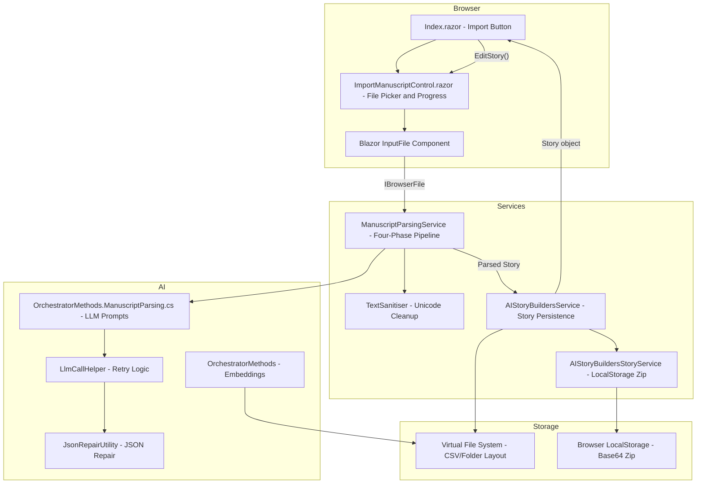
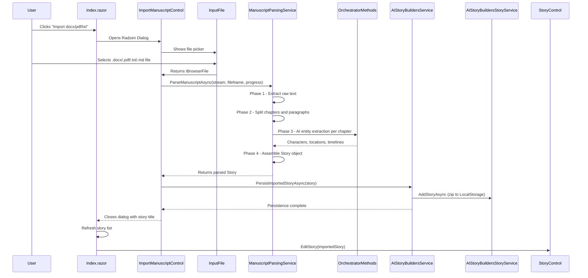
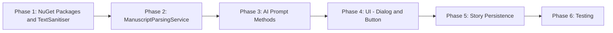
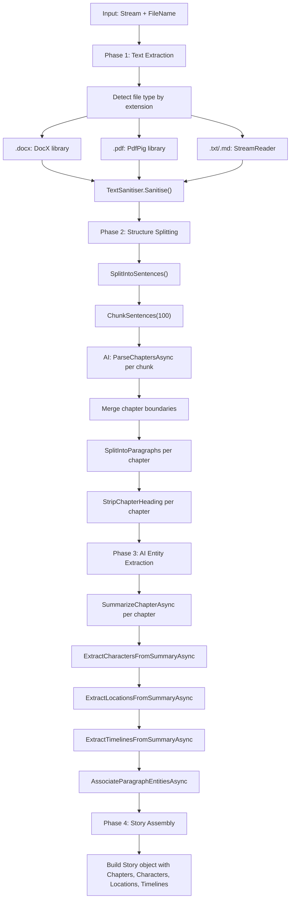
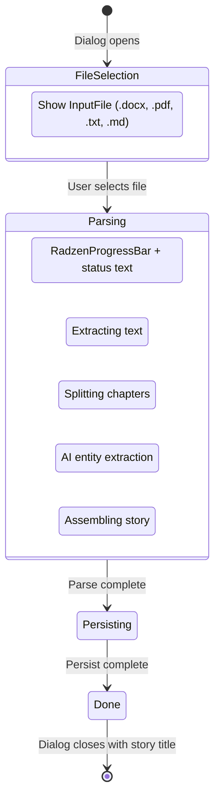
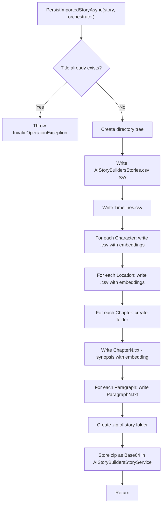
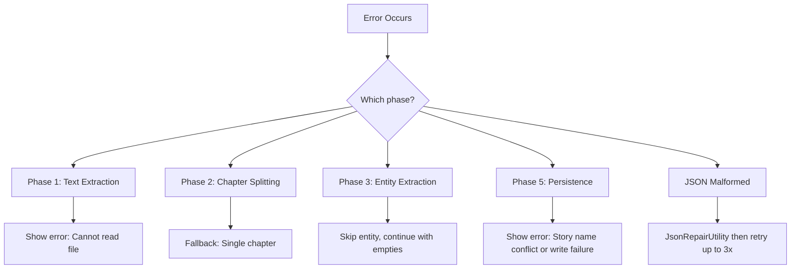

# Import docx/pdf/txt Manuscript Feature Plan (Online Edition)

## 1. Overview

This document describes the plan for adding a manuscript file import capability to **AIStoryBuildersOnline**, the Blazor WebAssembly (WASM) edition. Users will be able to import `.docx`, `.pdf`, `.txt`, and `.md` files directly from the Home screen. The imported file will be parsed through a multi-phase AI pipeline (adapted from the desktop AIStoryBuilders implementation and the original StoryParserProofOfConcept project) that extracts chapters, paragraphs, characters, locations, and timelines, then opens the resulting story in the Story editor.

### 1.1 Goals

- Add an **"Import docx/pdf/txt"** button next to the existing "Import Story" button on the Home screen
- Accept `.docx`, `.pdf`, `.txt`, and `.md` files via the Blazor `InputFile` component (browser file picker)
- Run a four-phase AI parsing pipeline to convert raw manuscript text into a fully structured `Story`
- Persist the parsed story using the existing Blazor LocalStorage + file-system approach (CSV/folder layout plus `AIStoryBuildersStoryService` zip storage)
- Open the newly imported story in the `StoryControl` editor immediately after import

### 1.2 Key Differences from Desktop Edition

The desktop AIStoryBuilders app uses MAUI `FilePicker` and writes to the local file system. The online edition runs in a **Blazor WebAssembly sandbox**, so:

| Concern | Desktop (MAUI) | Online (Blazor WASM) |
|---------|----------------|----------------------|
| File picker | `FilePicker.PickAsync()` | `InputFile` component / `IBrowserFile` |
| Text extraction libraries | `DocumentFormat.OpenXml`, `PdfPig` (system file access) | `Xceed.Words.NET` / `DocX` (already in project), PDF via JS interop or `PdfPig` WASM-compatible path |
| File system | Real OS file system via `File.*` | In-memory virtual file system (`Environment.SpecialFolder.MyDocuments`) |
| Story persistence | CSV/folder only | CSV/folder + Base64 zip in `AIStoryBuildersStoryService` (Local Storage) |
| DI registration | `AddSingleton` in `MauiProgram.cs` | `AddScoped` in `Program.cs` |

### 1.3 Reference Implementation

The following sources served as reference for this plan:

| Source | Purpose |
|--------|---------|
| [Desktop import plan](https://github.com/AIStoryBuilders/AIStoryBuilders/blob/main/docs/import-docx-pdf-txt-plan.md) | Detailed architecture and phase breakdown |
| [Desktop commit 8edad76](https://github.com/AIStoryBuilders/AIStoryBuilders/commit/8edad767ed1c9e598b863fb064f680dfa61e07df) | Working implementation for MAUI (7 files changed, +1666 lines) |
| `C:\Users\webma\Source\Repos\ADefWebserver\AIStoryBuilders` | Desktop project source |
| StoryParserProofOfConcept | Original parsing pipeline source |

---

## 2. Architecture

### 2.1 System Component Diagram



### 2.2 Model Mapping: Desktop to Online

The desktop implementation created new model classes; however the **Online edition already has the same model classes**. The mapping is direct:

| Model Class | Key Properties | Notes |
|-------------|---------------|-------|
| `Story` | Title, Style, Theme, Synopsis, Chapter[], Character[], Location[], Timeline[] | Identical structure |
| `Chapter` | ChapterName, Synopsis, Sequence, Paragraph[] | Maps from parsed chapter |
| `Paragraph` | Sequence, ParagraphContent, Location, Timeline, Characters | Same as desktop |
| `Character` | CharacterName, CharacterBackground[] | Background entries include Type, Description, Timeline |
| `Location` | LocationName, LocationDescription[] | Each has Description and Timeline |
| `Timeline` | TimelineName, TimelineDescription, StartDate, StopDate | Same property names |

### 2.3 Import Flow Diagram



---

## 3. Implementation Plan

### 3.1 Phase Summary



---

### 3.2 Phase 1: Add NuGet Packages and TextSanitiser

#### 3.2.1 NuGet Packages

The online project already has `DocX` (Xceed) version 5.0.0 for `.docx` extraction. For `.pdf` support, add `PdfPig`. Also verify WASM compatibility.

| Package | Version | Purpose | WASM Compatible |
|---------|---------|---------|-----------------|
| `DocX` (Xceed) | 5.0.0 | `.docx` text extraction | Already in project |
| `PdfPig` | 0.1.13+ | `.pdf` text extraction | Yes (pure .NET) |

Add to `AIStoryBuildersOnline.csproj`:

```xml
<PackageReference Include="PdfPig" Version="0.1.13" />
```

> **Note:** The desktop edition uses `DocumentFormat.OpenXml` for `.docx`. The online edition already has `DocX` (Xceed.Words.NET) which provides the same capability and is already a dependency. Use `DocX` for `.docx` extraction to avoid adding a redundant package.

#### 3.2.2 TextSanitiser Utility

Create `Services/TextSanitiser.cs` — a static helper that strips invisible Unicode characters, normalises whitespace, and removes control characters. Port directly from the desktop implementation.

**Key methods:**

```csharp
public static class TextSanitiser
{
    public const int MaxEmbeddingChars = 1500;
    public static (string Cleaned, bool WasTruncated) Sanitise(string raw);
}
```

The implementation removes:
- Zero-width spaces (`\u200B`, `\u200C`, `\u200D`, `\uFEFF`)
- Soft hyphens (`\u00AD`)
- Replaces non-breaking spaces (`\u00A0`) with regular spaces
- Normalises consecutive whitespace and blank lines

---

### 3.3 Phase 2: ManuscriptParsingService

Create `Services/ManuscriptParsingService.cs` — the core parsing engine. This service orchestrates the four-phase pipeline.

#### 3.3.1 Interface

No separate interface file is needed (desktop didn't use one in the online context). Register the concrete class directly.

```csharp
public class ManuscriptParsingService
{
    private readonly OrchestratorMethods _orchestrator;
    private readonly LogService _logService;

    public ManuscriptParsingService(
        OrchestratorMethods orchestrator,
        LogService logService) { ... }

    public async Task<Story> ParseManuscriptAsync(
        Stream fileStream,
        string fileName,
        IProgress<int> progress,
        IProgress<string> statusProgress);
}
```

> **Key difference from desktop:** The online version receives a `Stream` (from `IBrowserFile`) and a `fileName` (to determine file type), rather than a file path.

#### 3.3.2 Pipeline Phases



#### 3.3.3 Text Extraction Methods

Port extraction methods from the desktop, adapted for `Stream` input:

```csharp
private static string ExtractDocx(Stream stream)
{
    using var doc = DocX.Load(stream);
    var sb = new StringBuilder();
    foreach (var para in doc.Paragraphs)
    {
        sb.AppendLine(para.Text);
    }
    return sb.ToString();
}

private static string ExtractPdf(Stream stream)
{
    using var document = PdfDocument.Open(stream.ToByteArray());
    var sb = new StringBuilder();
    foreach (var page in document.GetPages())
    {
        sb.AppendLine(page.Text);
    }
    return sb.ToString();
}

private static async Task<string> ExtractText(Stream stream)
{
    using var reader = new StreamReader(stream);
    return await reader.ReadToEndAsync();
}
```

> For `.txt` and `.md` files, use `StreamReader`.

#### 3.3.4 Sentence Splitting and Chunking

Port the `SplitIntoSentences` and `ChunkSentences` methods directly from the desktop implementation. These:
- Split on sentence-ending punctuation followed by uppercase letters
- Group sentences into chunks of 100 for LLM consumption (keeps within token limits)

#### 3.3.5 Paragraph Splitting

Port the `SplitIntoParagraphs` method that:
- Splits on blank lines
- Collapses internal line breaks into single spaces
- Detects oversized paragraphs (over 500 words)
- Uses LLM-based splitting with heuristic fallback for oversized paragraphs

#### 3.3.6 Chapter Heading Removal

Port `StripChapterHeading` which removes chapter title lines from the beginning of chapter text to prevent them from becoming content paragraphs.

---

### 3.4 Phase 3: AI Prompt Methods for Manuscript Parsing

Add new methods to `OrchestratorMethods` via a new partial class file `AI/OrchestratorMethods.ManuscriptParsing.cs`. This is the same pattern used for the existing partial class files (`OrchestratorMethods.ParseNewStory.cs`, `OrchestratorMethods.WriteParagraph.cs`, etc.).

#### 3.4.1 Required AI Methods

| Method | Input | Output | Purpose |
|--------|-------|--------|---------|
| `ParseChaptersAsync(string chunkText)` | Raw text chunk (100 sentences) | `List<ChapterBoundary>` | LLM identifies chapter titles and boundaries |
| `SummarizeChapterAsync(string chapterText)` | Full chapter text | `string` summary | Comprehensive chapter summary for entity extraction |
| `ExtractBeatsAsync(string chapterSummary)` | Chapter summary | `string` beats | Narrative beat summary for chapter synopsis |
| `ExtractCharactersFromSummaryAsync(string summary, string chapterTitle)` | Chapter summary | `List<ParsedCharacter>` | Characters mentioned in this chapter |
| `ExtractLocationsFromSummaryAsync(string summary, string chapterTitle)` | Chapter summary | `List<ParsedLocation>` | Locations mentioned in this chapter |
| `ExtractTimelinesFromSummaryAsync(string summary, string title, int index)` | Chapter summary | `List<ParsedTimeline>` | Timeline events in this chapter |
| `AssociateParagraphEntitiesAsync(paragraphs, characters, locations, timelines)` | Paragraphs and entity lists | Annotated paragraphs | Tag each paragraph with location, timeline, characters |
| `SplitLongParagraphAsync(string text)` | Oversized paragraph text | `List<string>` sub-paragraphs | Split at natural pause points |

#### 3.4.2 Prompt Design

Each method sends a system prompt and user prompt to the configured LLM via the existing `LlmCallHelper` and `PromptTemplateService` infrastructure. The AI returns JSON which is deserialized into structured results.

All prompts should be defined as template strings in `AI/OrchestratorMethods.ManuscriptParsing.cs`, following the established pattern:

```csharp
var values = new Dictionary<string, string>
{
    { "ChunkText", chunkText }
};

var messages = _promptService.BuildMessages(
    systemTemplate,
    userTemplate,
    values);

var result = await _llmCallHelper.CallLlmWithRetry<List<ChapterBoundaryEntry>>(
    chatClient, messages, chatOptions,
    json => json["chapters"]?.ToObject<List<ChapterBoundaryEntry>>());
```

#### 3.4.3 JSON Response Models

Create internal DTOs within `OrchestratorMethods.ManuscriptParsing.cs`:

```csharp
private class ChapterBoundaryResult
{
    public List<ChapterBoundaryEntry> Chapters { get; set; }
}

private class ChapterBoundaryEntry
{
    public string Title { get; set; }
    public string FirstSentence { get; set; }
}

private class ParsedCharacterEntry
{
    public string Name { get; set; }
    public string Backstory { get; set; }
}

private class ParsedLocationEntry
{
    public string Name { get; set; }
    public string Description { get; set; }
}

private class ParsedTimelineEntry
{
    public string Name { get; set; }
    public string Description { get; set; }
}

private class ParagraphAssociation
{
    public int Index { get; set; }
    public string Location { get; set; }
    public string Timeline { get; set; }
    public List<string> Characters { get; set; }
}
```

Use `JsonRepairUtility.ExtractAndRepair()` (already in the project) for all LLM JSON responses, with `LlmCallHelper.CallLlmWithRetry` providing retry logic.

---

### 3.5 Phase 4: UI — Dialog and Button

#### 3.5.1 Add Button to Home Screen

In `Components/Pages/Index.razor`, add a new button next to the existing "Import Story" button.

**Current layout:**
```
[New Story]  [Import Story]
```

**New layout:**
```
[New Story]  [Import Story]  [Import docx/pdf/txt]
```

Add the button after the existing Import Story button:

```html
<span>&nbsp; &nbsp;</span>
<RadzenButton Click=@(() => ImportManuscript())
              Text="Import docx/pdf/txt"
              Icon="description"
              ButtonStyle="ButtonStyle.Info" />
```

#### 3.5.2 ImportManuscriptControl Dialog Component

Create a new Radzen dialog component `Components/Pages/Controls/Story/ImportManuscriptControl.razor` modeled on the existing `ImportStoryControl.razor`. This dialog handles:

1. File selection via `InputFile`
2. Progress display during parsing
3. Error notification



**Dialog markup:**

```html
@if (IsBusy)
{
    <div class="rz-m-10">
        @if (_parseProgress > 0)
        {
            <RadzenProgressBar Value="@_parseProgress" Max="100"
                               ShowValue="true" />
            <RadzenText TextStyle="TextStyle.Body2"
                        Style="color: #64748b;">
                @_parseStatus
            </RadzenText>
        }
        else
        {
            <RadzenProgressBar Value="100" ShowValue="false"
                               Mode="ProgressBarMode.Indeterminate" />
        }
    </div>
}
else
{
    <div class="form-group">
        <h4>Select a manuscript file</h4>
        <br />
        <InputFile OnChange="OnFileSelected"
                   accept=".docx,.pdf,.txt,.md" />
    </div>
}
```

#### 3.5.3 File Size Limit

Blazor `IBrowserFile` has a default max size of 512 KB. For manuscripts, increase this in the `OpenReadStream` call:

```csharp
// Allow up to 50 MB for large manuscripts
await file.OpenReadStream(maxAllowedSize: 50 * 1024 * 1024)
    .CopyToAsync(memoryStream);
```

#### 3.5.4 Full Dialog Code-Behind

```csharp
@code {
    ManuscriptParsingService ManuscriptParsingService;
    AIStoryBuildersService AIStoryBuildersService;
    OrchestratorMethods OrchestratorMethods;
    LogService LogService;

    bool IsBusy = false;
    int _parseProgress = 0;
    string _parseStatus = "";

    protected override async Task OnInitializedAsync()
    {
        ManuscriptParsingService = (ManuscriptParsingService)ScopedServices
            .GetService(typeof(ManuscriptParsingService));
        AIStoryBuildersService = (AIStoryBuildersService)ScopedServices
            .GetService(typeof(AIStoryBuildersService));
        OrchestratorMethods = (OrchestratorMethods)ScopedServices
            .GetService(typeof(OrchestratorMethods));
        LogService = (LogService)ScopedServices
            .GetService(typeof(LogService));
    }

    private async Task OnFileSelected(InputFileChangeEventArgs e)
    {
        if (e.File is null) return;

        try
        {
            IsBusy = true;
            _parseProgress = 0;
            _parseStatus = "Starting import...";
            StateHasChanged();

            var progress = new Progress<int>(p =>
            {
                _parseProgress = p;
                InvokeAsync(StateHasChanged);
            });

            var statusProgress = new Progress<string>(s =>
            {
                _parseStatus = s;
                InvokeAsync(StateHasChanged);
            });

            // Read file into memory stream
            using var memoryStream = new MemoryStream();
            await e.File.OpenReadStream(maxAllowedSize: 50 * 1024 * 1024)
                .CopyToAsync(memoryStream);
            memoryStream.Position = 0;

            // Run parsing pipeline
            var parsedStory = await ManuscriptParsingService
                .ParseManuscriptAsync(
                    memoryStream, e.File.Name,
                    progress, statusProgress);

            // Persist to file system and LocalStorage
            _parseStatus = "Saving story...";
            await InvokeAsync(StateHasChanged);

            await AIStoryBuildersService
                .PersistImportedStoryAsync(parsedStory, OrchestratorMethods);

            // Close dialog returning the story title
            dialogService.Close(parsedStory.Title);
        }
        catch (Exception ex)
        {
            NotificationService.Notify(new NotificationMessage
            {
                Severity = NotificationSeverity.Error,
                Summary = "Import Error",
                Detail = ex.Message,
                Duration = 4000
            });

            await LogService.WriteToLogAsync(
                "ImportManuscript: " + ex.Message);
        }
        finally
        {
            IsBusy = false;
            _parseProgress = 0;
            _parseStatus = "";
            StateHasChanged();
        }
    }
}
```

#### 3.5.5 Index.razor ImportManuscript Method

Add the method that opens the dialog and handles the result:

```csharp
private async Task ImportManuscript()
{
    try
    {
        var result = await dialogService.OpenAsync<ImportManuscriptControl>(
            "Import Manuscript", null,
            new DialogOptions() { Height = "250px", Width = "450px" });

        if (result is string storyTitle && !string.IsNullOrEmpty(storyTitle))
        {
            // Refresh story list
            colStorys = await AIStoryBuildersService.GetStorys();
            StateHasChanged();

            // Open the imported story in the editor
            var storyToEdit = colStorys
                .FirstOrDefault(s => s.Title == storyTitle);
            if (storyToEdit != null)
            {
                await EditStory(storyToEdit);
            }
        }
    }
    catch (Exception ex)
    {
        HomeVisible = true;
        InProgress = false;

        NotificationService.Notify(new NotificationMessage
        {
            Severity = NotificationSeverity.Error,
            Summary = "Error",
            Detail = ex.Message,
            Duration = 4000
        });

        await LogService.WriteToLogAsync(ex.Message);
    }
}
```

---

### 3.6 Phase 5: Story Persistence and Editor Launch

#### 3.6.1 PersistImportedStoryAsync

Add a new method to `AIStoryBuildersService` in a new partial class file `Services/AIStoryBuildersService.ManuscriptImport.cs`. This method takes the parsed `Story` object and writes it to both the virtual file system and LocalStorage.



**Key responsibilities:**

1. **Validate** story title is not a duplicate (check `Directory.Exists`)
2. **Create** directory tree: `{BasePath}/{Title}/Characters/`, `Chapters/`, `Locations/`
3. **Write** story row to `AIStoryBuildersStories.csv`: `id|Title|Style|Theme|Synopsis|WorldFacts`
4. **Write** `Timelines.csv` with pipe-delimited rows: `Name|Description|StartDate|StopDate`
5. **For each character**: write `Characters/{Name}.csv` with `Type|Timeline|VectorDescriptionAndEmbedding`
6. **For each location**: write `Locations/{Name}.csv` with `Description|Timeline|VectorEmbedding`
7. **For each chapter**: create `Chapters/ChapterN/` folder with:
   - `ChapterN.txt` containing synopsis and embedding
   - `ParagraphN.txt` files with `Location|Timeline|[Characters]|VectorContentAndEmbedding`
8. **Create zip** of the story folder (replicating what `ExportProject` does)
9. **Store** the zip as Base64 in `AIStoryBuildersStoryService.AddStoryAsync()` for LocalStorage persistence

#### 3.6.2 Embedding Generation During Persist

Each paragraph, character background, and location description needs an embedding vector. Use the existing `OrchestratorMethods.GetVectorEmbedding()` method:

```csharp
string VectorContentAndEmbedding =
    await orchestrator.GetVectorEmbedding(content, true);
```

This uses the `BrowserEmbeddingGenerator` (ONNX-based, already configured in the online project) running entirely client-side in the browser.

#### 3.6.3 Zip and LocalStorage

After writing the file-system structure, create a zip archive (the same format used by `ExportProject`) and store it via `AIStoryBuildersStoryService`:

```csharp
// Create zip of story folder
byte[] zipBytes = CreateZipFromStoryFolder(storyPath);
string zipBase64 = Convert.ToBase64String(zipBytes);

// Store in LocalStorage
await AIStoryBuildersStoryService.LoadAIStoryBuildersStoriesAsync();
await AIStoryBuildersStoryService.AddStoryAsync(new AIStoryBuildersStory
{
    Title = story.Title,
    Style = story.Style ?? "",
    Theme = story.Theme ?? "",
    Synopsis = story.Synopsis ?? "",
    ZipFile = zipBase64
});
```

#### 3.6.4 Editor Launch

After the dialog closes and returns the story title, `Index.razor` calls the existing `EditStory(story)` method which opens `StoryControl` as a Radzen dialog:

```csharp
var parms = new Dictionary<string, object>();
parms.Add("objStory", storyToEdit);

var EditStoryResult = await dialogService.OpenAsync<StoryControl>(
    $"{storyToEdit.Title}", parms,
    new DialogOptions() { Height = "650px", Width = "950px" });
```

---

### 3.7 Phase 6: Testing

#### 3.7.1 Test Matrix

| Test Case | Input | Expected Result |
|-----------|-------|-----------------|
| Import .docx novel | Multi-chapter Word document | Chapters, characters, locations extracted and visible in editor |
| Import .pdf novel | PDF file with chapter headings | Same as above |
| Import .txt file | Plain text with chapter markers | Same as above |
| Import .md file | Markdown file | Same as above |
| Import single-chapter file | Short story with no chapter headings | Single chapter "Chapter 1" created |
| Duplicate story title | Import file with same name as existing story | Error notification shown |
| Cancel file picker | User dismisses file dialog without selecting | No action, dialog remains open |
| Large file (50+ chapters) | Gutenberg novel | Progress bar updates per chapter |
| File too large (over 50 MB) | Very large file | Blazor error caught and shown |
| Empty file | Zero-byte file | Graceful error message |
| Corrupted .docx | Malformed Word document | Error notification with clear message |
| LLM API failure | API key invalid or quota exceeded | Fallback: single chapter, no entities |

---

## 4. Files to Create or Modify

### 4.1 New Files

| File | Purpose |
|------|---------|
| `Services/TextSanitiser.cs` | Unicode cleanup utility ported from desktop |
| `Services/ManuscriptParsingService.cs` | Four-phase parsing engine adapted for WASM `Stream` input |
| `AI/OrchestratorMethods.ManuscriptParsing.cs` | AI prompt methods for chapter splitting, entity extraction |
| `Components/Pages/Controls/Story/ImportManuscriptControl.razor` | Dialog component with file picker and progress bar |
| `Services/AIStoryBuildersService.ManuscriptImport.cs` | `PersistImportedStoryAsync()` method (partial class) |

### 4.2 Modified Files

| File | Change |
|------|--------|
| `AIStoryBuildersOnline.csproj` | Add `PdfPig` NuGet package |
| `Program.cs` | Register `ManuscriptParsingService` in DI |
| `Components/Pages/Index.razor` | Add "Import docx/pdf/txt" button and `ImportManuscript()` method |

### 4.3 Dependency Registration

In `Program.cs`, add after the existing service registrations:

```csharp
builder.Services.AddScoped<ManuscriptParsingService>();
```

> **Note:** Use `AddScoped` (not `AddSingleton`) to match the Blazor WASM pattern used by other services in this project. The `ManuscriptParsingService` constructor takes `OrchestratorMethods` and `LogService` as injected dependencies.

---

## 5. Error Handling Strategy

| Scenario | Handling |
|----------|----------|
| Unsupported file extension | Check extension before processing, show notification with supported types |
| File read failure (corrupt file) | Catch in Phase 1, show error notification, log to `LogService` |
| LLM API failure during chapter splitting | **Fallback:** treat entire text as one chapter named "Chapter 1" |
| LLM API failure during entity extraction | Skip that extraction step, continue with empty lists |
| LLM returns malformed JSON | Use `JsonRepairUtility.ExtractAndRepair()` (already in project), plus `LlmCallHelper.CallLlmWithRetry` for up to 3 attempts |
| Oversized paragraph LLM split fails | **Fallback:** `HeuristicSplit` with 250-word target |
| Duplicate story title during persist | Throw `InvalidOperationException`, caught at UI layer, shown as notification |
| Browser memory pressure | Stream processing; do not hold entire file plus extracted text simultaneously |
| `IBrowserFile` exceeds size limit | Caught by Blazor runtime; display user-friendly error |



---

## 6. Configuration Considerations

### 6.1 Browser Memory

Unlike the desktop edition, the online version runs in a browser sandbox with limited memory. Key mitigations:

- Read the file into a `MemoryStream` once, extract text, then discard the stream
- Process chapters sequentially (not in parallel) to limit peak memory
- Use `await Task.Delay(1)` between chapters to yield to the UI thread
- The 50 MB file size limit prevents excessively large uploads

### 6.2 LLM Token Limits

Follow the desktop strategy: chunk text into groups of 100 sentences before sending to the LLM. The `TextSanitiser.MaxEmbeddingChars = 1500` constant controls maximum text length sent for embedding generation.

### 6.3 Progress Reporting

The pipeline reports progress through two `IProgress<T>` callbacks:

| Callback | Type | Example Values |
|----------|------|---------------|
| `progress` | `IProgress<int>` | 0-100 (percentage complete) |
| `statusProgress` | `IProgress<string>` | "Extracting text...", "Parsing chapter 3 of 12...", "Extracting characters..." |

Progress percentage breakdown:
- 0-10%: Text extraction and sanitisation
- 10-30%: Chapter boundary detection
- 30-40%: Paragraph splitting
- 40-80%: AI entity extraction (scales with chapter count)
- 80-95%: Story assembly
- 95-100%: Persistence

---

## 7. Summary of Key Decisions

1. **Use `Stream` input, not file paths** — The online edition receives files via `IBrowserFile`, which provides a stream. All extraction methods are adapted to work with streams instead of file paths.

2. **Reuse `DocX` (Xceed) for .docx** — Already a project dependency. Avoids adding `DocumentFormat.OpenXml` as a redundant package.

3. **Use existing AI infrastructure** — All LLM calls go through the existing `OrchestratorMethods` + `LlmCallHelper` + `PromptTemplateService` which already handles provider selection (OpenAI, Anthropic, Google).

4. **Use existing embedding infrastructure** — Embeddings use the existing `BrowserEmbeddingGenerator` (ONNX-based, runs in-browser).

5. **Dialog-based UI** — Use a Radzen dialog (matching `ImportStoryControl`) rather than inline progress on the Index page. Keeps the Home page clean and follows established patterns.

6. **Dual persistence** — Write to the virtual file system (CSV/folder) AND to `AIStoryBuildersStoryService` (LocalStorage zip) to match how all other stories are stored in the online edition.

7. **`AddScoped` registration** — Match the DI pattern of the online project (`AddScoped`) rather than the desktop pattern (`AddSingleton`).

8. **Graceful degradation** — LLM failures produce partial results rather than complete failure. A manuscript with undetected chapters becomes a single-chapter story; missing entity extraction yields empty character/location/timeline lists.
