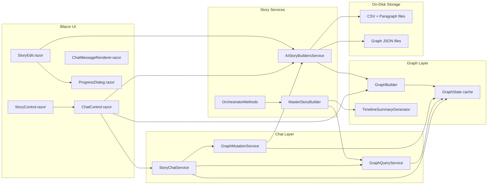
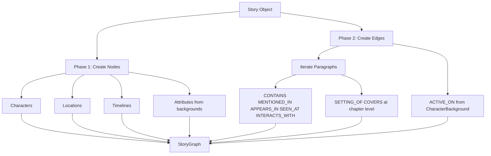
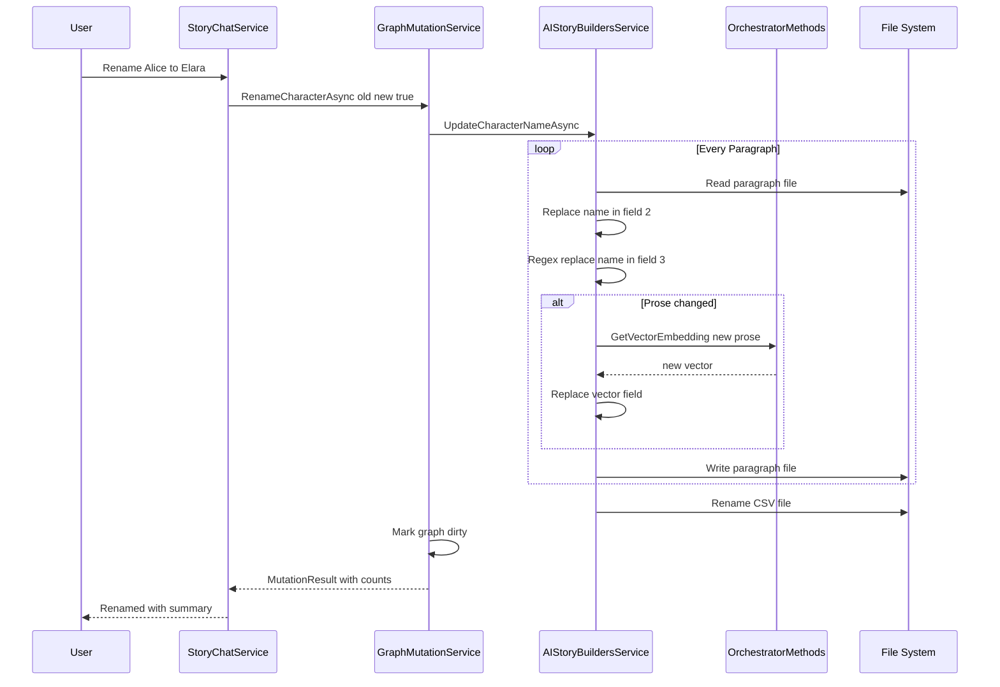
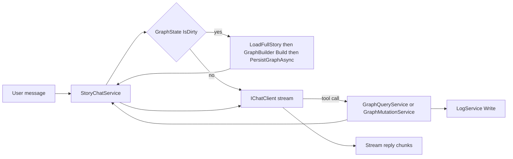
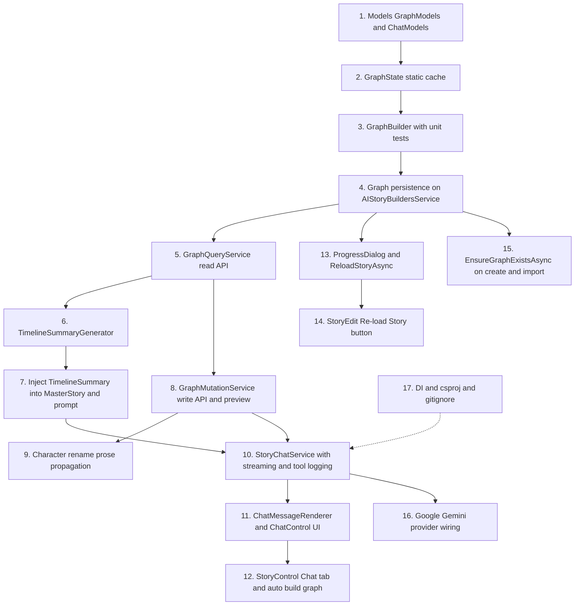

# Story Chat Assistant & Knowledge Graph Integration Plan

> Source: Port of [AIStoryBuilders PR #9 — "Chat"](https://github.com/AIStoryBuilders/AIStoryBuilders/pull/9) (11 commits, 33 files, +6,711 / −588) from the MAUI desktop app into the Blazor Server `AIStoryBuildersOnline` project.

This document describes the end-to-end design required to add a **Story Chat Assistant**, a **Knowledge Graph** backed by on-disk JSON, **graph-aware paragraph generation**, **AI-driven story mutations** (character rename, etc.), and a new **Google Gemini** provider channel to the online version of AIStoryBuilders.

---

## 1. Goals

1. Give users a conversational **Chat** tab per story that can answer questions about their story and perform edits through natural language.
2. Introduce a persistent **Knowledge Graph** (`StoryGraph`) that models characters, locations, timelines, chapters, paragraphs and attributes, together with typed relationships between them.
3. Use the graph to produce a **timeline-scoped summary** that is injected into the paragraph-writing prompt so prose stays consistent with established facts.
4. Propagate **character renames** into prose text and re-embed the affected paragraphs so embeddings stay in sync with the narrative.
5. Replace the existing "Re-Embed All" workflow with a richer **"Re-load Story"** workflow that also rebuilds the graph and emits progress.
6. Add **Google Gemini** support via `Mscc.GenerativeAI.Microsoft` and expose a model picker inside chat.
7. Log every tool call made by the chat LLM and **auto-rebuild** the graph when it becomes dirty.

---

## 2. Feature Inventory

| # | Feature | New / Modified Artifacts |
|---|---------|--------------------------|
| 1 | Story Chat Assistant UI | `Components/Pages/Controls/Chat/ChatControl.razor`, `ChatMessageRenderer.razor` |
| 2 | Markdown rendering in chat bubbles | `ChatMessageRenderer.razor` + `Markdig` |
| 3 | Knowledge Graph model | `Models/GraphModels.cs` |
| 4 | Chat DTOs | `Models/ChatModels.cs` |
| 5 | Graph builder | `Services/GraphBuilder.cs` |
| 6 | Graph query (read tools) | `Services/GraphQueryService.cs` |
| 7 | Graph mutation (write tools) | `Services/GraphMutationService.cs` |
| 8 | Story chat orchestrator | `Services/StoryChatService.cs` |
| 9 | Timeline summary generator | `Services/TimelineSummaryGenerator.cs` |
| 10 | Global graph state cache | `Services/GraphState.cs` |
| 11 | Graph persistence (`Graph/` folder) | `Services/AIStoryBuildersService.cs` |
| 12 | Timeline-aware master story | `Services/AIStoryBuildersService.MasterStory.cs` |
| 13 | `ReloadStoryAsync` pipeline | `Services/AIStoryBuildersService.ReEmbed.cs` |
| 14 | Character rename propagation | `Services/AIStoryBuildersService.Story.cs` |
| 15 | `EnsureGraphExistsAsync` on create/import | `Services/AIStoryBuildersService.cs`, `Services/AIStoryBuildersService.ManuscriptImport.cs` |
| 16 | Progress dialog | `Components/Pages/Controls/UtilityControls/ProgressDialog.razor` |
| 17 | Chat tab + reload button | `Components/Pages/Controls/Story/StoryControl.razor`, `StoryEdit.razor` |
| 18 | Prompt template updates | `AI/PromptTemplateService.cs`, `AI/OrchestratorMethods.WriteParagraph.cs` |
| 19 | `TimelineSummary` field | `Models/JSON/JSONMasterStory.cs`, `Services/MasterStoryBuilder.cs` |
| 20 | Google Gemini provider | `AIStoryBuildersOnline.csproj` (`Mscc.GenerativeAI.Microsoft`) |
| 21 | Dependency injection registrations | `Program.cs` |
| 22 | `.gitignore` — exclude `*.lscache` | `.gitignore` |

---

## 3. High-Level Architecture



Rule of thumb: **UI → ChatLayer → GraphLayer / StoryLayer → Storage**. The `GraphState` static holds the currently loaded `StoryGraph` and a dirty flag.

---

## 4. Data Model

### 4.1 `Models/GraphModels.cs`

```csharp
public enum NodeType { Character, Location, Timeline, Chapter, Paragraph, Attribute }

public class GraphNode
{
    public string Id { get; set; } = "";
    public string Label { get; set; } = "";
    public NodeType Type { get; set; }
    public Dictionary<string, string> Properties { get; set; } = new();
}

public class GraphEdge
{
    public string Id { get; set; } = "";
    public string SourceId { get; set; } = "";
    public string TargetId { get; set; } = "";
    public string Label { get; set; } = "";
    public Dictionary<string, string> Properties { get; set; } = new();
}

public class StoryGraph
{
    public string StoryTitle { get; set; } = "";
    public List<GraphNode> Nodes { get; set; } = new();
    public List<GraphEdge> Edges { get; set; } = new();
}
```

### 4.2 Node ID scheme

| Type | ID format |
|------|-----------|
| Character | `character:{normalized-name}` |
| Location | `location:{normalized-name}` |
| Timeline | `timeline:{normalized-name}` |
| Chapter | `chapter:{normalized-name}` |
| Paragraph | `paragraph:{chapter}:p{sequence}` |
| Attribute | `attribute:{parent-type}:{parent-name}:{attribute-type}:{sequence}` |

Normalization: trim, collapse whitespace/underscore/hyphen to single space, lowercase for the id suffix; preserve original casing in `Label`.

### 4.3 Edge labels

| Label | Direction | Meaning |
|-------|-----------|---------|
| `CONTAINS` | Chapter → Paragraph | Paragraph belongs to chapter |
| `MENTIONED_IN` | Character → Paragraph | Character appears in paragraph |
| `APPEARS_IN` | Character → Chapter | Character appears in chapter |
| `SEEN_AT` | Character → Location | Character observed at location |
| `INTERACTS_WITH` | Character ↔ Character | Pair share a paragraph |
| `SETTING_OF` | Location → Chapter | Location is used in chapter |
| `COVERS` | Timeline → Chapter | Timeline covers chapter content |
| `ACTIVE_ON` | Character → Timeline | Character has a background on timeline |
| `HAS_ATTRIBUTE` | Character or Location → Attribute | Attribute is owned |
| `IN_TIMELINE` | Attribute → Timeline | Attribute scoped to timeline |

### 4.4 Chat DTOs (`Models/ChatModels.cs`)

Includes `ConversationSession`, `ChatDisplayMessage`, and read-tool DTOs: `CharacterDto`, `LocationDto`, `TimelineDto`, `ChapterDto`, `ParagraphDto`, `RelationshipDto`, `AppearanceDto`, `LocationUsageDto`, `InteractionDto`, `OrphanDto`, `ArcStepDto`, `LocationEventDto`, `GraphSummaryDto`, `StoryDetailsDto`, `AttributeDto`, `TimelineContextDto`, `TimelineCharacterDto`, `TimelineLocationDto`, `TimelineEventDto`, plus the write result `MutationResult`.

### 4.5 `JSONMasterStory` change

Add one field:

```csharp
public string TimelineSummary { get; set; }
```

Propagated into `MasterStoryBuilder.EstimateBaseTokens` and `OrchestratorMethods.WriteParagraph` so the value is tokenized and substituted into the template.

### 4.6 Prompt template update (`AI/PromptTemplateService.cs`)

Add inside the paragraph-writing template:

```xml
<timeline_summary>{TimelineSummary}</timeline_summary>
```

Add to `<constraints>`:

- The `<timeline_summary>` describes what has happened so far in the current timeline. Do not contradict these facts.
- Do not reference events from other timelines unless explicitly present in the provided context.

---

## 5. On-Disk Persistence

Each story gets a new `Graph/` sibling folder alongside `Characters/`, `Chapters/`, `Locations/`.

```
{BasePath}/{StoryTitle}/
  Characters/
  Chapters/
  Locations/
  Graph/
    manifest.json   -- storyTitle, createdDate, version, nodeCount, edgeCount
    graph.json      -- serialized StoryGraph
    metadata.json   -- title, genre, theme, synopsis, counts
```

Serialization uses `System.Text.Json` with:

- `WriteIndented = true`
- `PropertyNamingPolicy = CamelCase`
- `JsonStringEnumConverter(CamelCase)` so `NodeType` round-trips as strings.

Key methods added to `AIStoryBuildersService.cs`:

| Method | Purpose |
|--------|---------|
| `PersistGraphAsync(Story, StoryGraph, storyPath)` | Write the three JSON files |
| `LoadGraphFromDisk(storyPath)` | Deserialize `graph.json`, return `null` on failure |
| `EnsureGraphExistsAsync(storyTitle, IGraphBuilder)` | Load from disk if present, otherwise build + persist, populate `GraphState` |
| `LoadFullStory(Story storyMeta)` | Hydrate a `Story` object with Characters, Locations, Timelines, Chapters and Paragraphs from disk |

---

## 6. Graph Construction

### 6.1 `IGraphBuilder` / `GraphBuilder`

Single public entry point:

```csharp
StoryGraph Build(Story story);
```

Two-phase algorithm:

1. **Phase 1 — Nodes.** Iterate characters, locations, timelines, chapters, paragraphs. Create `Attribute` nodes for every `CharacterBackground` and `LocationDescription` entry with a non-empty description; attach `HAS_ATTRIBUTE` and, where a background has a timeline, `IN_TIMELINE`.
2. **Phase 2 — Edges.** For every paragraph:
   - Add `CONTAINS` from chapter to paragraph.
   - For each character referenced: ensure node exists, then `MENTIONED_IN`, `APPEARS_IN`, and `SEEN_AT` for the paragraph's location.
   - For every unordered pair of characters in the paragraph, add a single deterministic `INTERACTS_WITH` (sort pair by case-insensitive name).
   - Track chapter-level sets of locations/timelines to emit `SETTING_OF` and `COVERS`.
3. After the paragraph pass, add `ACTIVE_ON` from characters to timelines present in their `CharacterBackground`.

### 6.2 Name resolution

When a character referenced in a paragraph does not match any known character file, resolve via:

1. Exact case-insensitive match.
2. Substring match either way.
3. Levenshtein distance ≤ 2 against the lower-cased known name list.
4. Fall back to the raw name, creating a stub node on the fly.

### 6.3 Edge de-duplication

Each edge's ID is `{sourceId}--{label}--{targetId}`; a `HashSet<string>` guarantees single insertion. `IsValidEntity` filters null/empty/"Unknown" labels.



---

## 7. Graph State Cache

```csharp
public static class GraphState
{
    public static StoryGraph Current { get; set; }
    public static Story CurrentStory { get; set; }
    public static bool IsDirty { get; set; } = true;
}
```

- Any write path (mutations, re-embed, reload, rename) sets `IsDirty = true`.
- Read paths (chat tools, timeline summary) check `IsDirty` or `Current == null` and rebuild lazily.
- For Blazor Server, a static cache is acceptable because users operate on one story at a time; if multi-tenant isolation is required, wrap this in a scoped/singleton service keyed by story title instead.

---

## 8. Graph Query Service

`IGraphQueryService` exposes read operations consumed by AI tools and by the paragraph pipeline. Canonical method set:

| Method | Returns |
|--------|---------|
| `GetCharacter(name)` | `CharacterDto` |
| `ListCharacters()` | `List<CharacterDto>` |
| `GetLocation(name)` | `LocationDto` |
| `ListLocations()` | `List<LocationDto>` |
| `GetTimeline(name)` | `TimelineDto` |
| `ListTimelines()` | `List<TimelineDto>` |
| `GetChapter(title)` | `ChapterDto` |
| `ListChapters()` | `List<ChapterDto>` |
| `GetParagraph(chapter, index)` | `ParagraphDto` |
| `GetRelationships(name)` | `List<RelationshipDto>` |
| `GetAppearances(characterName)` | `List<AppearanceDto>` |
| `GetLocationUsage(locationName)` | `List<LocationUsageDto>` |
| `GetInteractions(characterName)` | `List<InteractionDto>` |
| `FindOrphans()` | `List<OrphanDto>` |
| `GetCharacterArc(characterName)` | `List<ArcStepDto>` |
| `GetLocationEvents(locationName)` | `List<LocationEventDto>` |
| `GetGraphSummary()` | `GraphSummaryDto` |
| `GetStoryDetails()` | `StoryDetailsDto` |
| `ListAttributes(parentType, parentName)` | `List<AttributeDto>` |
| `GetTimelineContext(timelineName, chapterSequence, paragraphSequence)` | `TimelineContextDto` |

`GetTimelineContext` is the key method for paragraph generation: it gathers all characters/locations/events on the selected timeline **up to but not including** the current paragraph, so later events never leak into earlier prose.

---

## 9. Graph Mutation Service

`IGraphMutationService` is the bridge between the Chat LLM and the story-editing code. Operations support a **preview/confirm** pattern via a `confirmed` flag — the first call returns a `MutationResult { IsPreview = true, Summary = "..." }`, the second call actually writes.

Supported operations (same names as the AI tool schema):

- `RenameCharacterAsync(old, new, confirmed)`
- `UpdateCharacterBackgroundAsync(name, type, description, timeline, confirmed)`
- `AddCharacterAsync(name, role, backstory, confirmed)`
- `DeleteCharacterAsync(name, confirmed)`
- `AddLocationAsync(name, description, confirmed)`
- `UpdateLocationDescriptionAsync(name, description, timeline, confirmed)`
- `DeleteLocationAsync(name, confirmed)`
- `AddTimelineAsync(name, description, start, end, confirmed)`
- `UpdateWorldFactsAsync(facts, confirmed)`

Each call:

1. Performs the edit through `AIStoryBuildersService`.
2. Sets `GraphState.IsDirty = true`.
3. Returns a populated `MutationResult` with `AffectedFiles`, `EmbeddingsUpdated`, `GraphRefreshed`.

### 9.1 Character rename propagation

The existing `UpdateCharacterName` only rewrote the `[characters]` metadata field (pipe index 2). The new version — `UpdateCharacterNameAsync` — also:

1. Reads `ParagraphArray[3]` (prose text).
2. Runs a case-sensitive, word-boundary regex: `\b{Regex.Escape(oldName)}\b` → `newName`.
3. If the prose changed, calls `OrchestratorMethods.GetVectorEmbedding(newProse, false)` and replaces the last pipe field (vector).
4. Writes the line back.
5. Renames `Characters/{old}.csv` to `Characters/{new}.csv`.

Callers migrated to `await`:

- `GraphMutationService.RenameCharacterAsync`
- `Components/Pages/Controls/Characters/CharacterEdit.razor`



---

## 10. Story Chat Service

`IStoryChatService` is the conversational orchestrator. Public API:

```csharp
IAsyncEnumerable<string> SendMessageAsync(string userMessage, string sessionId);
void ClearSession(string sessionId);
void RefreshClient();   // re-reads SettingsService to honor a model change
```

### 10.1 Pipeline

1. Load/bootstrap a `ConversationSession` for the session id; append the user message.
2. Build a system prompt describing the story and the available tools.
3. Verify `GraphState.Current != null` and `!GraphState.IsDirty`; if either, call `GraphBuilder.Build` on `GraphState.CurrentStory` (or reload it) and persist.
4. Register tool definitions (read + write) against an `IChatClient` from `Microsoft.Extensions.AI`.
5. Stream response chunks back to the caller using `await foreach`.
6. Log every tool name and argument JSON to `LogService` (auditability).
7. After any mutation tool runs, let the auto-rebuild hook (see §12) refresh the graph before the next turn.

### 10.2 Tools registered

Read tools (from §8). Write tools (from §9) also carry a boolean `confirmed` parameter; the system prompt instructs the model to first call with `confirmed: false` to get a preview, relay the summary to the user, and only call with `confirmed: true` after explicit user approval.

### 10.3 Provider selection

`AIModelService` already returns per-provider `IChatClient`. PR #9 adds a `Mscc.GenerativeAI.Microsoft`-based Gemini client alongside the existing OpenAI/Anthropic clients. The chat service asks `AIModelService` for a client based on `SettingsService.AIType`.

---

## 11. Timeline-Aware Paragraph Generation

`Services/AIStoryBuildersService.MasterStory.cs` gains a new private helper:

```csharp
private async Task<string> BuildTimelineSummaryAsync(Chapter c, Paragraph p);
```

Algorithm:

1. If the paragraph has no timeline, return an empty string (no injection).
2. If `GraphState.IsDirty` or `Current == null`, call `LoadFullStory`, rebuild via `GraphBuilder`, persist, and clear the dirty flag.
3. Call `GraphQueryService.GetTimelineContext(timelineName, c.Sequence, p.Sequence)` to scope the context to events that precede the current paragraph on the current timeline.
4. Pass the resulting `TimelineContextDto` to `TimelineSummaryGenerator.GenerateSummary` and return the produced prose.

The returned string is assigned to `objMasterStory.TimelineSummary` inside `CreateMasterStory`, so it flows into `PromptTemplateService` substitution automatically.

### 11.1 `TimelineSummaryGenerator`

Deterministic, token-aware text builder (max 800 words). Structure:

```
Timeline: {name} ({startDate} to {endDate})
{timeline description}

Characters active in this timeline:
- Alice (Hero): orphaned at 7; trained by Bob
- ...

Locations in this timeline:
- The Tavern: smoke-stained and warm
- ...

Events (chronological):
- Chapter 1, P3: Alice, Bob at The Tavern
- ...
- ... and N earlier events         <- inserted if budget exceeded
```

Budget handling: oldest events are dropped first when the cumulative word count would exceed `MaxWords`.

---

## 12. Reload Pipeline & Auto-Rebuild

### 12.1 `ReloadStoryAsync`

New replacement for `ReEmbedStory`. Five reported steps:

| Step | Work |
|------|------|
| 1/5 | Save story CSV metadata via `UpdateStory(story)` |
| 2/5 | Re-embed every `Paragraph*.txt` from field 3 prose |
| 3/5 | Re-embed all chapter synopses, character descriptions, location descriptions |
| 4/5 | `LoadFullStory` + `GraphBuilder.Build` + `PersistGraphAsync`; update `GraphState` |
| 5/5 | Reload in-memory story objects (`Character`, `Location`, `Timeline`, `Chapter`) |

Accepts an `IProgress<string>` so the UI can display each step via notifications or the new `ProgressDialog.razor`.

### 12.2 Auto-rebuild hook

After each chat mutation tool returns, `StoryChatService`:

1. Sets `GraphState.IsDirty = true` (mutations do this themselves).
2. Before the next tool call or next user message, synchronously rebuilds if dirty using `LoadFullStory` + `GraphBuilder.Build`, then `PersistGraphAsync`.
3. Writes a structured log: `ToolCall: {name} args={json} durationMs=... graphRebuilt=true|false`.



---

## 13. UI Integration

### 13.1 `ChatControl.razor`

- Renders inside the new `Chat` tab of `StoryControl.razor`.
- Card-style chat panel with a scrolling message list, model dropdown, and clear-conversation button.
- Streams assistant chunks into a live "thinking" bubble; after the stream completes, pushes the accumulated content into the history list.
- Exposes a public `BuildGraph()` method the parent calls when the user first opens the Chat tab, so the graph is ready before the first question.
- Renders assistant messages through `ChatMessageRenderer` (Markdig) so headings, tables, and code blocks look right.

### 13.2 `ChatMessageRenderer.razor`

A thin wrapper around `Markdig.Markdown.ToHtml(Content, Pipeline)` using a `UseAdvancedExtensions()` pipeline. Ships with scoped CSS to style headings, lists, code, blockquotes, tables, and links inside chat bubbles.

### 13.3 `StoryControl.razor`

- Adds `@using AIStoryBuilders.Components.Pages.Controls.Chat;`.
- Adds a `<RadzenTabsItem Text="Chat">` hosting `<ChatControl @ref="chatControl" objStory="objStory" />`.
- On tab change to the chat index, calls `await chatControl.BuildGraph()`.

### 13.4 `StoryEdit.razor`

- Injects `IGraphBuilder`.
- Renames the "Re-Embed All" button to **"Re-load Story"** (icon `sync`, style `Warning`).
- Confirm dialog copy updated to mention the Knowledge Graph.
- Calls `ReloadStoryAsync(objStory, GraphBuilder, progress)` with an `IProgress<string>` that fans out `NotificationService.Notify` calls.

### 13.5 `ProgressDialog.razor`

Reusable Radzen-based dialog with:

- `UpdateProgress(string)` to change the displayed line.
- `SetError(string)` to render an error alert.
- `SetComplete()` to enable the close button.

Consumed by `ReloadStoryAsync`, manuscript import, and any other long-running background operation.

### 13.6 `Index.razor` / Story creation

- Inject `IGraphBuilder`.
- After `AddStory(...)`, call `await AIStoryBuildersService.EnsureGraphExistsAsync(title, GraphBuilder)` so the Chat tab works immediately.
- After import from JSON export, locate the newly imported story and ensure the graph exists.
- Manuscript import: `PersistImportedStoryAsync(parsedStory, OrchestratorMethods, GraphBuilder)` — pass the graph builder so the importer can build + persist the graph at the end of the pipeline.

---

## 14. DI Registrations (`Program.cs`)

```csharp
builder.Services.AddSingleton<AIStoryBuildersService>();
builder.Services.AddSingleton<AIModelService>();
builder.Services.AddSingleton<ManuscriptParsingService>();
builder.Services.AddSingleton<IGraphBuilder, GraphBuilder>();
builder.Services.AddSingleton<IGraphQueryService, GraphQueryService>();
builder.Services.AddSingleton<IGraphMutationService, GraphMutationService>();
builder.Services.AddSingleton<IStoryChatService, StoryChatService>();
builder.Services.AddSingleton<ITimelineSummaryGenerator, TimelineSummaryGenerator>();
```

> In `AIStoryBuildersOnline` (Blazor Server) `Program.cs` replaces `MauiProgram.cs`; registration lifetimes may need to be `Scoped` for any service that reads per-user settings. `GraphState` remaining static is acceptable for single-user operation; for multi-user deployments, move it behind a scoped service keyed on the active story.

---

## 15. Package Additions

Add to `AIStoryBuildersOnline.csproj`:

```xml
<PackageReference Include="Mscc.GenerativeAI.Microsoft" Version="3.1.0" />
```

`Markdig` is already present for chat rendering; if not, add:

```xml
<PackageReference Include="Markdig" Version="0.37.0" />
```

Update `.gitignore`:

```
*.lscache
/AIStoryBuildersOnline.csproj.lscache
```

---

## 16. Blazor Server Adaptation Notes

The PR targets the MAUI desktop app. Porting to `AIStoryBuildersOnline` requires:

1. Replace `MauiProgram.cs` registrations with `Program.cs` equivalents.
2. Any `Microsoft.Maui.Storage.FileSystem.AppDataDirectory` usage inside path helpers maps to the existing server `BasePath` constant already present in this repo.
3. Replace `ScopedServices.GetService(typeof(OrchestratorMethods))` inside `ChatControl.OnInitialized` with constructor `@inject OrchestratorMethods OrchestratorMethods;` if `OwningComponentBase` is not used in the online project's pattern.
4. Long-running `ReloadStoryAsync` should not block the circuit; run behind `ProgressDialog` with `IProgress<string>` as designed.
5. `GraphState` must be treated as **process-wide**; if concurrent users may each work on a different story, wrap it in `Scoped` service or key it per-`CircuitId`.
6. Confirm the `IChatClient` streaming abstraction in `Microsoft.Extensions.AI` is wired through `AIModelService` the same way it is in the online solution's existing `AI/` folder.

---

## 17. Implementation Order



---

## 18. Testing Plan

### 18.1 Unit tests

| Area | Tests |
|------|-------|
| `GraphBuilder` | Characters/locations/timelines become nodes; every paragraph emits `CONTAINS`; pair of characters in a paragraph emits deterministic single `INTERACTS_WITH`; duplicate edges are suppressed; fuzzy character name match; `Unknown`/blank entity rejection |
| `GraphQueryService` | Each list/lookup returns correct DTO shape; `FindOrphans` detects isolated nodes; `GetTimelineContext` excludes later paragraphs |
| `TimelineSummaryGenerator` | Header/characters/locations sections produced; word-cap truncation drops oldest events and inserts summary line; empty context returns empty string |
| `GraphMutationService` | Preview mode does not write; confirmed mode calls service and sets dirty; rename reports prose + metadata counts |
| `UpdateCharacterNameAsync` | Exact word replacement; substring ignored (`Malice` stays); possessive (`Alice's` → `Elara's`); multi-word names; case-sensitive behavior; embeddings regenerated only when prose changed |
| `PersistGraphAsync` / `LoadGraphFromDisk` | Round-trip node/edge equality; enum serialized as camel-case string |

### 18.2 Integration tests

| Scenario | Expectation |
|----------|-------------|
| Create story → open Chat tab | Graph is built, first question answers correctly |
| Import manuscript | Graph persisted under `Graph/`, summary node/edge counts match expectations |
| Ask chat to rename character | Preview returned; upon confirm, prose + metadata updated in every paragraph; graph rebuilt |
| Re-load Story | All five progress steps emitted; embeddings regenerated; graph rebuilt |
| Switch provider to Gemini | Model dropdown loads models; chat replies stream |
| Paragraph generation with timeline | `<timeline_summary>` populated in the prompt; no later-timeline leakage |

---

## 19. Risks & Mitigations

| Risk | Mitigation |
|------|------------|
| Embedding provider rate limits during `ReloadStoryAsync` | Batch where possible; surface errors via `ProgressDialog.SetError` |
| Regex-based rename misses nicknames | Out of scope; future `FindAndReplaceInProse(old, new)` tool |
| Stale `GraphState` across concurrent users | Gate with `IsDirty`; for multi-user, move to scoped service |
| Prompt bloat from timeline summary | 800-word cap enforced by `TimelineSummaryGenerator` |
| JSON schema drift for graph persistence | `manifest.version` written on every save; add a loader guard that rebuilds on unknown versions |
| Tool call loops from the model | Enforce confirm/preview on all writes; cap per-turn tool invocations in `StoryChatService` |

---

## 20. Definition of Done

- `docs/` already contains the existing migration plans; this document is the umbrella plan and should be followed step-by-step.
- All 22 items in §2 are implemented, registered, and covered by at least one unit or integration test.
- A new story can be created, opened, chatted with, mutated via chat, and reloaded, with the graph persisted under `Graph/` the entire time.
- Paragraph generation visibly references timeline facts via `<timeline_summary>`.
- Renaming a character via chat updates both metadata and prose across every affected paragraph and regenerates the corresponding embeddings.
